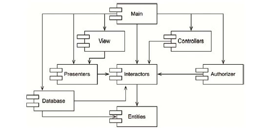
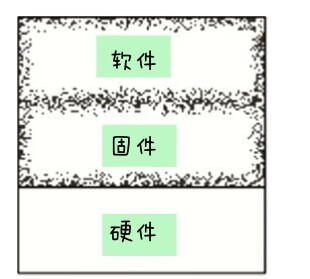

# 第1章 设计与架构究竟是什么

软件设计也是如此。底层设计细节和高层架构信息是不可分割的。它们组合在一起，共同定义了整个软件系统，缺一不可。所谓的底层和高层本身就是一系列决策组成的连续体，并没有清晰的分界线。

## 目标是什么

软件架构的终极目标是，用最小的人力成本来满足构建和维护该系统的需求。

一个软件架构的优劣，可以用它满足用户需求所需要的成本来衡量。如果该成本很低，并且在系统的整个生命周期内一直都能维持这样的低成本，那么这个系统的设计就是优良的。如果该系统的每次发布都会提升下一次变更的成本，那么这个设计就是不好的。就这么简单。

## 案例分析

这和现代软件研发工作有点类似，现在的软件研发工程师都有点过于自信。哦，当然，他们确实不会偷懒，一点也不。但是他们真正偷懒的地方在于——持续低估那些好的、良好设计的、整洁的代码的重要性。

这些工程师们普遍用一句话来欺骗自己：“我们可以未来再重构代码，产品上线最重要！”但是结果大家都知道，产品上线以后重构工作就再没人提起了。市场的压力永远也不会消退，作为首先上市的产品，后面有无数的竞争对手追赶，必须要比他们跑得更快才能保持领先。

对常年关注软件开发本质的人来说，它其实揭示了软件开发的一个核心特点：

要想跑得快，先要跑得稳。

过度自信只会使得重构设计陷入和原项目一样的困局中。

## 行为价值

软件系统的行为是其最直观的价值维度。程序员的工作就是让机器按照某种指定方式运转，给系统的使用者创造或者提高利润。程序员们为了达到这个目的，往往需要帮助系统使用者编写一个对系统功能的定义，也就是需求文档。然后，程序员们再把需求文档转化为实际的代码。

当机器出现异常行为时，程序员要负责调试，解决这些问题。

大部分程序员认为这就是他们的全部工作。他们的工作是且仅是：按照需求文档编写代码，并且修复任何Bug。这真是大错特错。

## 架构价值

软件系统的第二个价值维度，就体现在软件这个英文单词上：software。“ware”的意思是“产品”，而“soft”的意思，不言而喻，是指软件的灵活性。

软件系统必须保持灵活。软件发明的目的，就是让我们可以以一种灵活的方式来改变机器的工作行为。对机器上那些很难改变的工作行为，我们通常称之为硬件（hardware）。

为了达到软件的本来目的，软件系统必须够“软”——也就是说，软件应该容易被修改。当需求方改变需求的时候，随之所需的软件变更必须可以简单而方便地实现。变更实施的难度应该和变更的范畴（scope）成等比关系，而与变更的具体形状（shape）无关。

## 哪个价值维度更重要

如果你问业务部门，是否想要能够变更需求，他们的回答一般是肯定的，而且他们会增加一句：完成现在的功能比实现未来的灵活度更重要。但讽刺的是，如果事后业务部门提出了一项需求，而你的预估工作量大大超出他们的预期，这帮家伙通常会对你放任系统混乱到无法变更的状态而勃然大怒。

## 艾森豪威尔矩阵

软件系统的第一个价值维度：系统行为，是紧急的，但是并不总是特别重要。

软件系统的第二个价值维度：系统架构，是重要的，但是并不总是特别紧急。

但研发人员还忘了一点，那就是业务部门原本就是没有能力评估系统架构的重要程度的，这本来就应该是研发人员自己的工作职责！所以，平衡系统架构的重要性与功能的紧急程度这件事，是软件研发人员自己的职责。

## 为好的软件架构而持续斗争

研发团队必须从公司长远利益出发与其他部门抗争，这和管理团队的工作一样，甚至市场团队、销售团队、运营团队都是这样。公司内部的抗争本来就是无止境的。

# 第3章 编程范式总览

本章将讲述三个编程范式，它们分别是结构化编程（structured programming）、面向对象编程（object-oriented programming）以及函数式编程（functional programming）。

## 结构化编程

我们可以将结构化编程范式归结为一句话：

结构化编程对程序控制权的直接转移进行了限制和规范。

面向对象编程

在这里，我们也可以用一句话来总结面向对象编程：

面向对象编程对程序控制权的间接转移进行了限制和规范。

## 函数式编程

众所周知，λ演算法的一个核心思想是不可变性——某个符号所对应的值是永远不变的，所以从理论上来说，函数式编程语言中应该是没有赋值语句的。大部分函数式编程语言只允许在非常严格的限制条件下，才可以更改某个变量的值。

因此，我们在这里可以将函数式编程范式总结为下面这句话：

函数式编程对程序中的赋值进行了限制和规范。

## 仅供思考

我们应该认识到，这三个编程范式分别限制了goto语句、函数指针和赋值语句的使用。那么除此之外，还有什么可以去除的吗？

没有了。因此这三个编程范式可能是仅有的三个了——如果单论去除能力的编程范式的话。支撑这一结论的另外一个证据是，三个编程范式都是在1958年到1968年这10年间被提出来的，后续再也没有新的编程范式出现过。

## 本章小结

这和软件架构的三大关注重点不谋而合：功能性、组件独立性以及数据管理。

## goto是有害的

现如今，无论是否自愿，我们都是结构化编程范式的践行者了，因为我们用的编程语言基本上都已经禁止了不受限制的直接控制转移语句。

## 功能性降解拆分

既然结构化编程范式可将模块递归降解拆分为可推导的单元，这就意味着模块也可以按功能进行降解拆分。这样一来，我们就可以将一个大型问题拆分为一系列高级函数的组合，而这些高级函数各自又可以继续被拆分为一系列低级函数，如此无限递归。更重要的是，每个被拆分出来的函数也都可以用结构化编程范式来书写。

## 科学来救场

科学和数学在证明方法上有着根本性的不同，科学理论和科学定律通常是无法被证明的，譬如我们并没有办法证明牛顿第二运动定律F=ma或者万有引力定律F=Gm1m2/r2是正确的，但我们可以用实际案例来演示这些定律的正确性，并通过高精度测量来证明当相关精度达到小数点后多少位时，被测量对象仍然一直满足这个定律。

这就是科学理论和科学定律的特点：它们可以被证伪，但是没有办法被证明。

科学方法论不需要证明某条结论是正确的，只需要想办法证明它是错误的。如果某个结论经过一定的努力无法证伪，我们则认为它在当下是足够正确的。

最终，我们可以说数学是要将可证明的结论证明，而与之相反，科学研究则是要将可证明的结论证伪。

## 测试

Dijkstra曾经说过“测试只能展示Bug的存在，并不能证明不存在Bug”，换句话说，一段程序可以由一个测试来证明其错误性，但是却不能被证明是正确的。测试的作用是让我们得出某段程序已经足够实现当前目标这一结论。

软件开发虽然看起来是在操作很多数学结构，其实不是一个数学研究过程。恰恰相反，软件开发更像是一门科学研究学科，我们通过无法证伪来证明软件的正确性。

# 第5章 面向对象编程

另一种常见的回答是“面向对象编程是一种对真实世界进行建模的方式”，这种回答只能算作避重就轻。“对真实世界的建模”到底要如何进行？我们为什么要这么做，有什么好处？也许这句话意味着是“由于采用面向对象方式构建的软件与真实世界的关系更紧密，所以面向对象编程可以使得软件开发更容易”——即使这样说，也仍然逃避了关键问题——面向对象编程究竟是什么？

究竟什么是面向对象？

对于这个问题，一种常见的回答是“数据与函数的组合”。这种说法虽然被广为引用，但总显得并不是那么贴切，因为它似乎暗示了o.f（）与f（o）之间是有区别的，这显然不是事实。

还有些人在回答这个问题的时候，往往会搬出一些神秘的词语，譬如封装（encapsulation）、继承（inheritance）、多态（polymorphism）。其隐含意思就是说面向对象编程是这三项的有机组合，或者任何一种支持面向对象的编程语言必须支持这三个特性。

那么，我们接下来可以逐个来分析一下这三个概念。

## 整数平方

这句话有点出人意料：函数式编程语言中的变量（Variable）是不可变（Vary）的。

## 不可变性与软件架构

为什么不可变性是软件架构设计需要考虑的重点呢？为什么软件架构师要操心变量的可变性呢？答案显而易见：所有的竞争问题、死锁问题、并发更新问题都是由可变变量导致的。如果变量永远不会被更改，那就不可能产生竞争或者并发更新问题。如果锁状态是不可变的，那就永远不会产生死锁问题。

换句话说，一切并发应用遇到的问题，一切由于使用多线程、多处理器而引起的问题，如果没有可变变量的话都不可能发生。

## 可变性的隔离

一种常见方式是将应用程序，或者是应用程序的内部服务进行切分，划分为可变的和不可变的两种组件。不可变组件用纯函数的方式来执行任务，期间不更改任何状态。这些不可变的组件将通过与一个或多个非函数式组件通信的方式来修改变量状态（参见图6.1）。

图6.1：修改状态以及事务型内存

事务型内存基本上与数据库保护磁盘数据的方式[9]类似，通常采用的是事务或者重试机制。

这里的要点是：一个架构设计良好的应用程序应该将状态修改的部分和不需要修改状态的部分隔离成单独的组件，然后用合适的机制来保护可变量。

软件架构师应该着力于将大部分处理逻辑都归于不可变组件中，可变状态组件的逻辑应该越少越好。

## 事件溯源

举个简单的例子，假设某个银行应用程序需要维护客户账户余额信息，当它执行存取款事务时，就要同时负责修改余额记录。

如果我们不保存具体账户余额，仅仅保存事务日志，那么当有人想查询账户余额时，我们就将全部交易记录取出，并且每次都得从最开始到当下进行累计。当然，这样的设计就不需要维护任何可变变量了。

但显而易见，这种实现是有些不合理的。因为随着时间的推移，事务的数目会无限制增长，每次处理总额所需要的处理能力很快就会变得不能接受。如果想使这种设计永远可行的话，我们将需要无限容量的存储，以及无限的处理能力。

但是可能我们并不需要这个设计永远可行，而且可能在整个程序的生命周期内，我们有足够的存储和处理能力来满足它。

这就是事件溯源[10]，在这种体系下，我们只存储事务记录，不存储具体状态。当需要具体状态时，我们只要从头开始计算所有的事务即可。

更重要的是，这种数据存储模式中不存在删除和更新的情况，我们的应用程序不是CRUD，而是CR。因为更新和删除这两种操作都不存在了，自然也就不存在并发问题。

## 本章小结

结构化编程是对程序控制权的直接转移的限制。

面向对象编程是对程序控制权的间接转移的限制。

函数式编程是对程序中赋值操作的限制。

这三个编程范式都对程序员提出了新的限制。每个范式都约束了某种编写代码的方式，没有一个编程范式是在增加新能力。

第3部分 设计原则

一般情况下，我们为软件构建中层结构的主要目标如下：

使软件可容忍被改动。

使软件更容易被理解。

构建可在多个软件系统中复用的组件。

SRP：单一职责原则。

该设计原则是基于康威定律（Conway's Law）[1]的一个推论——一个软件系统的最佳结构高度依赖于开发这个系统的组织的内部结构。这样，每个软件模块都有且只有一个需要被改变的理由。

OCP：开闭原则。

该设计原则是由Bertrand Meyer在20世纪80年代大力推广的，其核心要素是：如果软件系统想要更容易被改变，那么其设计就必须允许新增代码来修改系统行为，而非只能靠修改原来的代码。

LSP：里氏替换原则。

该设计原则是Barbara Liskov在1988年提出的一个著名的子类型定义。简单来说，这项原则的意思是如果想用可替换的组件来构建软件系统，那么这些组件就必须遵守同一个约定，以便让这些组件可以相互替换。

ISP：接口隔离原则。

这项设计原则主要告诫软件设计师应该在设计中避免不必要的依赖。

DIP：依赖反转原则。

该设计原则指出高层策略性的代码不应该依赖实现底层细节的代码，恰恰相反，那些实现底层细节的代码应该依赖高层策略性的代码。

# 第7章 SRP：单一职责原则

在历史上，我们曾经这样描述SRP这一设计原则：

任何一个软件模块都应该有且仅有一个被修改的原因。

所以，我们也可以这样描述SRP：

任何一个软件模块都应该只对一个用户（User）或系统利益相关者（Stakeholder）负责。

只要这些人希望对系统进行的变更是相似的，就可以归为一类——一个或多个有共同需求的人。在这里，我们将其称为行为者（actor）。

所以，对于SRP的最终描述就变成了：

任何一个软件模块都应该只对某一类行为者负责。

那么，上文中提到的“软件模块”究竟又是在指什么呢？大部分情况下，其最简单的定义就是指一个源代码文件。然而，有些编程语言和编程环境并不是用源代码文件来存储程序的。在这些情况下，“软件模块”指的就是一组紧密相关的函数和数据结构。

例如，calculatePay（）函数和reportHours（）函数使用同样的逻辑来计算正常工作时数。程序员为了避免重复编码，通常会将该算法单独实现为一个名为regularHours（）的函数（见图7.2）。

接下来，假设CFO团队需要修改正常工作时数的计算方法，而COO带领的HR团队不需要这个修改，因为他们对数据的用法是不同的。

这时候，负责这项修改的程序员会注意到 calculatePay（）函数调用了regularHours（）函数，但可能不会注意到该函数会同时被reportHours（）调用。

于是，该程序员就这样按照要求进行了修改，同时CFO团队的成员验证了新算法工作正常。这项修改最终被成功部署上线了。

但是，COO 团队显然完全不知道这些事情的发生，HR 仍然在使用reportHours（）产生的报表，随后就会发现他们的数据出错了！最终这个问题让COO十分愤怒，因为这些错误的数据给公司造成了几百万美元的损失。

## 反面案例2：代码合并

一个拥有很多函数的源代码文件必然会经历很多次代码合并，该文件中的这些函数分别服务不同行为者的情况就更常见了。

例如，CTO团队的DBA决定要对Employee数据库表结构进行简单修改。与此同时，COO团队的HR需要修改工作时数报表的格式。

这样一来，就很可能出现两个来自不同团队的程序员分别对Employee类进行修改的情况。不出意外的话，他们各自的修改一定会互相冲突，这就必须要进行代码合并。

在这个例子中，这次代码合并不仅有可能让CTO和COO要求的功能出错，甚至连CFO原本正常的功能也可能受到影响。

事实上，这样的案例还有很多，我们就不一一列举了。它们的一个共同点是，多人为了不同的目的修改了同一份源代码，这很容易造成问题的产生。

而避免这种问题产生的方法就是

# 第9章 LSP：里氏替换原则

这里需要的是一种可替换性：如果对于每个类型是S的对象o1都存在一个类型为T的对象o2，能使操作T类型的程序P在用o2替换o1时行为保持不变，我们就可以将S称为T的子类型。

## 正方形/长方形问题

正方形/长方形问题是一个著名（或者说臭名远扬）的违反LSP的设计案例（该问题的结构如图9.2所示）。

## LSP与软件架构

LSP适用于上述所有的应用场景，因为这些场景中的用户都依赖于一种接口，并且都期待实现该接口的类之间能具有可替换性。

## 本章小结

LSP可以且应该被应用于软件架构层面，因为一旦违背了可替换性，该系统架构就不得不为此增添大量复杂的应对机制。

## ISP与软件架构

回顾一下ISP最初的成因：在一般情况下，任何层次的软件设计如果依赖于不需要的东西，都会是有害的。

# 第11章 DIP：依赖反转原则

依赖反转原则（DIP）主要想告诉我们的是，如果想要设计一个灵活的系统，在源代码层次的依赖关系中就应该多引用抽象类型，而非具体实现。

## 稳定的抽象层

我们每次修改抽象接口的时候，一定也会去修改对应的具体实现。但反过来，当我们修改具体实现时，却很少需要去修改相应的抽象接口。所以我们可以认为接口比实现更稳定。

应在代码中多使用抽象接口，尽量避免使用那些多变的具体实现类。这条守则适用于所有编程语言，无论静态类型语言还是动态类型语言。同时，对象的创建过程也应该受到严格限制，对此，我们通常会选择用抽象工厂（abstract factory）这个设计模式。不要在具体实现类上创建衍生类。上一条守则虽然也隐含了这层意思，但它还是值得被单独拿出来做一次详细声明。在静态类型的编程语言中，继承关系是所有一切源代码依赖关系中最强的、最难被修改的，所以我们对继承的使用应该格外小心。即使是在稍微便于修改的动态类型语言中，这条守则也应该被认真考虑。

不要覆盖（override）包含具体实现的函数。调用包含具体实现的函数通常就意味着引入了源代码级别的依赖。即使覆盖了这些函数，我们也无法消除这其中的依赖——这些函数继承了那些依赖关系。在这里，控制依赖关系的唯一办法，就是创建一个抽象函数，然后再为该函数提供多种具体实现。

应避免在代码中写入与任何具体实现相关的名字，或者是其他容易变动的事物的名字。这基本上是DIP原则的另外一个表达方式。

# 第12章 组件

组件是软件的部署单元，是整个软件系统在部署过程中可以独立完成部署的最小实体。例如，对于Java来说，它的组件是jar文件。而在Ruby中，它们是gem文件。在．Net中，它们则是DLL文件。总而言之，在编译运行语言中，组件是一组二进制文件的集合。而在解释运行语言中，组件则是一组源代码文件的集合。无论采用什么编程语言来开发软件，组件都是该软件在部署过程中的最小单元。

我们可以将多个组件链接成一个独立可执行文件，也可以将它们汇总成类似．war文件这样的部署单元，又或者，组件也可以被打包成．jar、.dll或者．exe文件，并以可动态加载的插件形式来独立部署。但无论采用哪种部署形式，设计良好的组件都应该永远保持可被独立部署的特性，这同时也意味着这些组件应该可以被单独开发。

# 第13章 组件聚合

在本章中，我们会具体讨论以下三个与构建组件相关的基本原则：

REP：复用/发布等同原则。

CCP：共同闭包原则。

CRP：共同复用原则。

## 复用/发布等同原则

REP原则初看起来好像是不言自明的。毕竟如果想要复用某个软件组件的话，一般就必须要求该组件的开发由某种发布流程来驱动，并且有明确的发布版本号。

这其中的一个原因是，如果没有设定版本号，我们就没有办法保证所有被复用的组件之间能够彼此兼容。另外更重要的一点是，软件开发者必须要能够知道这些组件的发布时间，以及每次发布带来了哪些变更。

只有这样，软件工程师才能在收到相关组件新版本发布的通知之后，依据该发布所变更的内容来决定是继续使用旧版本还是做些相应的升级，这是很基本的要求。

从软件设计和架构设计的角度来看，REP原则就是指组件中的类与模块必须是彼此紧密相关的。也就是说，一个组件不能由一组毫无关联的类和模块组成，它们之间应该有一个共同的主题或者大方向。

## 共同闭包原则

我们应该将那些会同时修改，并且为相同目的而修改的类放到同一个组件中，而将不会同时修改，并且不会为了相同目的而修改的那些类放到不同的组件中。

总而言之，CCP的主要作用就是提示我们要将所有可能会被一起修改的类集中在一处。也就是说，如果两个类紧密相关，不管是源代码层面还是抽象理念层面，永远都会一起被修改，那么它们就应该被归属为同一个组件。通过遵守这个原则，我们就可以有效地降低因软件发布、验证及部署所带来的工作压力。

如前所述，CCP原则实际上就是SRP原则的组件版。在SRP原则的指导下，我们将会把变更原因不同的函数放入不同的类中。而CCP原则指导我们应该将变更原因不同的类放入不同的组件中。简而言之，这两个原则都可以用以下一句简短的话来概括：

将由于相同原因而修改，并且需要同时修改的东西放在一起。将由于不同原因而修改，并且不同时修改的东西分开。

## 共同复用原则

不要强迫一个组件的用户依赖他们不需要的东西。

CRP原则实际上是ISP原则的一个普适版。ISP原则是建议我们不要依赖带有不需要的函数的类，而CRP原则则是建议我们不要依赖带有不需要的类的组件。

上述两条建议实际上都可以用下面一句话来概括：

不要依赖不需要用到的东西。

## 组件聚合张力图

读到这里，读者可能已经意识到上述三个原则之间彼此存在着竞争关系。REP和CCP原则是黏合性原则，它们会让组件变得更大，而CRP原则是排除性原则，它会尽量让组件变小。软件架构师的任务就是要在这三个原则中间进行取舍。

下面我们来看一下图13.1。这是一张组件聚合三大原则的张力图[5]，图的边线所描述的是忽视对应原则的后果。

图13.1：组件聚合原则的张力图

一般来说，一个软件项目的重心会从该三角区域的右侧开始，先期主要牺牲的是复用性。然后，随着项目逐渐成熟，其他项目会逐渐开始对其产生依赖，项目重心就会逐渐向该三角区域的左侧滑动。换句话说，一个项目在组件结构设计上的重心是根据该项目的开发时间和成熟度不断变动的，我们对组件结构的安排主要与项目开发的进度和它被使用的方式有关，与项目本身功能的关系其实很小。

## 无依赖环原则

组件依赖关系图中不应该出现环。

我们一定都有过这样的经历：当你花了一整天的时间，好不容易搞定了一段代码，第二天上班时却发现这段代码莫名其妙地又不能工作了。这通常是因为有人在你走后修改了你所依赖的某个组件。我给这种情况起了个名字——“一觉醒来综合征”。

这种综合征的主要病因是多个程序员同时修改了同一个源代码文件。虽然在规模相对较小、人员较少的项目中，这种问题或许并不严重，但是随着项目的增长，研发人员的增加，这种每天早上刚上班时都要经历一遍的痛苦就会越来越多。甚至会严重到让有的团队在长达数周的时间内都不能发布一个稳定的项目版本，因为每个人都在不停地修改自己的代码，以适应其他人所提交的变更。

在过去几十年中，针对这个问题逐渐演化出了两种解决方案，它们都来自电信行业。第一种是“每周构建”，第二种是“无依赖环原则（ADP）”。

每周构建方案是中型项目中很常见的一种管理手段。其具体做法如下：在每周的前四天中，让所有的程序员在自己的私有库上工作，忽略其他人的修改，也不考虑互相之间的集成问题；然后在每周五要求所有人将自己所做的变更提交，进行统一构建。

上述方案确实可以让程序员们每周都有四天的时间放手干活。然而一到星期五，所有人都必须要花费大量的精力来处理前四天留下来的问题。

而且更不幸的是，随着项目越来越大，每周五的集成工作会越来越难以按时完成。而随着集成任务越来越重，周六的加班也会变得越来越频繁。

对于上述情景，我们的解决办法是将研发项目划分为一些可单独发布的组件，这些组件可以交由单人或者某一组程序员来独立完成。当有人或团队完成某个组件的某个版本时，他们就会通过发布机制通知其他程序员，并给该组件打一个版本号，放入一个共享目录。这样一来，每个人都可以依赖于这些组件公开发布的版本来进行开发，而组件开发者则可以继续去修改自己的私有版本。

每当一个组件发布新版本时，其他依赖这个组件的团队都可以自主决定是否立即采用新版本。若不采用，该团队可以选择继续使用旧版组件，直到他们准备好采用新版本为止。

但是，如果想要成功推广这个开发流程，就必须控制好组件之间的依赖结构，绝对不能允许该结构中存在着循环依赖关系。如果某项目结构中存在着循环依赖关系，那么“一觉醒来综合征”将是不可避免的。

下面让我们来看看图14.1，该图展示了一个典型应用程序的组件结构。当然，这个应用程序的具体功能与我们要讨论的无关，真正重要的是其组件之间的依赖结构。我们应该可以注意到，该组件依赖结构所呈现的是一个有向图，图中的每个节点都是一个项目组件，依赖关系就是有向图中的边。

更重要的是，不管我们从该图中的哪个节点开始，都不能沿着这些代表了依赖关系的边最终走回到起始点。也就是说，这种结构中不存在环，我们称这种结构为有向无环图（Directed Acyclic Graph，简写为DAG）。

图14.1：典型的组件结构图

打破循环依赖

当然，我们可以打破这些组件中的循环依赖，并将其依赖图转化为DAG。目前有以下两种主要机制可以做到这件事情。

1．应用依赖反转原则（DIP）：

2．创建一个新的组件，

## 自上而下的设计

如果我们在设计具体类之前就来设计组件依赖关系，那么几乎是必然要失败的。因为在当下，我们对项目中的共同闭包一无所知，也不可能知道哪些组件可以复用，这样几乎一定会创造出循环依赖的组件。因此，组件依赖关系是必须要随着项目的逻辑设计一起扩张和演进的。

## 稳定依赖原则

依赖关系必须要指向更稳定的方向。

任何一个我们预期会经常变更的组件都不应该被一个难于修改的组件所依赖，否则这个多变的组件也将会变得非常难以被修改。

软件组件的变更困难度与很多因素有关，例如代码的体量大小、复杂度、清晰度等。我们在这里会忽略这些因素，只集中讨论一个特别的因素——让软件组件难于修改的一个最直接的办法就是让很多其他组件依赖于它。带有许多入向依赖关系的组件是非常稳定的，因为它的任何变更都需要应用到所有依赖它的组件上。

X是一个稳定的组件。因为有三个组件依赖着X，所以X有三个不应该被修改的原因。这里就说X要对三个组件负责。另一方面，X不依赖于任何组件，所以不会有任何原因导致它需要被变更，我们称它为“独立”组件。

下面再来看看图14.6中的Y组件，这是一个非常不稳定的组件。由于没有其他的组件依赖Y，所以Y并不对任何组件负责。但因为Y同时依赖于三个组件，所以它的变更就可能由三个不同的源产生。这里就说Y是有依赖性的组件。

图14.6：Y，一个非常不稳定的组件

那么，究竟该如何来量化一个组件的稳定性呢？其中一种方法是计算所有入和出的依赖关系。通过这种方法，我们就可以计算出一个组件的位置稳定性（positional stability）。

Fan-in：入向依赖，这个指标指代了组件外部类依赖于组件内部类的数量。

Fan-out：出向依赖，这个指标指代了组件内部类依赖于组件外部类的数量。

I：不稳定性，I=Fan-out/（Fan-in+Fan-out）。该指标的范围是[0,1],I=0意味着组件是最稳定的，I=1意味着组件是最不稳定的。

在C++中，这些依赖关系一般是通过#include语句来表达的。事实上，当每个源文件只包含一个类的时候，I指标是最容易计算的。同样在Java中，I指标也可以通过Import语句和全引用名字的数量来计算。

当I指标等于1时，说明没有组件依赖当前组件（Fan-in=0），同时该组件却依赖于其他组件（Fan-out＞0）。这是组件最不稳定的一种情况，我们认为这种组件是“不负责的（irresponsible）、对外依赖的（dependent）”。由于这个组件没有被其他组件依赖，所以自然也就没有力量会干预它的变更，同时也因为该组件依赖于其他组件，所以就必然会经常需要变更。

稳定依赖原则（SDP）的要求是让每个组件的I指标都必须大于其所依赖组件的I指标。也就是说，组件结构依赖图中各组件的I指标必须要按其依赖关系方向递减。

## 稳定抽象原则

在一个软件系统中，总有些部分是不应该经常发生变更的。这些部分通常用于表现该系统的高阶架构设计及一些策略相关的高阶决策。我们不想让这些业务决策和架构设计经常发生变更，因此这些代表了系统高阶策略的组件应该被放到稳定组件（I=0）中，而不稳定的组件（I=1）中应该只包含那些我们想要快速和方便修改的部分。

现在，我们可以来定义组件的稳定性I与其抽象化程度A之间的关系了，具体如图14.12所示。在该图中，纵轴为A值，横轴为I值。如果我们将两个“设计良好”的组件绘制在该图上，那么最稳定的、包含了无限抽象类的组件应该位于左上角（0,1），最不稳定的、最具体的组件应该位于右下角（1,0）。

图14.12：I/A图

当然，不可能所有的组件都能处于这两个位置上，因为组件通常都有各自的稳定程度和抽象化程度。

而这个区间应该可以通过排除法推导出来，也就是说，我们可以先找出那些组件不应该处于的位置（请参考图14.13）。

图14.13：排除区

在图14.13中，假设某个组件处于（0,0）位置，那么它应该是一个非常稳定但也非常具体的组件。这样的组件在设计上是不佳的，因为它很难被修改，这意味着该组件不能被扩展。这样一来，因为这个组件不是抽象的，而且它又由于稳定性的原因变得特别难以被修改，我们并不希望一个设计良好的组件贴近这个区域，因此（0,0）周围的这个区域被我们称为痛苦区（zone of pain）。

当然，有些软件组件确实会处于这个区域中，这方面的一个典型案例就是数据库的表结构（schema）。它在可变性上可谓臭名昭著，但是它同时又非常具体，并被非常多的组件依赖。这就是面向对象应用程序与数据库之间的接口这么难以管理，以及每次更新数据库的过程都那么痛苦的原因。

现在我们来看看靠近（1,1）这一位置点的组件。该位置上的组件不会是我们想要的，因为这些组件通常是无限抽象的，但是没有被其他组件依赖，这样的组件往往无法使用。因此我们将这个区域称为无用区。

对于这个区域中的软件组件来说，其源码或者类中的设计问题通常是由于历史原因造成的。例如我们常常会在系统的某个角落里看到某个没有人实现的抽象类，它们一直静静地躺在那里，没有人使用。

很明显，最多变的组件应该离上述两个区域越远越好。在图14.13中，我们可以将距离两个区域最远的点连成一条线，即从（1,0）连接到（0,1）。我将这条线称为主序列线（mainsequence）。[7]

接下来介绍最后一个指标：如果让组件位于或者靠近主序列是可取的目标，那么我们就可以创建一个指标来衡量一个组件距离最佳位置的距离。

D指标[8]：距离D=|A+I-1|，该指标的取值范围是[0,1]。值为0意味着组件是直接位于主序列线上的，值为1则意味着组件在距离主序列最远的位置。

通过计算每个组件的D指标，就可以量化一个系统设计与主序列的契合程度了。另外，我们也可以用D指标大于0多少来指导组件的重构与重新设计。

#第15章 什么是软件架构

也许软件架构师生产的代码量不是最多的，但是他们必须不停地承接编程任务。如果不亲身承受因系统设计而带来的麻烦，就体会不到设计不佳所带来的痛苦，接着就会逐渐迷失正确的设计方向。

一个软件系统的架构质量和该系统是否能正常工作的关系并不大，毕竟世界上有很多架构设计糟糕但是工作正常的软件系统。真正的麻烦往往并不会在我们运行软件的过程中出现，而是会出现在这个软件系统的开发、部署以及后续的补充开发中。

## 部署（Deployment）

为了让开发成为有效的工作，软件系统就必须是可部署的。在通常情况下，一个系统的部署成本越高，可用性就越低。因此，实现一键式的轻松部署应该是我们设计软件架构的一个目标。

## 维护（Maintenance）

在软件系统的所有方面中，维护所需的成本是最高的。满足永不停歇的新功能需求，以及修改层出不穷的系统缺陷这些工作将会占去绝大部分的人力资源。

系统维护的主要成本集中在“探秘”和“风险”这两件事上。其中，“探秘（spelunking）”的成本主要来自我们对于现有软件系统的挖掘，目的是确定新增功能或被修复问题的最佳位置和最佳方式。而“风险（risk）”，则是指当我们进行上述修改时，总是有可能衍生出新的问题，这种可能性就是风险成本。

## 保持可选项

正如我们在之前章节中所说的，软件有行为价值与架构价值两种价值。这其中的第二种价值又比第一种更重要，因为它正是软件之所以“软”的原因。

软件架构师的目标是创建一种系统形态，该形态会以策略为最基本的元素，并让细节与策略脱离关系，以允许在具体决策过程中推迟或延迟与细节相关的内容。

例如，

在开发的早期阶段应该无须选择数据库系统，因为软件的高层策略不应该关心其底层到底使用哪一种数据库。事实上，如果软件架构师足够小心，软件的高层策略甚至可以不用关心该数据库是关系型数据库，还是分布式数据库，是多级数据库，还只是一些文本文件而已。

在开发的早期阶段也不应该选定使用的Web服务，因为高层策略并不应该知道自己未来要以网页形式发布。如果高层策略能够与HTML、AJAX、JSP、JSF或任何Web开发技术脱钩，那么我们就可以将对Web系统的选择推迟到项目的最后阶段。事实上，很有可能我们压根不需要考虑这个系统到底是不是以网页形式发布的。

在开发的早期阶段不应该过早地采用REST模式，因为软件的高层策略应该与外部接口无关。同样的，我们也不应该过早地考虑采用微服务框架、SOA框架等。再说一遍，软件的高层策略压根不应该跟这些有关。

那么如果其他人已经替我们做出了决策呢？譬如说，我们的公司已经指定了某个数据库，或某种Web服务，或某个框架，这时应该怎么办？通常一个优秀的软件架构师会假装这些决策还没有确定，并尽可能长时间地让系统有推迟或修改这些决策的能力。

一个优秀的软件架构师应该致力于最大化可选项数量。

## 用例

譬如说，一个架构优良的购物车应用看起来就该像是一个购物车应用。该系统的主要用例会在其系统结构上明确可见。开发人员将不需要在系统中查找系统所应有的行为，因为这些行为在系统顶层作为主要元素已经是明确可见的了，这些元素会以类、函数或模块的形式在架构中占据明显位置，它们的名字也能够清晰地描述对应的功能。

## 保留可选项

一个设计良好的架构应该通过保留可选项的方式，让系统在任何情况下都能方便地做出必要的变更。

## 按层解耦

我们就发现了一个系统可以被解耦成若干个水平分层——UI界面、应用独有的业务逻辑、领域普适的业务逻辑、数据库等。

## 用例的解耦

接下来，还有什么不同原因的变更呢？答案正是这些用例本身！譬如说，添加新订单的用例与删除订单的用例在发生变更的原因上几乎肯定是不同的，而且发生变更的速率也不同。因此，我们按照用例来切分系统是非常自然的选择。

解耦的模式

现在我们来想想所有的这些解耦动作对架构设计的第二个目标——系统运行——究竟有什么意义。如果不同面向之间的用例得到了良好的隔离，那么需要高吞吐量的用例就和需要低吞吐量的用例互相自然分开了。如果UI和数据库的部分能从业务逻辑分离出来，那么它们就可以运行在不同的服务器上。而且需要较大带宽的应用也可以在多个服务器上运行多个实例。

开发的独立性

我们进行架构设计的第三个目标是支持系统的开发。很显然，当系统组件之间被高度解耦之后，开发团队之间的干扰就大大减少了。譬如说，如果系统的业务逻辑与其UI无关，那么专注于UI开发的团队就不会对专注于业务逻辑开发的团队造成多大的影响。同样的，如果系统的各个用例之间相互隔离，那么专注于addOrder用例的团队就不太可能干扰到负责deleteOrder用例的团队。

只要系统按照其水平分层和用例进行了恰当的解耦，整个系统的架构就可以支持多团队开发，不管团队组织形式是分功能开发、分组件开发、分层开发，还是按照别的什么变量分工都可以。

## 部署的独立性

这种按用例和水平分层的解耦也会给系统的部署带来极大的灵活性。实际上，如果解耦工作做得好，我们甚至可以在系统运行过程中热切换（hot-swap）其各个分层实现和具体用例。在这种情况下，我们增加新用例就只需要在系统中添加一些新的jar文件，或启动一些服务即可，其他部分将完全不受影响。

## 重复

架构师们经常会钻进一个牛角尖——害怕重复。

当然，重复在软件行业里一般来说都是坏事。我们不喜欢重复的代码，当代码真的出现重复时，我们经常会感到作为一个专业人士，自己是有责任减少或消除这种重复的。

但是重复也存在着很多种情况。其中有些是真正的重复，在这种情况下，每个实例上发生的每项变更都必须同时应用到其所有的副本上。重复的情况中也有一些是假的，或者说这种重复只是表面性的。如果有两段看起来重复的代码，它们走的是不同的演进路径，也就是说它们有着不同的变更速率和变更缘由，那么这两段代码就不是真正的重复。等我们几年后再回过头来看，可能就会发现这两段代码是非常不一样的了。

当我们按用例垂直切分系统时，这样的问题会经常出现。我们经常遇到一些不同的用例为了上述原因被耦合在了一起。不管是因为它们展现形式类似，还是使用了相似的语法、相似的数据库查询/表结构等，总之，我们一定要小心避免陷入对任何重复都要立即消除的应激反应模式中。一定要确保这些消除动作只针对那些真正意义上的重复。

同样的道理，当我们对系统进行水平分层时，也可能会发现某个数据库记录的结构和某个屏幕展示的数据接口非常相似。我们可能也会为了避免再创建一个看起来相同的视图模型并在两者之间复制元素，而选择直接将数据库记录传递给UI层。我们也一定要小心，这里几乎肯定只是一种表面性的重复。而且，另外创建一个视图模型并不会花费太多力气，这可以帮助我们保持系统水平分层之间的隔离。

## 再谈解耦模式

让我们再回到解耦模式的问题上来。按水平分层和用例解耦一个系统有很多种方式。例如，我们可以在源码层次上解耦、二进制层次上解耦（部署），也可以在执行单元层次上解耦（服务）。源码层次：我们可以控制源代码模块之间的依赖关系，以此来实现一个模块的变更不会导致其他模块也需要变更或重新编译（例如Ruby Gem）。在这种解耦模式下，系统所有的组件都会在同一个地址空间内执行，它们会通过简单的函数调用来进行彼此的交互。这类系统在运行时是作为一个执行文件被统一加载到计算机内存中的。人们经常把这种模式叫作单体结构。部署层次：我们可以控制部署单元（譬如jar文件、DLL、共享库等）之间的依赖关系，以此来实现一个模块的变更不会导致其他模块的重新构建和部署。

在这种模式下，大部分组件可能还是依然运行在同一个地址空间内，通过彼此的函数调用通信。但有一些别的组件可能会运行在同一个处理器下的其他进程内，使用跨进程通信，或者通过socket或共享内存进行通信。这里最重要的是，这些组件的解耦产生出许多可独立部署的单元，例如jar文件、Gem文件和DLL等。服务层次：我们可以将组件间的依赖关系降低到数据结构级别，然后仅通过网络数据包来进行通信。这样系统的每个执行单元在源码层和二进制层都会是一个独立的个体，它们的变更不会影响其他地方（例如，常见的服务或微服务就都是如此的）。

例如，我们不难想象，一个在某台服务器上运行良好的程序发展到一定程度，可能就会需要将其某些组件迁移到其他服务器上才能满足运行要求。当该系统只运行在一台服务器上时，我们进行源码层次的解耦就已经足够了。但在这之后，我们可能需要进行部署单元层次的解耦，甚至服务层次的解耦。

另一个解决方案（似乎也是目前最流行的方案）是，默认就采用服务层次的解耦。这种做法的问题主要在于它的成本很高，并且是在鼓励粗粒度的解耦。毕竟，无论微服务有多么“微”，其解耦的精细度都可能是不够的。

而随着时间的流逝，系统的运维需求可能又会降低。之前需要进行服务层次解耦的系统可能现在只需要进行部署层次或源码层次的解耦就够了。

一个设计良好的架构应该能允许一个系统从单体结构开始，以单一文件的形式部署，然后逐渐成长为一组相互独立的可部署单元，甚至是独立的服务或者微服务。最后还能随着情况的变化，允许系统逐渐回退到单体结构。

# 第17章 划分边界

软件架构设计本身就是一门划分边界的艺术。边界的作用是将软件分割成各种元素，以便约束边界两侧之间的依赖关系。其中有一些边界是在项目初期——甚至在编写代码之前——就已经划分好，而其他的边界则是后来才划分的。在项目初期划分这些边界的目的是方便我们尽量将一些决策延后进行，并且确保未来这些决策不会对系统的核心业务逻辑产生干扰。

正如我们之前所说，架构师们所追求的目标是最大限度地降低构建和维护一个系统所需的人力资源。那么我们就需要了解一个系统最消耗人力资源的是什么？答案是系统中存在的耦合——尤其是那些过早做出的、不成熟的决策所导致的耦合。

那么，怎样的决策会被认为是过早且不成熟的呢？答案是那些决策与系统的业务需求（也就是用例）无关。这部分决策包括我们要采用的框架、数据库、Web服务器、工具库、依赖注入等。在一个设计良好的系统架构中，这些细节性的决策都应该是辅助性的，可以被推迟的。一个设计良好的系统架构不应该依赖于这些细节，而应该尽可能地推迟这些细节性的决策，并致力于将这种推迟所产生的影响降到最低。

## 应在何时、何处画这些线

边界线应该画在那些不相关的事情中间。GUI与业务逻辑无关，所以两者之间应该有一条边界线。数据库与GUI无关，这两者之间也应该有一条边界线。数据库又与业务逻辑无关，所以两者之间也应该有一条边界线。

我们可以从图17.1中清晰地看到，BusinessRules是通过DatabaseInterface来加载和保存数据的。而DatabaseAccess则负责实现该接口，以及其与实际Database的交互。

图17.1：隐藏在接口背后的数据库

这里的类与接口仅仅是一个例子。在一个真实的应用程序中，将会有很多业务逻辑类、很多数据库接口类以及很多数据库访问的实现。不过，所有一切所遵循的模式应该是相似的。

那么这里的边界线应该被画在哪里？边界应该穿过继承关系，在DatabaseInterface之下（见图17.2）。

图17.2：边界线

请注意，DatabaseAccess类的那两个对外的箭头。这两个箭头都指向了远离DatabaseAccess 类的方向，这意味着它们所指向的两个类都不知道DatabaseAccess类的存在。

下面让我们把抽象层次拉高一点，看一下包含多个业务逻辑类的组件与包含数据库及其访问类的组件之间是什么关系（见图17.3）。

图17.3：业务逻辑组件与数据库组件

请注意，图17.3中的箭头指向，它说明了Database组件知道BusinessRules组件的存在，而BusinessRules组件则不知道Database组件的存在。这意味着DatabaseInterface类是包含在BusinessRules组件中的，而DatabaseAccess类则被包含在Database组件中。

这个箭头的方向很重要。因为它意味着Database组件不会对BusinessRules组件形成干扰，但Database组件却不能脱离BusinessRules组件而存在。

## 输入和输出怎么办

GUI和BusinessRules这两个组件之间也应该有一条边界线（见图17.4）。再强调一次，在这里不重要的组件依赖于较为重要的组件，箭头指向的方向代表着组件之间的关系，GUI关心BusinessRules。

图17.4：GUI与BusinessRules之间的边界线

通过这条边界线以及这个箭头，我们可以看出GUI可以用任何一种其他形式的界面来代替[5]。BusinessRules组件不需要了解这些细节。

插件式架构

事实上，软件开发技术发展的历史就是一个如何想方设法方便地增加插件，从而构建一个可扩展、可维护的系统架构的故事。系统的核心业务逻辑必须和其他组件隔离，保持独立，而这些其他组件要么是可以去掉的，要么是有多种实现的（见图17.5）。

## 插件式架构的好处

所以，边界线也应该沿着系统的变更轴来画。也就是说，位于边界线两侧的组件应该以不同原因、不同速率变化着。

一个系统的GUI与业务逻辑的变更原因、变更速率显然是不同的，所以二者中间应该有一条边界线。同样的，一个系统的业务逻辑与依赖注入框架之间的变更原因和变更速度也会不同，它们之间也应该画边界线。

这其实就是单一职责原则（SRP）的具体实现，SRP的作用就是告诉我们应该在哪里画边界线。

## 跨边界调用

在运行时，跨边界调用指的是边界线一侧的函数调用另一侧的函数，并同时传递数据的行为。构造合理的跨边界调用需要我们对源码中的依赖关系进行合理管控。

为什么需要管控源码中的依赖关系呢？因为当一个模块的源码发生变更时，其他模块的源码也可能会随之发生变更或重新编译，并需要重新部署。所谓划分边界，就是指在这些模块之间建立这种针对变更的防火墙。

## 令人生畏的单体结构

最简单的跨边界调用形式，是由低层客户端来调用高层服务函数，这种依赖关系在运行时和编译时会保持指向一致，都是从低层组件指向高层组件。

在图18.1中，我们可以看到控制流跨越边界的方向是从左向右的，Client调用了Service上的函数f（），并向它传递了一个Data实例。这里的＜DS＞标记是指Data是一个数据结构。Data实例的具体传递方法可以是函数的调用参数，也可以是其他更复杂的传递方式。读者在这里需要注意的是，Data的定义位于边界的被调用方一侧。

图18.1：从低层组件跨越边界到达高层组件的控制流

但当高层组件中的客户端需要调用低层组件中的服务时，我们就需要运用动态形式的多态来反转依赖关系了。在这种情况下，系统在运行时的依赖关系与编译时的依赖关系就是相反的。

在图18.2中，控制流跨越边界的方向与之前是一样的，都是从左至右的。这里是高层组件Client通过Service接口调用了低层组件ServiceImpl上的函数f（）。但请读者注意，图18.2中所有的依赖关系却都是从右向左跨越边界的，方向是由低层组件指向高层组件的。同时，我们也应该注意到，这一次数据结构的定义是位于调用方这一侧的。

图18.2：反方向跨越边界的控制流

即使是在一个单体部署、静态链接的可执行文件中，这种自律式的组件划分仍然可以极大地帮助整个项目的开发、测试与部署，使不同的团队可以独立开发不同的组件，不会互相干扰。高层组件与低层细节之间也可以得到良好的隔离，独立演进。

由于单体结构的部署需要编译所有源码，并且进行静态链接，这就意味着这些系统中的组件一般都会以源码形式交付。

## 部署层次的组件

下面我们来看看系统架构最常见的物理边界形式：动态链接库。这种形式包括．Net的DLL、Java的jar文件、Ruby Gem以及UNIX的共享库等。这种类型的组件在部署时不需要重新编译，因为它们都是以二进制形式或其他等价的可部署形式交付的。这里采用的就是部署层次上的解耦模式。部署这种类型的项目，就是将其所有可部署的单元打包成一个便于操作的文件格式，例如WAR文件，甚至可以只是一个目录（或者文件夹）。

除这一点以外，这种按部署层次解耦的组件与单体结构几乎是一样的，其所有的函数仍然处于同一个进程、同一个地址空间中。管理组件划分依赖关系的策略也基本上是和上文一致的[7]。

与单体结构类似，按部署层次解耦的组件之间的跨边界调用也只是普通的函数调用，成本很低。虽然动态链接或运行时加载的过程本身可能会有一个一次性的调用成本，但它们之间的跨边界通信调用依然会很频繁。

## 线程

单体结构和按部署层次划分的组件都可以采用线程模型。当然，线程既不属于架构边界，也不属于部署单元，它们仅仅是一种管理并调度程序执行的方式。一个线程既可以被包含在单一组件中，也可以横跨多个组件。

## 本地进程

系统架构还有一个更明显的物理边界形式，那就是本地进程。本地进程一般是由命令行启动或其他等价的系统调用产生的。本地进程往往运行于单个处理器或多核系统的同一组处理器上，但它们拥有各自不同的地址空间。一般来说，现有的内存保护机制会使这些进程无法共享其内存，但它们通常可以用某种独立的内存区域来实现共享。

最常见的情况是，这些本地进程会用socket来实现彼此的通信。当然，它们也可以通过一些操作系统提供的方式来通信，例如共享邮件或消息队列。

对本地进程来说，这就意味着高层进程的源码中不应该包含低层进程的名字、物理内存地址或是注册表键名。请读者务必要记住，该系统架构的设计目标是让低层进程成为高层进程的一个插件。

本地进程之间的跨边界通信需要用到系统调用、数据的编码和解码，以及进程间的上下文切换，成本相对来说会更高一些，所以这里需要谨慎地控制通信的次数。

## 服务

系统架构中最强的边界形式就是服务。一个服务就是一个进程，它们通常由命令行环境或其他等价的系统调用来产生。服务并不依赖于具体的运行位置，两个互相通信的服务既可以处于单一物理处理器或多核系统的同一组处理器上，也可以彼此位于不同的处理器上。服务会始终假设它们之间的通信将全部通过网络进行。

服务之间的跨边界通信相对于函数调用来说，速度是非常缓慢的，其往返时间可以从几十毫秒到几秒不等。因此我们在划分架构边界时，一定要尽可能地控制通信次数。在这个层次上通信必须能够适应高延时情况。

除此之外，我们可以在服务层次上使用与本地进程相同的规则。也就是让较低层次服务成为较高层次服务的“插件”。为此，我们要确保高层服务的源码中没有包含任何与低层服务相关的物理信息（例如URI）。

# 第19章 策略与层次

在一个设计良好的架构中，依赖关系的方向通常取决于它们所关联的组件层次。一般来说，低层组件被设计为依赖于高层组件。

## 层次（Level）

我们对“层次”是严格按照“输入与输出之间的距离”来定义的。也就是说，一条策略距离系统的输入/输出越远，它所属的层次就越高。而直接管理输入/输出的策略在系统中的层次是最低的。

在图19.1中，我们看到的是一个简单加密程序的数据流向图，该程序从输入设备读取字符，然后用查表法转换这些字符，并将转换后的字符输出到输出设备。我们将图中数据的流向用弯曲实心箭头标识了出来，而对于经精妙设计过的源码中的依赖关系则使用直虚线来标识。

图19.1：简单加密程序

在图19.1中，Translate组件是这个系统中层次最高的组件，因为该组件距离系统输入/输出距离最远[8]。

另外需要注意的是，图19.1中的数据流向和源码中的依赖关系并不总处于同一方向上。这也是软件架构设计工作的一部分。我们希望源码中的依赖关系与其数据流向脱钩，而与组件所在的层次挂钩。

但我们很容易将这个加密程序写成下面这样，这就构成了一个不正确的架构：

function encrypt（）{

while（true）

writeChar（translate（readChar（）））；

}

上面这个程序架构设计的错误在于，它让高层组件中的函数encrypt（）依赖于低层组件中的函数readChar（）与writeChar（）。

更好的系统架构设计应如图19.2所示。请注意图19.2中被虚线框起来的Encrypt类及其两个接口CharReader和CharWriter。所有的依赖关系都指向了边界内部。这一切都说明它是该系统中最高层次的组件。

图19.2：更好的系统架构设计图

在图19.2中，ConsoleReader和ConsoleWriter都属于具体类。由于它们与输入/输出最近，因此属于低层组件。

变更原因和变更时间相同的策略应在SRP和CCP这两个原则的指导下合并为同一组件。离输入/输出最远的策略——高层策略——一般变更没有那么频繁。即使发生变更，其原因也比低层策略所在的组件更重大。反之，低层策略则很有可能会频繁地进行一些小变更。

通过将策略隔离，并让源码中的依赖方向都统一调整为指向高层策略，我们可以大幅度降低系统变更所带来的影响。因为一些针对系统低层组件的紧急小修改几乎不会影响系统中更高级、更重要的组件。

从另一个角度来说，低层组件应该成为高层组件的插件。图19.3中的组件图展示了这种关系，我们可以看到Encryption组件对IODevices组件的情况一无所知，而IODevices组件则依赖于Encryption组件。

图19.3：低层组件应该成为高层组件的插件

# 第20章 业务逻辑

如果我们要将自己的应用程序划分为业务逻辑和插件两部分，就必须更仔细地了解业务逻辑究竟是什么，它到底有几种类型。

严格地讲，业务逻辑就是程序中那些真正用于赚钱或省钱的业务逻辑与过程。更严格地讲，无论这些业务逻辑是在计算机上实现的，还是人工执行的，它们在省钱/赚钱上的作用都是一样的。

我们通常称这些逻辑为“关键业务逻辑”，因为它们是一项业务的关键部分，不管有没有自动化系统来执行这项业务，这一点是不会改变的。

“关键业务逻辑”通常会需要处理一些数据，例如，在借贷的业务逻辑中，我们需要知道借贷的数量、利率以及还款日程。

我们将这些数据称为“关键业务数据”，这是因为这些数据无论自动化程序存在与否，都必须要存在。

关键业务逻辑和关键业务数据是紧密相关的，所以它们很适合被放在同一个对象中处理。我们将这种对象称为“业务实体（Entity）”

## 业务实体

当我们创建这样一个类时，其实就是在将软件中具体实现了该关键业务的部分聚合在一起，将其与自动化系统中我们所构建的其他部分隔离区分。这个类独自代表了整个业务逻辑，它与数据库、用户界面、第三方框架等内容无关。该类可以在任何一个系统中提供与其业务逻辑相关的服务，它不会去管这个系统是如何呈现给用户的，数据是如何存储的，或者是以何种方式运行的。总而言之，业务实体这个概念中应该只有业务逻辑，没有别的。

有些读者可能会担心我在这里把业务实体解释成一个类。不是这样的，业务实体不一定非要用面向对象编程语言的类来实现。业务实体这个概念只要求我们将关键业务数据和关键业务逻辑绑定在一个独立的软件模块内。

业务实体实际上就是计算机系统中的一种对象，这种对象中包含了一系列用于操作关键数据的业务逻辑。这些实体对象要么直接包含关键业务数据，要么可以很容易地访问这些数据。业务实体的接口层则是由那些实现关键业务逻辑、操作关键业务数据的函数组成的。

例如，在图20.1中，我们看到的是一个对应于借贷业务的实体类Loan的UML图。如你所见，该类中包含了三个关键业务数据，以及三个代表了其关键业务逻辑的接口。

图20.1：对应于借贷业务的实体类Loan的UML

## 用例

并不是所有的业务逻辑都是一个纯粹的业务实体。例如，有些业务逻辑是通过定义或限制自动化系统的运行方式来实现赚钱或省钱的业务的。这些业务逻辑就不能靠人工来执行，它们只有在作为自动化系统的一部分时才有意义。

例如，假设我们现在有一个银行职员们用来新建借贷的应用程序，银行可能设计的业务逻辑是，银行职员必须首先收集、验证客户的联系信息，确保客户的信用值在500以上，然后才允许向用户提供借贷还款的预估值。因此，银行就必须要求在设计其计算机系统时确保两件事：首先，客户必须能通过屏幕填写所有的联系信息并且让其通过相关验证；其次，客户只有在其信用值大于既定阈值时才能进入还款预估页。

我们在上面所描述的就是一个用例（usecase）[10]。用例本质上就是关于如何操作一个自动化系统的描述，它定义了用户需要提供的输入数据、用户应该得到的输出信息以及产生输出所应该采取的处理步骤。当然，用例所描述的是某种特定应用情景下的业务逻辑，它并非业务实体中所包含的关键业务逻辑。

。

图20.2：用例示范

如上所示，用例中包含了对如何调用业务实体中的关键业务逻辑的定义。简而言之，用例控制着业务实体之间的交互方式。

除此之外，这里还应该注意，用例除非正式地描述了数据流入/流出接口以外，并不详细描述用户界面。也就是说，如果我们只看用例，是没有办法分辨出系统是在Web平台上交付的，还是交付了某种富客户端；或者是以命令行模式交付的，还是以一个内部服务模式交付的。

这是非常重要的。用例并不描述系统与用户之间的接口，它只描述该应用在某些特定情景下的业务逻辑，这些业务逻辑所规范的是用户与业务实体之间的交互方式，它与数据流入/流出系统的方式无关。

当然，业务实体并不会知道是哪个业务用例在控制它们，这也是依赖反转原则（DIP）的另一个应用情景。也就是像业务实体这样的高层概念是无须了解像用例这样的低层概念的。反之，低层的业务用例却需要了解高层的业务实体。

## 请求和响应模型

在通常情况下，用例会接收输入数据，并产生输出数据。但在一个设计良好的架构中，用例对象通常不应该知道数据展现给用户或者其他组件的方式。很显然，我们当然不会希望这些用例类中的代码出现HTML和SQL。

可能有些读者会选择直接在数据结构中使用对业务实体对象的引用。毕竟，业务实体与请求/响应模型之间有很多相同的数据。但请一定不要这样做！这两个对象存在的意义是非常、非常不一样的。随着时间的推移，这两个对象会以不同的原因、不同的速率发生变更。所以将它们以任何方式整合在一起都是对共同闭包原则（CCP）和单一职责原则（SRP）的违反。这样做的后果，往往会导致代码中出现很多分支判断语句和中间数据。

# 第21章 尖叫的软件架构

那么，我们的应用程序的架构设计又会“喊”些什么呢？当我们查看它的顶层结构目录，以及顶层软件包中的源代码时，它们究竟是在喊“健康管理系统”“账务系统”“库存管理系统”，还是在喊：“Rails”“Spring/Hibernate”“ASP”这样的技术名词呢？

## 架构设计的主题

软件的系统架构应该为该系统的用例提供支持。这就像住宅和图书馆的建筑计划满篇都在非常明显地凸显这些建筑的用例一样，软件系统的架构设计图也应该非常明确地凸显该应用程序会有哪些用例。

软件的系统架构应该为该系统的用例提供支持。这就像住宅和图书馆的建筑计划满篇都在非常明显地凸显这些建筑的用例一样，软件系统的架构设计图也应该非常明确地凸显该应用程序会有哪些用例。

架构设计不是（或者说不应该是）与框架相关的，这件事不应该是基于框架来完成的。对于我们来说，框架只是一个可用的工具和手段，而不是一个架构所规范的内容。如果我们的架构是基于框架来设计的，它就不能基于我们的用例来设计了。

架构设计不是（或者说不应该是）与框架相关的，这件事不应该是基于框架来完成的。对于我们来说，框架只是一个可用的工具和手段，而不是一个架构所规范的内容。如果我们的架构是基于框架来设计的，它就不能基于我们的用例来设计了。

## 架构设计的核心目标

一个良好的架构设计应该围绕着用例来展开，这样的架构设计可以在脱离框架、工具以及使用环境的情况下完整地描述用例。这就好像一个住宅建筑设计的首要目标应该是满足住宅的使用需求，而不是确保一定要用砖来构建这个房子。架构师应该花费很多精力来确保该架构的设计在满足用例需要的情况下，尽可能地允许用户能自由地选择建筑材料（砖头、石料或者木材）。

而且，良好的架构设计应该尽可能地允许用户推迟和延后决定采用什么框架、数据库、Web服务以及其他与环境相关的工具。框架应该是一个可选项，良好的架构设计应该允许用户在项目后期再决定是否采用Rails、Spring、Hibernate、Tomcat、MySQL这些工具。同时，良好的架构设计还应该让我们很容易改变这些决定。总之，良好的架构设计应该只关注用例，并能将它们与其他的周边因素隔离。

一个良好的架构设计应该围绕着用例来展开，这样的架构设计可以在脱离框架、工具以及使用环境的情况下完整地描述用例。这就好像一个住宅建筑设计的首要目标应该是满足住宅的使用需求，而不是确保一定要用砖来构建这个房子。架构师应该花费很多精力来确保该架构的设计在满足用例需要的情况下，尽可能地允许用户能自由地选择建筑材料（砖头、石料或者木材）。

而且，良好的架构设计应该尽可能地允许用户推迟和延后决定采用什么框架、数据库、Web服务以及其他与环境相关的工具。框架应该是一个可选项，良好的架构设计应该允许用户在项目后期再决定是否采用Rails、Spring、Hibernate、Tomcat、MySQL这些工具。同时，良好的架构设计还应该让我们很容易改变这些决定。总之，良好的架构设计应该只关注用例，并能将它们与其他的周边因素隔离。

## 可测试的架构设计

如果系统架构的所有设计都是围绕着用例来展开的，并且在使用框架的问题上保持谨慎的态度，那么我们就应该可以在不依赖任何框架的情况下针对这些用例进行单元测试。另外，我们在运行测试的时候不应该运行Web服务，也不应该需要连接数据库。我们测试的应该只是一个简单的业务实体对象，没有任何与框架、数据库相关的依赖关系。总而言之，我们应该通过用例对象来调度业务实体对象，确保所有的测试都不需要依赖框架。

# 第22章 整洁架构

虽然这些架构在细节上各有不同，但总体来说是非常相似的。它们都具有同一个设计目标：按照不同关注点对软件进行切割。也就是说，这些架构都会将软件切割成不同的层，至少有一层是只包含该软件的业务逻辑的，而用户接口、系统接口则属于其他层。

按照这些架构设计出来的系统，通常都具有以下特点。

独立于框架：这些系统的架构并不依赖某个功能丰富的框架之中的某个函数。框架可以被当成工具来使用，但不需要让系统来适应框架。

可被测试：这些系统的业务逻辑可以脱离UI、数据库、Web服务以及其他的外部元素来进行测试。

独立于UI：这些系统的UI变更起来很容易，不需要修改其他的系统部分。例如，我们可以在不修改业务逻辑的前提下将一个系统的UI由Web界面替换成命令行界面。

独立于数据库：我们可以轻易将这些系统使用的Oracle、SQL Server替换成Mongo、BigTable、CouchDB之类的数据库。因为业务逻辑与数据库之间已经完成了解耦。

独立于任何外部机构：这些系统的业务逻辑并不需要知道任何其他外部接口的存在。

可测试的架构设计

如果系统架构的所有设计都是围绕着用例来展开的，并且在使用框架的问题上保持谨慎的态度，那么我们就应该可以在不依赖任何框架的情况下针对这些用例进行单元测试。另外，我们在运行测试的时候不应该运行Web服务，也不应该需要连接数据库。我们测试的应该只是一个简单的业务实体对象，没有任何与框架、数据库相关的依赖关系。总而言之，我们应该通过用例对象来调度业务实体对象，确保所有的测试都不需要依赖框架。

# 第22章 整洁架构

虽然这些架构在细节上各有不同，但总体来说是非常相似的。它们都具有同一个设计目标：按照不同关注点对软件进行切割。也就是说，这些架构都会将软件切割成不同的层，至少有一层是只包含该软件的业务逻辑的，而用户接口、系统接口则属于其他层。

按照这些架构设计出来的系统，通常都具有以下特点。

独立于框架：这些系统的架构并不依赖某个功能丰富的框架之中的某个函数。框架可以被当成工具来使用，但不需要让系统来适应框架。

可被测试：这些系统的业务逻辑可以脱离UI、数据库、Web服务以及其他的外部元素来进行测试。

独立于UI：这些系统的UI变更起来很容易，不需要修改其他的系统部分。例如，我们可以在不修改业务逻辑的前提下将一个系统的UI由Web界面替换成命令行界面。

独立于数据库：我们可以轻易将这些系统使用的Oracle、SQL Server替换成Mongo、BigTable、CouchDB之类的数据库。因为业务逻辑与数据库之间已经完成了解耦。

独立于任何外部机构：这些系统的业务逻辑并不需要知道任何其他外部接口的存在。

下面我们要通过图22.1将上述所有架构的设计理念综合成为一个独立的理念。

图22.1：整洁架构

## 依赖关系规则

当然这其中有一条贯穿整个架构设计的规则，即它的依赖关系规则：

源码中的依赖关系必须只指向同心圆的内层，即由低层机制指向高层策略。

换句话说，就是任何属于内层圆中的代码都不应该牵涉外层圆中的代码，尤其是内层圆中的代码不应该引用外层圆中代码所声明的名字，包括函数、类、变量以及一切其他有命名的软件实体。

当然这其中有一条贯穿整个架构设计的规则，即它的依赖关系规则：

源码中的依赖关系必须只指向同心圆的内层，即由低层机制指向高层策略。

换句话说，就是任何属于内层圆中的代码都不应该牵涉外层圆中的代码，尤其是内层圆中的代码不应该引用外层圆中代码所声明的名字，包括函数、类、变量以及一切其他有命名的软件实体。

同样的道理，外层圆中使用的数据格式也不应该被内层圆中的代码所使用，尤其是当数据格式是由外层圆的框架所生成时。总之，我们不应该让外层圆中发生的任何变更影响到内层圆的代码。

同样的道理，外层圆中使用的数据格式也不应该被内层圆中的代码所使用，尤其是当数据格式是由外层圆的框架所生成时。总之，我们不应该让外层圆中发生的任何变更影响到内层圆的代码。

软件的用例层中通常包含的是特定应用场景下的业务逻辑，这里面封装并实现了整个系统的所有用例。这些用例引导了数据在业务实体之间的流入/流出，并指挥着业务实体利用其中的关键业务逻辑来实现用例的设计目标。

我们既不希望在这一层所发生的变更影响业务实体，同时也不希望这一层受外部因素（譬如数据库、UI、常见框架）的影响。用例层应该与它们都保持隔离。

然而，我们知道应用行为的变化会影响用例本身，因此一定会影响用例层的代码。因为如果一个用例的细节发生了变化，这一层中的某些代码自然要受到影响。

软件的用例层中通常包含的是特定应用场景下的业务逻辑，这里面封装并实现了整个系统的所有用例。这些用例引导了数据在业务实体之间的流入/流出，并指挥着业务实体利用其中的关键业务逻辑来实现用例的设计目标。

我们既不希望在这一层所发生的变更影响业务实体，同时也不希望这一层受外部因素（譬如数据库、UI、常见框架）的影响。用例层应该与它们都保持隔离。

然而，我们知道应用行为的变化会影响用例本身，因此一定会影响用例层的代码。因为如果一个用例的细节发生了变化，这一层中的某些代码自然要受到影响。

软件的接口适配器层中通常是一组数据转换器，它们负责将数据从对用例和业务实体而言最方便操作的格式，转化成外部系统（譬如数据库以及Web）最方便操作的格式。例如，这一层中应该包含整个GUI MVC框架。展示器、视图、控制器都应该属于接口适配器层。而模型部分则应该由控制器传递给用例，再由用例传回展示器和视图。

同样的，这一层的代码也会负责将数据从对业务实体与用例而言最方便操作的格式，转化为对所采用的持久性框架（譬如数据库）最方便的格式

软件的接口适配器层中通常是一组数据转换器，它们负责将数据从对用例和业务实体而言最方便操作的格式，转化成外部系统（譬如数据库以及Web）最方便操作的格式。例如，这一层中应该包含整个GUI MVC框架。展示器、视图、控制器都应该属于接口适配器层。而模型部分则应该由控制器传递给用例，再由用例传回展示器和视图。

同样的，这一层的代码也会负责将数据从对业务实体与用例而言最方便操作的格式，转化为对所采用的持久性框架（譬如数据库）最方便的格式

最外层的模型层一般是由工具、数据库、Web框架等组成的。在这一层中，我们通常只需要编写一些与内层沟通的黏合性代码。

框架与驱动程序层中包含了所有的实现细节。Web是一个实现细节，数据库也是一个实现细节。我们将这些细节放在最外层，这样它们就很难影响到其他层了。

最外层的模型层一般是由工具、数据库、Web框架等组成的。在这一层中，我们通常只需要编写一些与内层沟通的黏合性代码。

框架与驱动程序层中包含了所有的实现细节。Web是一个实现细节，数据库也是一个实现细节。我们将这些细节放在最外层，这样它们就很难影响到其他层了。

很多数据库框架会返回一个便于查询的结果对象，我们称之为“行结构体”。这个结构体不应该跨边界向架构的内层传递。因为这等于让内层的代码引用外层代码，违反依赖规则。

因此，当我们进行跨边界传输时，一定要采用内层最方便使用的形式。

## 谦卑对象模式

谦卑对象模式[11]最初的设计目的是帮助单元测试的编写者区分容易测试的行为与难以测试的行为，并将它们隔离。其设计思路非常简单，就是将这两类行为拆分成两组模块或类。其中一组模块被称为谦卑（Humble）组，包含了系统中所有难以测试的行为，而这些行为已经被简化到不能再简化了。另一组模块则包含了所有不属于谦卑对象的行为。

例如，GUI通常是很难进行单元测试的，因为让计算机自行检视屏幕内容，并检查指定元素是否出现是非常难的事情。然而，GUI中的大部分行为实际上是很容易被测试的。这时候，我们就可以利用谦卑对象模式将GUI的这两种行为拆分成展示器与视图两部分。

## 展示器与视图

总而言之，应用程序所能控制的、要在屏幕上显示的一切东西，都应该在视图模型中以字符串、布尔值或枚举值的形式存在。然后，视图部分除了加载视图模型所需要的值，不应该再做任何其他事情。因此，我们才能说视图是谦卑对象。[12]

## 测试与架构

众所周知，强大的可测试性是一个架构的设计是否优秀的显著衡量标准之一。谦卑对象模式就是这方面的一个非常好的例子。我们将系统行为分割成可测试和不可测试两部分的过程常常就也定义了系统的架构边界。展示器与视图之间的边界只是多种架构边界中的一种，另外还有许多其他边界。

## 最细节化的部分

Main组件是系统中最细节化的部分——也就是底层的策略，它是整个系统的初始点。在整个系统中，除了操作系统不会再有其他组件依赖于它了。Main组件的任务是创建所有的工厂类、策略类以及其他的全局设施，并最终将系统的控制权转交给最高抽象层的代码来处理。

Main组件中的依赖关系通常应该由依赖注入框架来注入。在该框架将依赖关系注入到Main组件之后，Main组件就应该可以在不依赖于该框架的情况下自行分配这些依赖关系了。

请记住，Main组件是整个系统中细节信息最多的组件。

## 运送猫咪的难题

这就是所谓的横跨型变更（cross-cutting concern）问题，它是所有的软件系统都要面对的问题，无论服务化还是非服务化的。其中，图27.1所示的这种按功能切分服务的架构方式，在跨系统的功能变更时是最脆弱的。

## 测试专用API

结构性耦合是测试代码所具有的耦合关系中最强大、最阴险的一种形式。假设我们现在有一组测试套件，它针对每个产品类都有一个对应的测试类，每个产品函数都有一个对应的测试函数。显然，该测试套件与应用程序在结构上是紧耦合的。

每当应用程序中的一个函数或类发生变更时，该测试套件就必须进行大量相应的修改。因此，这些测试是非常脆弱的，它们也会让产品代码变得非常死板。

测试专用API的作用就是将应用程序与测试代码解耦。这样，我们的产品代码就可以在不影响测试的情况下进行重构和演进。同样的，这种设计也允许测试代码在不影响生产代码的情况下进行重构和演进。

这种对演进过程的隔离是很重要的，因为随着时间的推移，测试代码趋向于越来越具体和详细。相比之下，我们的产品代码则会趋向于越来越抽象和通用。结构性的强耦合可能会让这种必需的演进无法进行——至少会形成强烈的干扰。

# 第29章 整洁的嵌入式架构

虽然软件本身并不会随时间推移而磨损，但硬件及其固件却会随时间推移而过时，随即也需要对软件做相应改动。

我并不反对固件，也不反对固件工程师（我自己也曾经写过固件）。但是我们真的应该少写点固件，而多写点软件。事实上，我最失望的是固件工程师竟然要写那么多固件程序！

还有，非嵌入式工程师竟然也要写固件程序！虽然你可能并不是嵌入式系统的开发者，但如果你在代码中嵌入了SQL或者是代码中引入了对某个平台的依赖的话，其实就是在写固件代码。譬如，Android工程师在没有将业务逻辑与Android API分离之前，实际上也是在写固件代码。

我参与过很多软件项目，其中一些产品的功能代码（软件）与硬件支持代码（固件）的边界模糊得几乎不存在。

每当我们向系统工程师提出一个产品问题——系统在某个情况下应该如何处理某通电话，这位系统工程师就会消失一段时间，然后给出一个非常具体的答案。我们问他是从哪里查到这个结果的？答案是“从当前的产品代码里！”这些复杂交错的老旧代码已经成为系统定义的一部分。该系统在实现过程中并没有区分TDM技术代码和拨打电话这样的业务逻辑代码。整个产品从头到尾都与具体技术、具体硬件息息相关，无法分割。可以说整个产品已经成为事实上的固件。

## “程序适用测试”测试

Kent Beck描述了软件构建过程中的三个阶段（引号部分是他的原话，楷体部分是我的注解）：

1.“先让代码工作起来”——如果代码不能工作，就不能产生价值。

2.“然后再试图将它变好”——通过对代码进行重构，让我们自己和其他人更好地理解代码，并能按照需求不断地修改代码。

3.“最后再试着让它运行得更快”——按照性能提升的“需求”来重构代码。

## 目标硬件瓶颈

软件与固件之间的分割线往往没有代码与硬件之间的分割线那么清晰，如图29.3所示。

图29.3：软件与固件之间的边界往往没有代码与硬件之间的边界那么清晰

所以，我们的工作之一就是将这个边界定义得更清晰一些。软件与固件之间的边界被称为硬件抽象层（HAL），如图29.4所示。这不是一个新概念，它在PC上的存在甚至可以追溯到Windows诞生之前。

# 第30章 数据库只是实现细节

这里讨论的不是数据模型。为应用程序中的数据设计结构，对于系统架构来说当然是很重要的，但是数据库并不是数据模型。数据库只是一款软件，是用来存取数据的工具。从系统架构的角度来看，工具通常是无关紧要的——因为这只是一个底层的实现细节，一种达成目标的手段。一个优秀的架构师是不会让实现细节污染整个系统架构的。

## 关系型数据库

很多数据访问框架允许将数据行和数据表以对象的形式在系统内部传递。这么做在系统架构上来说是完全错误的，这会导致程序的用例、业务逻辑、甚至UI与数据的关系模型相互绑定在一起。

## 总结一下

将上面的故事总结成一句话，就是：GUI只是一个实现细节。而Web则是GUI的一种，所以也是一个实现细节。作为一名软件架构师，我们需要将这类细节与核心业务逻辑隔离开来。

将上面的故事总结成一句话，就是：GUI只是一个实现细节。而Web则是GUI的一种，所以也是一个实现细节。作为一名软件架构师，我们需要将这类细节与核心业务逻辑隔离开来。

## 组织形式与封装的区别

最后，在“组件”封装模式中，OrdersComponet接口有来自Controller的依赖关系，但是其他类都可以设置为包protected。Public类型越少，潜在的依赖关系就越少。现在包外代码就不能再直接使用OrdersRepository接口或者其对应的实现[10]，我们就可以利用编译器来维护架构设计原则了。在．Net语言中，我们可以用internal关键词达到一样的目的，然而我们需要给每个组件创建一个单独的assembly。

最后，在“组件”封装模式中，OrdersComponet接口有来自Controller的依赖关系，但是其他类都可以设置为包protected。Public类型越少，潜在的依赖关系就越少。现在包外代码就不能再直接使用OrdersRepository接口或者其对应的实现[10]，我们就可以利用编译器来维护架构设计原则了。在．Net语言中，我们可以用internal关键词达到一样的目的，然而我们需要给每个组件创建一个单独的assembly。

# 附录A 架构设计考古

在真正制作出来一个可复用框架之前，是不知道怎么制作一个可复用框架的。想要制作一个可复用的框架，必须要和几个复用该框架的应用一起开发。

来自京东读书

导出日期：2024-06-19
