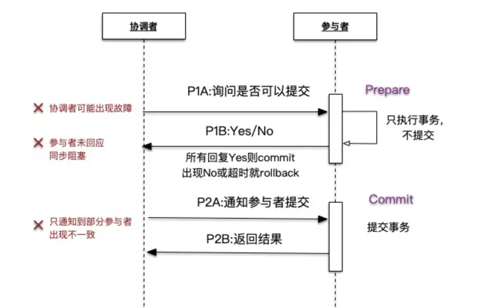
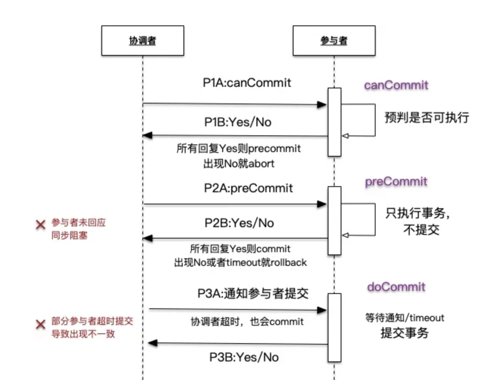

# 1 分布式一致性协议

分布式一致性协议是用于在分布式系统中实现数据一致性的协议。由于分布式系统中的数据存储和处理通常分布在多个节点上，节点之间存在网络延迟、通信故障和部分故障等问题，因此保持数据的一致性成为一个挑战。

分布式一致性协议旨在解决分布式系统中节点之间的数据一致性问题。它定义了一系列规则和约束，以确保在分布式环境中的数据操作具有原子性、一致性、隔离性和持久性（ACID）的特点。

# 2 2PC介绍

2PC的全称是Two-Phase Commit，它是一种经典的分布式一致性协议，用于确保分布式环境下的事务操作的原子性和一致性。2PC协议的特点是具有强一致性和原子性，即要么所有参与者都提交事务，要么都回滚事务。

二阶段提交协议的优点：原理简单，实现方便。

二阶段提交协议的缺点：同步阻塞、单点问题、脑裂、太过保守。

# 3 2PC的工作流程

阶段一：提交事务请求

1.事务询问。

协调者向所有的参与者发送事务内容，询问是否可以执行事务提交操作，并开始等待各参与者的响应。

2.执行事务。

各参与者节点执行事务操作，并将Undo和Redo信息记入事务日志中。

3.各参与者向协调者反馈事务询问的响应。

如果参与者成功执行了事务操作，那么就反馈给协调者 Yes 响应，表示事务可以执行；如果参与者没有成功执行事务，那么就反馈给协调者No响应，表示事务不可以执行。

由于上面讲述的内容在形式上近似是协调者组织各参与者对一次事务操作的投票表态过程，因此二阶段提交协议的阶段一也被称为“投票阶段”，即各参与者投票表明是否要继续执行接下去的事务提交操作。

阶段二：执行事务提交

在阶段二中，协调者会根据各参与者的反馈情况来决定最终是否可以进行事务提交操作，正常情况下，包含以下两种可能。

执行事务提交

假如协调者从所有的参与者获得的反馈都是Yes响应，那么就会执行事务提交。

1.发送提交请求。

协调者向所有参与者节点发出Commit请求。

2.事务提交。

参与者接收到 Commit 请求后，会正式执行事务提交操作，并在完成提交之后释放在整个事务执行期间占用的事务资源。

3.反馈事务提交结果。

参与者在完成事务提交之后，向协调者发送Ack消息。

4.完成事务。

协调者接收到所有参与者反馈的Ack消息后，完成事务。

中断事务

假如任何一个参与者向协调者反馈了No响应，或者在等待超时之后，协调者尚无法接收到所有参与者的反馈响应，那么就会中断事务。

1.发送回滚请求。

协调者向所有参与者节点发出Rollback请求。

2.事务回滚。

参与者接收到 Rollback 请求后，会利用其在阶段一中记录的 Undo 信息来执行事务回滚操作，并在完成回滚之后释放在整个事务执行期间占用的资源。

3.反馈事务回滚结果。

参与者在完成事务回滚之后，向协调者发送Ack消息。

4.中断事务。

协调者接收到所有参与者反馈的Ack消息后，完成事务中断。

以上就是二阶段提交过程中，前后两个阶段分别进行的处理逻辑。简单地讲，二阶段提交将一个事务的处理过程分为了投票和执行两个阶段，其核心是对每个事务都采用先尝试后提交的处理方式，因此也可以将二阶段提交看作一个强一致性的算法。

# 4 2PC缺点

同步阻塞

二阶段提交协议存在的最明显也是最大的一个问题就是同步阻塞，这会极大地限制分布式系统的性能。在二阶段提交的执行过程中，所有参与该事务操作的逻辑都处于阻塞状态，也就是说，各个参与者在等待其他参与者响应的过程中，将无法进行其他任何操作。

单点问题

在上面的讲解过程中，相信读者可以看出，协调者的角色在整个二阶段提交协议中起到了非常重要的作用。一旦协调者出现问题，那么整个二阶段提交流程将无法运转，更为严重的是，如果协调者是在阶段二中出现问题的话，那么其他参与者将会一直处于锁定事务资源的状态中，而无法继续完成事务操作。

数据不一致

在二阶段提交协议的阶段二，即执行事务提交的时候，当协调者向所有的参与者发送Commit请求之后，发生了局部网络异常或者是协调者在尚未发送完Commit请求之前自身发生了崩溃，导致最终只有部分参与者收到了Commit请求。于是，这部分收到了Commit请求的参与者就会进行事务的提交，而其他没有收到Commit请求的参与者则无法进行事务提交，于是整个分布式系统便出现了数据不一致性现象。

太过保守

如果在协调者指示参与者进行事务提交询问的过程中，参与者出现故障而导致协调者始终无法获取到所有参与者的响应信息的话，这时协调者只能依靠其自身的超时机制来判断是否需要中断事务，这样的策略显得比较保守。换句话说，二阶段提交协议没有设计较为完善的容错机制，任意一个节点的失败都会导致整个事务的失败。

# 5 XA和2PC

XA（Extended Architecture）是一种用于实现分布式事务的标准规范。它定义了事务管理器（Transaction Manager）和资源管理器（Resource Manager）之间的接口协议，确保在分布式环境中的事务执行的一致性和原子性。2PC是XA规范中实现分布式事务的协议之一。很多关系型数据库也实现了XA协议。

# 6 3PC

3PC，是Three-Phase Commit的缩写，即三阶段提交，是2PC的改进版，其将二阶段提交协议的“提交事务请求”过程一分为二，形成了由CanCommit、PreCommit和do Commit三个阶段组成的事务处理协议。

阶段一：CanCommit

1.事务询问。

协调者向所有的参与者发送一个包含事务内容的 canCommit请求，询问是否可以执行事务提交操作，并开始等待各参与者的响应。

2.各参与者向协调者反馈事务询问的响应。

参与者在接收到来自协调者的 canCommit请求后，正常情况下，如果其自身认为可以顺利执行事务，那么会反馈Yes响应，并进入预备状态，否则反馈No响应。

阶段二：PreCommit

在阶段二中，协调者会根据各参与者的反馈情况来决定是否可以进行事务的PreCommit操作，正常情况下，包含两种可能。

执行事务预提交

假如协调者从所有的参与者获得的反馈都是Yes响应，那么就会执行事务预提交。

1.发送预提交请求。

协调者向所有参与者节点发出preCommit的请求，并进入Prepared阶段。

2.事务预提交。

参与者接收到preCommit请求后，会执行事务操作，并将Undo和Redo信息记录到事务日志中。

3.各参与者向协调者反馈事务执行的响应。

如果参与者成功执行了事务操作，那么就会反馈给协调者Ack响应，同时等待最终的指令：提交（commit）或中止（abort）。

中断事务

假如任何一个参与者向协调者反馈了No响应，或者在等待超时之后，协调者尚无法接收到所有参与者的反馈响应，那么就会中断事务。

1.发送中断请求。

协调者向所有参与者节点发出abort请求。

2.中断事务。

无论是收到来自协调者的abort请求，或者是在等待协调者请求过程中出现超时，参与者都会中断事务。

阶段三：doCommit

该阶段将进行真正的事务提交，会存在以下两种可能的情况。

执行提交

1.发送提交请求。

进入这一阶段，假设协调者处于正常工作状态，并且它接收到了来自所有参与者的Ack响应，那么它将从“预提交”状态转换到“提交”状态，并向所有的参与者发送doCommit请求。

2.事务提交。

参与者接收到 doCommit 请求后，会正式执行事务提交操作，并在完成提交之后释放在整个事务执行期间占用的事务资源。

3.反馈事务提交结果。

参与者在完成事务提交之后，向协调者发送Ack消息。

4.完成事务。

协调者接收到所有参与者反馈的Ack消息后，完成事务。

中断事务

进入这一阶段，假设协调者处于正常工作状态，并且有任意一个参与者向协调者反馈了No响应，或者在等待超时之后，协调者尚无法接收到所有参与者的反馈响应，那么就会中断事务。

1.发送中断请求。

协调者向所有的参与者节点发送abort请求。

2.事务回滚。

参与者接收到abort请求后，会利用其在阶段二中记录的Undo信息来执行事务回滚操作，并在完成回滚之后释放在整个事务执行期间占用的资源。

3.反馈事务回滚结果。

参与者在完成事务回滚之后，向协调者发送Ack消息。

4.中断事务。

协调者接收到所有参与者反馈的Ack消息后，中断事务。

需要注意的是，一旦进入阶段三，可能会存在以下两种故障。

· 协调者出现问题。

· 协调者和参与者之间的网络出现故障。

无论出现哪种情况，最终都会导致参与者无法及时接收到来自协调者的doCommit或是abort请求，针对这样的异常情况，参与者都会在等待超时之后，继续进行事务提交。

优缺点

三阶段提交协议的优点：相较于二阶段提交协议，三阶段提交协议最大的优点就是降低了参与者的阻塞范围，并且能够在出现单点故障后继续达成一致。

三阶段提交协议的缺点：三阶段提交协议在去除阻塞的同时也引入了新的问题，那就是在参与者接收到preCommit消息后，如果网络出现分区，此时协调者所在的节点和参与者无法进行正常的网络通信，在这种情况下，该参与者依然会进行事务的提交，这必然出现数据的不一致性。

7 3PC对比2PC的改进之处

- 在第一阶段和第二阶段中插入一个准备阶段，第一阶段canCommit并不执行事务，这样当第一阶段失败或者timeout时，不占用事务资源不需要回滚(提高效率减少事务阻塞)。

- 引入超时机制。在2PC中，只有协调者拥有超时机制，3PC同时在协调者和参与者中都引入超时机制， 主要是避免了参与者在长时间无法与协调者节点通讯（协调者挂掉了）的情况下，无法释放资源的问题，因为参与者自身拥有超时机制会在超时后主动提交释放资源，降低了阻塞时间。由于有第一阶段canCommit的yes才会进入第三阶段，因而该阶段极大概率是commit而不是rollback，因而当协调者挂掉后，默认执行commit是最接近正确的行为。