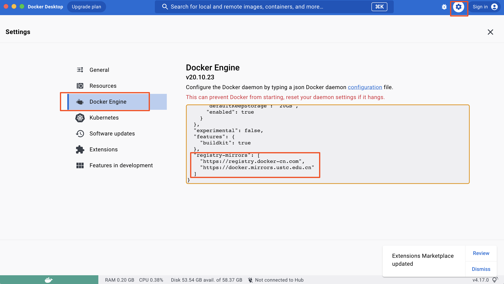
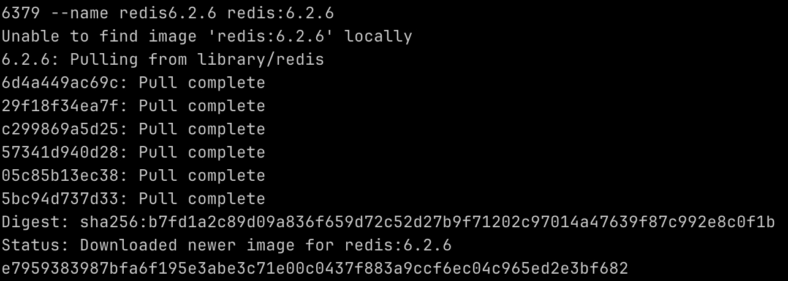
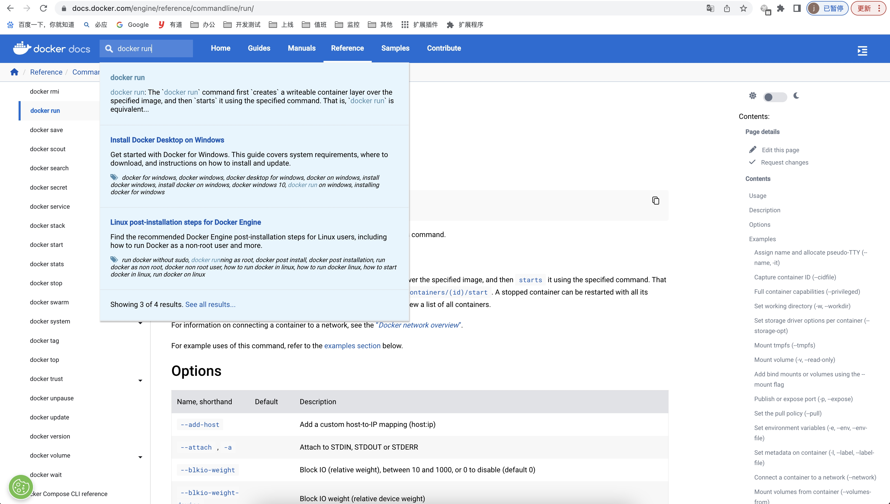
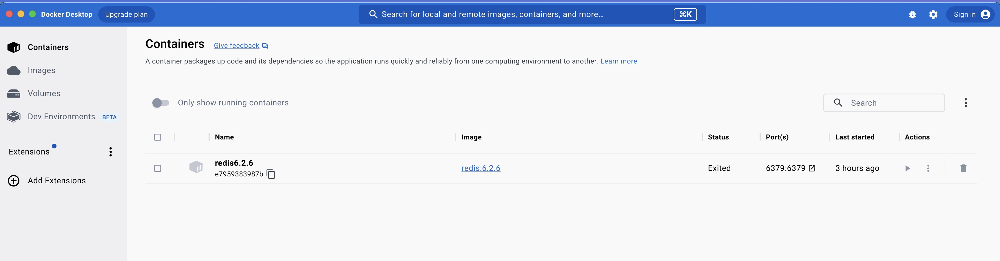
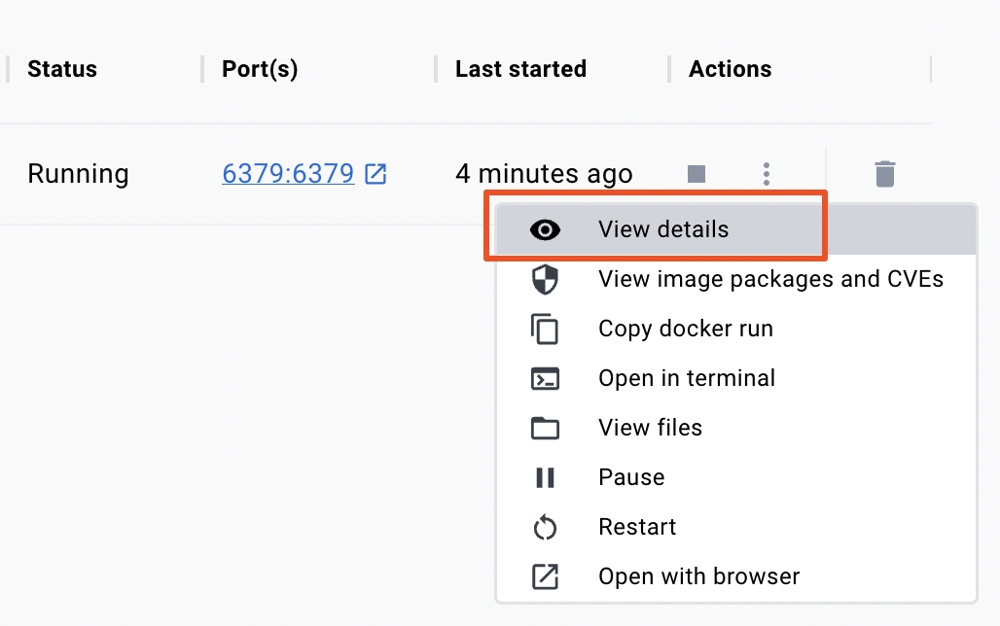
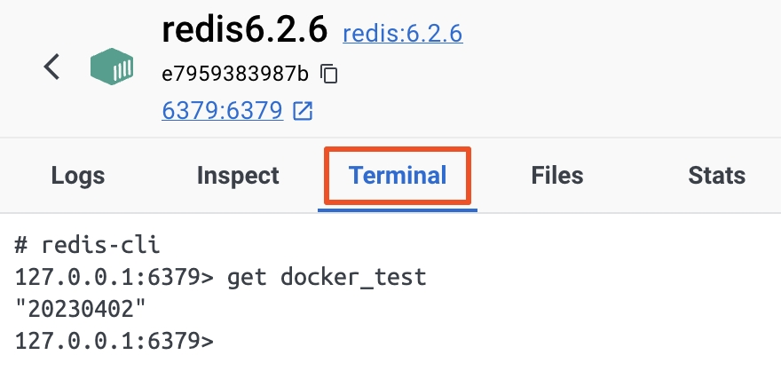
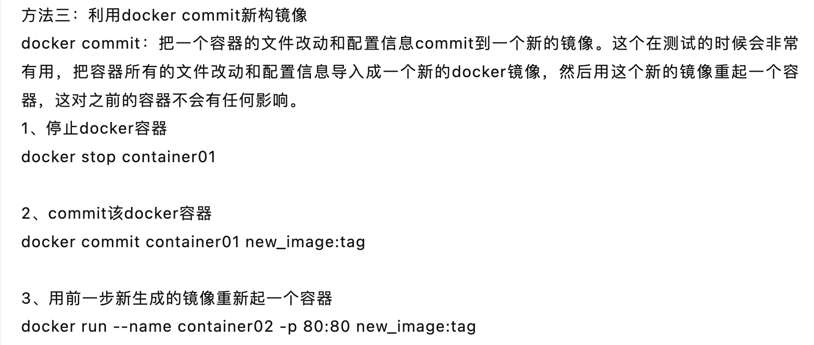

# 学习目的

就个人的目前情况来说，Docker学习并不是一个迫在眉睫的事情，公司有自己的容器化工具，不需要过多的关注这块的内容。但是为什么要学它呢？主要目的是为了学习Elasticsearch这个工具，要使用它不可避免的需要在电脑上安装它的运行环境。今天学这个明天学那个，电脑上安装了很多软件，基本很少使用，又不想卸载。在这种情况下，想到了使用Docker来管理这些软件，所以这个笔记命名为Docker_Get_started——Docker的快速入门。如果以后有必要的话，再做更深入的学习。Docker是什么，参考文章：https://zhuanlan.zhihu.com/p/187505981

# docker安装

docker本身需要依赖操作系统的环境，所以docker的安装也要看具体安装到什么操作系统下，比如Linux、windows、mac等。我的电脑是mac操作系统，所以选择mac桌面版的docker进行安装。在这里可以找到桌面版docker的安装包：https://www.docker.com/products/docker-desktop/。mac版本的安装只要双击下载好的Docker.dmg文件，将Docker拖拽到应用程序即可。安装完成后，在Finder的应用程序中就可以找到Docker。

如果使用的是windows操作系统，可以参考这个文章的简介和安装部分：https://docker.easydoc.net/doc/81170005/cCewZWoN/lTKfePfP

# 镜像加速

需要翻山越岭，给拉取镜像提个速。

Docker 中国官方镜像	https://registry.docker-cn.com

DaoCloud 镜像站	http://f1361db2.m.daocloud.io

Azure 中国镜像	https://dockerhub.azk8s.cn

科大镜像站	https://docker.mirrors.ustc.edu.cn

阿里云	https://ud6340vz.mirror.aliyuncs.com

七牛云	https://reg-mirror.qiniu.com

网易云	https://hub-mirror.c.163.com

腾讯云	https://mirror.ccs.tencentyun.com

```json
"registry-mirrors":[
        "https://registry.docker-cn.com",
        "https://docker.mirrors.ustc.edu.cn",
        "https://hub-mirror.c.163.com",
        "https://hub.daocloud.io"
    ]
```



# 使用docker安装redis

为什么是安装redis？前面不是说学习Elasticsearch？没办法,视频教程里面就是这样教的，而且本文的目的是为了学习Docker，redis还是Elasticsearch并不重要。

安装完docker后，再安装redis镜像只需要一个命令即可；

```shell
docker run -d -p 6379:6379 --name redis6.2.6 redis:6.2.6
```



- -d：这个命令表示后台运行

- -p：这个命令表示将docker中的6379端口映射到宿主机的6379端口

- --name：这个命令表示给镜像明明

- redis:6.2.6：这个表示拉取redis的镜像，版本号是6.2.6

想要了解docker的其他命令，可以在docker的官网文档中查找，文档地址：https://docs.docker.com/。比如要搜索run命令，如下图所示。



当命令执行成功，返回docker的控制台，查看容器和镜像情况。



redis已经通过docker容器运行起来了，如果本地安装了redis客户端，可以直接在本地访问，也可以在docker终端中访问redis。

- 本地方式

```shell
redis-cli  
127.0.0.1:6379> set docker_test '20230402'
OK
127.0.0.1:6379>
```

- 终端方式





# 安装Elasticsearch

```shell
# 拉取es镜像，版本为7.12.1
docker pull elasticsearch:7.14.1
# 查看已镜像
docker images
# 运行es镜像。-e表示设置环境变量，最后的字符串是本地已拉取的镜像id
docker run -d --name es -p 9200:9200 -p 9300:9300 -e "discovery.type=single-node" d090d5af83ca
```

下面是一段更复杂的脚本：

```shell
docker run -d \
	--name elasticsearch \
    -e "ES_JAVA_OPTS=-Xms512m -Xmx512m" \
    -e "discovery.type=single-node" \
    -v es-data:/usr/share/elasticsearch/data \
    -v es-plugins:/usr/share/elasticsearch/plugins \
    --privileged \
    --network itmentu-net \
    -p 9200:9200 \
    -p 9300:9300 \
elasticsearch:7.14.1
```

- -e "cluster.name=es-docker-cluster"：设置集群名称
- -e "http.host=0.0.0.0"：监听的地址，可以外网访问
- -e "ES_JAVA_OPTS=-Xms512m -Xmx512m"：内存大小
- -e "discovery.type=single-node"：非集群模式
- -v es-data:/usr/share/elasticsearch/data：挂载逻辑卷，绑定elasticsearch的数据目录
- -v es-logs:/usr/share/elasticsearch/logs：挂载逻辑卷，绑定elasticsearch的日志目录
- -v es-plugins:/usr/share/elasticsearch/plugins：挂载逻辑卷，绑定elasticsearch的插件目录
- --privileged：授予逻辑卷访问权
- --network itmentu-net ：加入一个名为itmentu-net的网络中
- -p 9200:9200：端口映射配置

在浏览器访问http://localhost:9200，返回如下json字符串，表示elasticsearch已安装成功。

```json
{
  "name" : "9046665f2b27",
  "cluster_name" : "docker-cluster",
  "cluster_uuid" : "sxwz868ATxqm0VtZxDeHeQ",
  "version" : {
    "number" : "7.12.1",
    "build_flavor" : "default",
    "build_type" : "docker",
    "build_hash" : "3186837139b9c6b6d23c3200870651f10d3343b7",
    "build_date" : "2021-04-20T20:56:39.040728659Z",
    "build_snapshot" : false,
    "lucene_version" : "8.8.0",
    "minimum_wire_compatibility_version" : "6.8.0",
    "minimum_index_compatibility_version" : "6.0.0-beta1"
  },
  "tagline" : "You Know, for Search"
}
```
# 安装kibana

Kibana是一个开源的分析与可视化平台，设计出来用于和Elasticsearch一起使用的。你可以用kibana搜索、查看存放在Elasticsearch中的数据。Kibana与Elasticsearch的交互方式是各种不同的图表、表格、地图等，直观的展示数据，从而达到高级的数据分析与可视化的目的。

```shell
docker pull kibana:7.14.1
```

本来在安装elasticsearch时，安装的是7.12.1版本，但是由于我本地是M1芯片，暂时没有找到能支持M1芯片的kibana的7.12.1版本，想尝试一下是否可以es使用7.12.1，kinana使用7.14.1，但是发现不可以，启动kibana容器的时候会报错：This version of Kibana (v7.14.1) is incompatible with the following Elasticsearch nodes in your cluster: v7.12.1 @ 172.17.0.2:9200 (172.17.0.2)。最终把两个版本都调整为7.14.1。

```shell
docker run --name kibana -e ELASTICSEARCH_HOSTS=http://192.168.10.183:9200 -p 5601:5601 -d kibana:7.14.1
```
这里启动kibana的时候，如果ip写成localhost或127.0.0.1会有问题，可以直接改成本地的ip地址。

浏览器访问：http://localhost:5601/


如果需要频繁修改ip地址（换了个网络），可以参考下面的办法：




