# 1.安装Python

## 版本选择

选择Python3版本

## windows安装

到官网下载python的安装版本，官网地址：https://www.python.org/

推荐参考文章：https://zhuanlan.zhihu.com/p/569019068

## mac安装

推荐文章：https://zhuanlan.zhihu.com/p/532840161#:~:text=%E5%9C%A8Mac%E4%B8%8A%E8%BF%9B%E8%A1%8CPython%E5%A4%9A%E7%89%88%E6%9C%AC%E5%88%87%E6%8D%A2%201%201%E3%80%81%E5%AE%89%E8%A3%85Homebrew%202,2%E3%80%81%E9%80%9A%E8%BF%87brew%E5%AE%89%E8%A3%85pyenv%203%203%E3%80%81%E4%BD%BF%E7%94%A8pyenv%E5%AE%89%E8%A3%85Python3%204%204%E3%80%81%E8%A7%A3%E5%86%B3Python%E7%94%A8pip%E5%91%BD%E4%BB%A4%E5%AE%89%E8%A3%85%E9%80%9F%E5%BA%A6%E6%85%A2%EF%BC%8C%E6%94%B9%E7%94%A8%E5%9B%BD%E5%86%85%E9%95%9C%E5%83%8F

前提电脑上安装了brew，推荐安装文章：https://blog.csdn.net/muyimo/article/details/125211460

```shell
vi ~/.bash_profile
```
在最后增加(然后保存退出) ：
    export PYENV_ROOT=~/.pyenv
    export PATH=$PYENV_ROOT/shims:$PATH
    eval "$(pyenv init -)"

source .bash_profile

查看可安装的Python版本：pyenv install --list

安装相应的版本(可去上面的官网查看版本)：pyenv install 3.10.12 -v

更新：pyenv rehash

切换python版本:

    pyenv global 3.10.12
    pyenv global system

查看当前python版本： python --version

如果没有生效，可能是已经安装了其他版本的Python，需要删除：

ls /Library/Frameworks/Python.framework/Versions/
sudo rm -rf /Library/Frameworks/Python.framework/Versions/版本号

然后重复执行pyenv global 3.10.12，最后重启shell即可

import os os.environ['TK_SILENCE_DEPRECATION'] = '1'

# 安装IDE

使用一款语言进行开发时，需要选择一个合适的IDE，这里选择使用PyCharm。

下载地址：https://www.jetbrains.com/pycharm/download/?section=mac

试用方法：https://blog.csdn.net/For_if_while/article/details/121513041

# Python基础

笔者在学习Python前具有java语言的相关经验，所以可能着重记录与Java的不同之处，相同之处忽略了。笔记以《Python编程快速上手：让繁琐的工作自动化》为基础。

## 表达式

在Python中，2 + 2称为“表达式”，它是语言中最基本的编程结构。表达式包含“值”（例如2）和“操作符”（例如+）。

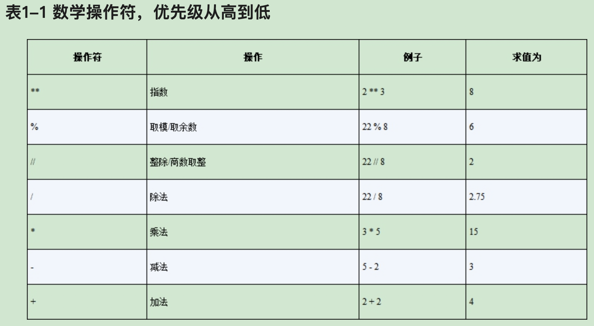

## 整形、浮点型、字符串

每个值都只属于一种数据类型。下图是常用的数据类型：int， float， strs（总是用单引号（'）包围住字符串）。

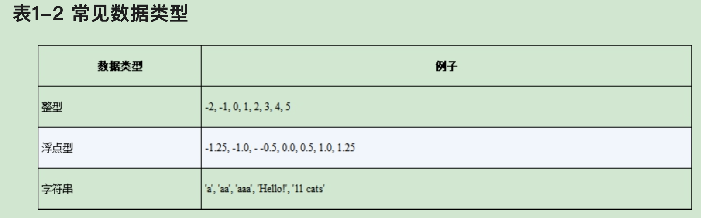

## 字符串连接和复制

加号在用于两个字符串时，它将字符串连接起来，成为“字符串连接”操作符。

'Alice' + 'Bob'
'AliceBob

字符串和数字连接将会报错
'Alice' + 42
Traceback (most recent call last):
   File "<pyshell#26>", line 1, in <module>
     'Alice' + 42
TypeError: Can't convert 'int' object to str implicitly

## 变量

spam = 'Hello'

变量只能是一个词，只能包含字母、数字、下划线，不能以数字开头。变量名区分大小写。

## 第一个程序

```python
# This program says hello and asks for my name.
print('Hello world!')
# ask for their name
print('What is your name?')
myName = input()
print('It is good to meet you, ' + myName)
print('The length of your name is:')
print(len(myName))
# ask for their age
print('What is your age?')
myAge = input()
print('You will be ' + str(int(myAge) + 1) + ' in a year.')

```
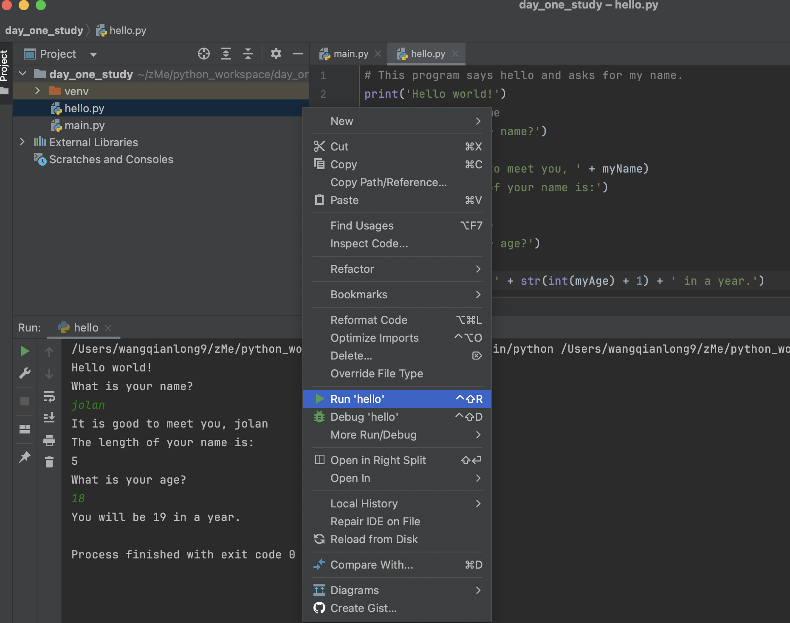

注释：使用#表示注释

print()：将括号内的字符串显示在屏幕上

input()：函数等待用户在键盘上输入一些文本，并按下回车键。

len()：字符串中字符的个数。

str(29)：表示把整形转为字符串形式。

int()：把字符串转为整形。如果传入的参数不能被转换为整形，则会报错。

int('99.99')
Traceback (most recent call last):
  File "<pyshell#18>", line 1, in <module>
    int('99.99')
ValueError: invalid literal for int() with base 10: '99.99'

float()：字符串转换为浮点数。

## 文本和数字相等判断

42 == '42'
False
42 == 42.0
True
42.0 == 0042.000
True

# 控制流

## 布尔值

略

## 比较操作符

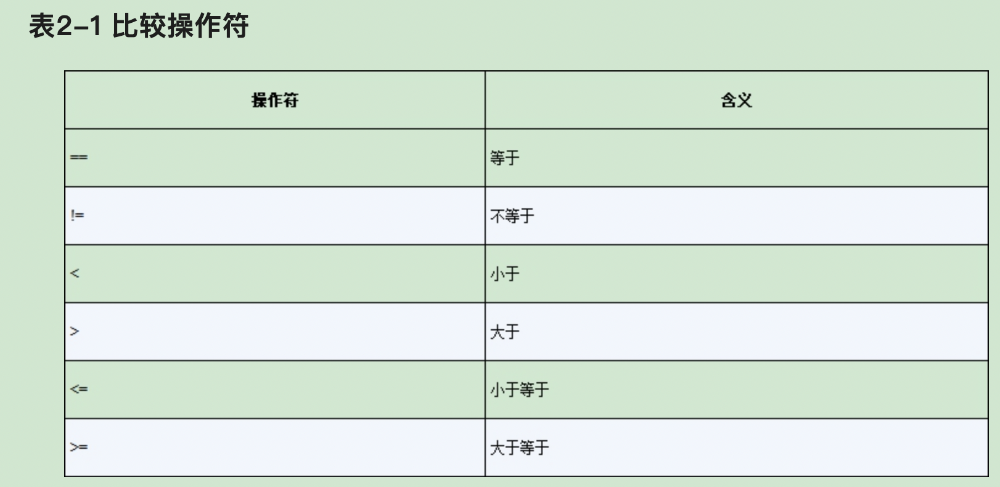

整型或浮点型的值永远不会与字符串相等。表达式42 == '42'求值为False是因为，Python认为整数42与字符串'42'不同。

另一方面，<、>、<=和>=操作符仅用于整型和浮点型值。int和float可以比较。

## not操作符

```shell
>>> not 　True
　False
>>> not not not not True
　True
```

## and和or操作符

```shell
>>> (4 < 5) and (5 < 6)
True
>>> (4 < 5) and (9 < 6)
False
>>> (1 == 2) or (2 == 2)
True
```

## 控制流的元素

### 条件

略

### 代码块

一些代码行可以作为一组，放在“代码块”中。可以根据代码行的缩进，知道代码块的开始和结束。代码块有3条规则。

1．缩进增加时，代码块开始。

2．代码块可以包含其他代码块。

3．缩进减少为零，或减少为外面包围代码块的缩进，代码块就结束了。

看一些有缩进的代码，更容易理解代码块。所以让我们在一小段游戏程序中，寻找代码块，如下所示：

```python
　if name == 'Mary':
    print('Hello Mary')
　if password == 'swordfish':
    print('Access granted.')
　else:
    print('Wrong password.')
```

## 控制流语句

### if语句

最常见的控制流语句是if语句。if语句的子句（也就是紧跟if语句的语句块），将在语句的条件为True时执行。如果条件为False，子句将跳过。

if关键字；
条件（即求值为True或False的表达式）；
冒号；
在下一行开始，缩进的代码块（称为if子句）。

### else语句

if子句后面有时候也可以跟着else语句。只有if语句的条件为False时，else子句才会执行。

```python
if name == 'Alice':
    print('Hi, Alice.')
else:
    print('Hello, stranger.')
```

### elif语句

相当于java中的else if。

```shell
if name == 'Alice':
    print('Hi, Alice.')
elif age < 12:
    print('You are not Alice, kiddo.')
```

### while循环

利用while语句，可以让一个代码块一遍又一遍的执行。只要while语句的条件为True，while子句中的代码就会执行。在代码中，while语句总是包含下面几部分：

关键字；
条件（求值为True或False的表达式）；
冒号；
从新行开始，缩进的代码块（称为while子句）。

```python
spam=0
while spam < 5:
    print('Hello, world.')
    spam=spam + 1
```

带break的while：

```python
while True:
    print('Please type your name.')
    name = input()
    if name == 'your name':
        break
print('Thank you!')
```

带continue的while

```python
while True:
    print('Who are you?')
    name = input()
    if name != 'Joe':
        continue
    print('Hello, Joe. What is the password? (It is a fish.)')
    password = input()
    if password == 'swordfish':
        break
print('Access granted.')

```

### 默认数据类型的布尔值

其他数据类型中的某些值，条件认为它们等价于True和False。在用于条件时，0、0.0和' '（空字符串）被认为是False，其他值被认为是True。比如下面这段程序的结果是True。

```python
name = ''
print(not name)

```

在代码中，for语句看起来像for i in range(5):这样，总是包含以下部分：

for关键字；
一个变量名；
in关键字；
调用range()方法，最多传入3个参数；
冒号；
从下一行开始，缩退的代码块（称为for子句）。

```python
print('My name is')
for i in range(5):
    print('Jimmy Five Times (' + str(i) + ')')
```

rang()函数最多可以输入三个参数。如果只有一个参数表示循环的上线，如果是两个参数表示循环的范围，如果是三个参数表示上限、下限、以及步长。

```python
for i in range(0, 10, 2):
    print(i)


```

```
0
2
4
6
8
```

## 导入模块

Python程序可以调用一组基本的函数，这称为“内建函数”，包括你见到过的print()、input()和len()函数。Python也包括一组模块，称为“标准库”。每个模块都是一个Python程序，包含一组相关的函数，可以嵌入你的程序之中。例如，math模块有数学运算相关的函数，random模块有随机数相关的函数，等等。

在开始使用一个模块中的函数之前，必须用import语句导入该模块。在代码中，import语句包含以下部分：

import关键字；
模块的名称；
可选的更多模块名称，之间用逗号隔开。

```python
import random
for i in range(5):
    print(random.randint(1, 10))


```

import语句的另一种形式包括from关键字，之后是模块名称，import关键字和一个星号，例如from random import *。

使用这种形式的import语句，调用random模块中的函数时不需要random.前缀。但是，使用完整的名称会让代码更可读，所以最好是使用普通形式的import语句。

## 提前结束程序

通过调用sys.exit()函数，可以让程序终止或退出。因为这个函数在sys模块中，所以必须先导入sys，才能使用它。

```python
import sys

while True:
    print('Type exit to exit.')
    response=input()
    if response == 'exit':
        sys.exit()
    print('You typed ' + response + '.')
```

# 函数

```python
def hello():
    print('Howdy!')
    print('Howdy!!!')
    print('Hello there.')


hello()
hello()
hello()
```

def语句，定义了一个名为hello()的函数。def语句之后的代码块是函数体。这段代码在函数调用时执行，而不是在函数第一次定义时执行。函数之后的hello()语句行是函数调用。

```
Howdy!
Howdy!!!
Hello there.
Howdy!
Howdy!!!
Hello there.
Howdy!
Howdy!!!
Hello there.
```

## def语句和参数

略

## 返回值和return语句

略

## None值

在Python中有一个值称为None，它表示没有值。None是NoneType数据类型的唯一值。

## 关键字参数和print()

### end关键字

end关键字表示不换行。观察下面代码和运行结果。

```python
print('Hello')
print('World')

print('Hello', end='')
print('World')
```

```
Hello
World
HelloWorld
```

### step关键字

step关键字可以将打印的字符串按照step关键字指定的字符串进行拼接。观察下面的代码和结果。

```python
print('cats', 'dogs', 'mice')

print('cats', 'dogs', 'mice', sep=',')


```

```
cats dogs mice
cats,dogs,mice
```

## global语句

如果需要在一个函数内修改全局变量，就使用global语句。如果在函数的顶部有global eggs这样的代码，它就告诉Python，“在这个函数中，eggs指的是全局变量，所以不要用这个名字创建一个局部变量。

比如要修改全局变量param的值，可以使用这种用法。这样在方法内部和方法外部都会输出2。

```python
def test_function():
    global param
    param += 1
    print('inner print:' + str(param))


param = 1
test_function()
print('outer print:' + str(param))
```

如果像java一样，如下所示，在方法中会输出2，在外面会输出1。那么说明python的参数传递是值传递么？这里先画一个问号？

```python
def test_function(param):
    param += 1
    print('inner print:' + str(param))


param = 1
test_function(param)
print('outer print:' + str(param))
```

## 变量作用域

有4条法则，来区分一个变量是处于局部作用域还是全局作用域：

1．如果变量在全局作用域中使用（即在所有函数之外），它就总是全局变量。

2．如果在一个函数中，有针对该变量的global语句，它就是全局变量。

3．否则，如果该变量用于函数中的赋值语句，它就是局部变量。

4．但是，如果该变量没有用在赋值语句中，它就是全局变量。

## 异常处理

错误可以由try和except语句来处理。那些可能出错的语句被放在try子句中。如果错误发生，程序执行就转到接下来的except子句开始处。一旦执行跳到except子句的代码，就不会回到try子句。它会继续照常向下执行。

```python
def spam(divideBy):
    try:
        return 42 / divideBy
    except ZeroDivisionError:
        print('Error: Invalid argument.')


print(spam(2))
print(spam(12))
print(spam(0))
print(spam(1))

```

```
21.0
3.5
Error: Invalid argument.
None
42.0
```
## 猜数游戏

展示一个简单的猜数字游戏。如下所示：

```
I am thinking of a number between 1 and 20.
Take a guess.
10
Your guess is too low.
Take a guess.
15
Your guess is too low.
Take a guess.
17
Your guess is too high.
Take a guess.
16
Good job! You guessed my number in 4 guesses!
```

我编写的代码:

```python
import random


def compare(input_number):
    if input_number == random_number:
        return True
    elif input_number < random_number:
        print('Your guess is too low.')
    else:
        print('Your guess is too high.')
    print('Take a guess.')
    return False


random_number = random.randint(1, 20)
times = 0
print('I am thinking of a number between 1 and 20.')
while True:
    times += 1
    if compare(int(input())):
        break
print('Good job! You guessed my number in ' + str(times) + ' guesses!')

```

书中案例：

```python
# This is a guess the number game.
import random
secretNumber=random.randint(1, 20)
print('I am thinking of a number between 1 and 20.')

# Ask the player to guess 6 times.
for guessesTaken in range(1, 7):
    print('Take a guess.')
    guess=int(input())

    if guess < secretNumber:
        print('Your guess is too low.')
    elif guess > secretNumber:
        print('Your guess is too high.')
    else:
        break # This condition is the correct guess!
if guess == secretNumber:
    print('Good job! You guessed my number in ' + str(guessesTaken) + ' guesses!')
else:
    print('Nope. The number I was thinking of was ' + str(secretNumber))
```


# 列表

## 列表定义和常用方法

```python
spam=['cat', 'bat', 'rat', 'elephant']
```

列表可以按下表取值，下表从0开始。如果下表超过列表长度，将会报错。

列表也可以包括其他列表值，比如：

```python
spam=[['cat', 'bat'], [10, 20, 30, 40, 50]]
```

如果需要打印出bat可以这样写：spam[0][1]

列表还可以使用负数下标。-1表示列表的最后一个元素，-2表示倒数第二个元素，以此类推。

列表切片，也就是列表截取。如果要截取spam的第1个到第2个元素，可以这样写：spam[0:3]，中括号中的冒号左边表示其实位置，冒号右边表示截止位置，但是不包括这个位置。

作为快捷方法，你可以省略切片中冒号两边的一个下标或两个下标。省略第一个下标相当于使用0，或列表的开始。省略第二个下标相当于使用列表的长度，意味着分片直至列表的末尾。

len()函数可以用来获取列表的长度，如获取spam列表的长度可以这样写：len(spam)。如果len中的参数不是一个列表类型将会报错。

spam[1]='jolan'，表示将列表中第2个元素的值修改为jolan。

+操作可以连接两个列表。

```python
list1 = [1, 2, 3]
list2 = ['lucy', 'jim']
list3 = list1 + list2
for frequency in range(len(list1) + len(list2)):
    print(list3[frequency])
```

```
1
2
3
lucy
jim
```

*可以实现列表的复制，如spam * 3表示列表变为原来的3份

```python
['X', 'Y', 'Z'] * 3
```

del可以从列表中删除元素，如下面的代码将输出1 3

```python
list1 = [1, 2, 3]
del list1[1]
print(list1[0], list1[1])
```

## in和not in

利用in和not in操作符，可以确定一个值是否在列表中。如下面代码将输出True和False。

```python
list1 = [1, 2, 3]
print(1 in list1)
print(4 in list1)


```

### 列表的快速赋值

将列表中的值快速的赋值给多个变量。如下面一段代码，将输出：fat black loud

```python
cat = ['fat', 'black', 'loud']
size, color, disposition = cat
print(size, color, disposition)


```

变量的数目和列表的长度必须严格相等，否则Python将给报错。

## 增强的赋值操作

针对+、-、*、/和%操作符，都有增强的赋值操作符

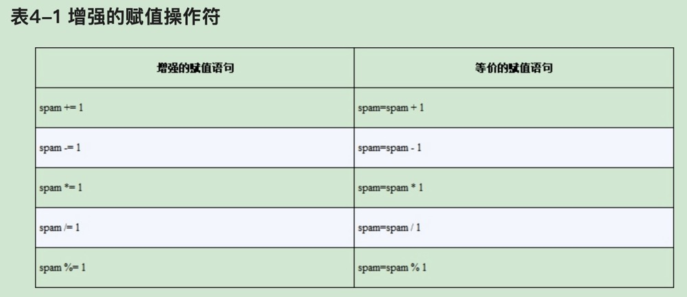

## 列表的方法

### index

列表值有一个index()方法，可以传入一个值，如果该值存在于列表中，就返回它的下标。如果该值不在列表中，Python就报ValueError。列表值有一个index()方法，可以传入一个值，如果该值存在于列表中，就返回它的下标。如果该值不在列表中，Python就报ValueError。如果列表中存在重复的值，就返回它第一次出现的下标。

```python
cat = ['fat', 'black', 'loud', 'fat']
print(cat.index('black'))
print(cat.index('dog'))


```

### append和insert

append是在列表的最后添加元素，insert是在指定的下表插入元素。

```python
pet = ['dog', 'cat', 'snake']
pet.append('duck')
print(pet)
pet.insert(1, 'chicken')
print(pet)


```

```
['dog', 'cat', 'snake', 'duck']
['dog', 'chicken', 'cat', 'snake', 'duck']
```

### remove

给 remove()方法传入一个值，它将从被调用的列表中删除。如果该值在列表中出现多次，只有第一次出现的值会被删除。和del相比较，remove是按照元素的值删除，del是按照下标来删除。

```python
pet = ['dog', 'cat', 'snake']
pet.append('duck')
print(pet)
pet.insert(1, 'chicken')
print(pet)
pet.remove('duck')
del pet[-1]
print(pet)
```

```
['dog', 'cat', 'snake', 'duck']
['dog', 'chicken', 'cat', 'snake', 'duck']
['dog', 'chicken', 'cat']
```

## sort

对列表进行排序。排序时，需要注意一下几点。

- 不能对既有数字又有字符串值的列表排序，因为Python不知道如何比较它们。

- sort()方法对字符串排序时，使用“ASCII字符顺序”，而不是实际的字典顺序。

- 如果需要按照普通的字典顺序来排序，就在sort()方法调用时，将关键字参数key设置为str.lower。它不会修改列表中的实际值。

- 可以指定reverse关键字为True来对列表进行倒序排列

```python
pet = ['dog', 'cat', 'Tiger', 'panda']
pet.sort()
print(pet)
pet.sort(reverse=True)
print(pet)
pet.sort(reverse=True, key=str.lower)
print(pet)


```

## 类似列表的类型：字符串和元组

对列表的许多操作，也可以作用于字符串：按下标取值、切片、用于for循环、用于len()，以及用于in和not in操作符。

```python
strs = 'excellence'
print(strs[0])
print(strs[2:5])
print(strs.index('l'))
print('exc' in strs)
for i in strs:
    print('*** ' + i + ' ***')


```

```
e
cel
4
True
*** e ***
*** x ***
*** c ***
*** e ***
*** l ***
*** l ***
*** e ***
*** n ***
*** c ***
*** e ***
```

但列表和字符串在一个重要的方面是不同的。列表是“可变的”数据类型，它的值可以添加、删除或改变。但是，字符串是“不可变的”，它不能被更改。尝试对字符串中的一个字符重新赋值，将导致TypeError错误。

“改变”一个字符串的正确方式，是使用切片和连接。构造一个“新的”字符串，从老的字符串那里复制一些部分。

```python
strs = 'I am best'
s = strs[0:4] + ' the ' + strs[5:10]
print(strs)
print(s)


```

查看下面的代码，虽然box的结果都是[4, 5, 6]，但是第一种是覆盖了box中的值，而第二种是修改了box。

```python
box = [1, 2, 3]
box = [4, 5, 6]
print(box)
box = [1, 2, 3]
box = [4, 5, 6]
del box[2]
del box[1]
del box[0]
box.append(4)
box.append(5)
box.append(6)
print(box)


```

下图中的eggs就是代码中的box：

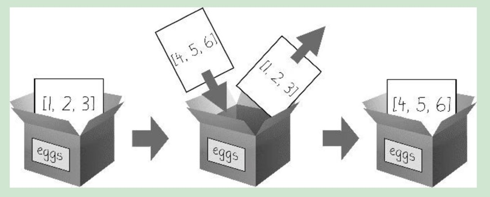

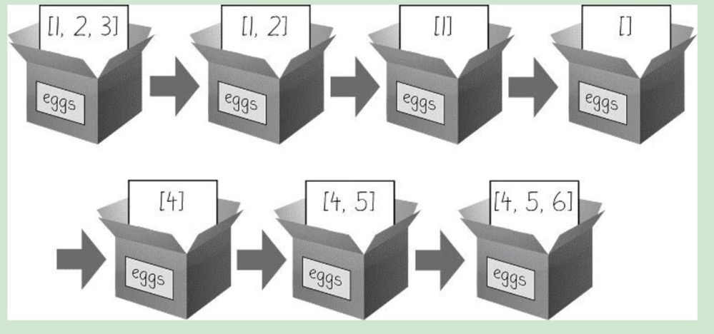

## 元组数据类型

除了两个方面，“元组”数据类型几乎与列表数据类型一样。

- 元组输入时用圆括号()，而不是用方括号[]

- 元组像字符串一样，是不可变的。元组不能让它们的值被修改、添加或删除。下面的代码会报错：TypeError: 'tuple' object does not support item assignment


```python
container = ('egg', 98, 'books')
container[1] = 99


```

如果元组中只有一个元素，需要在第一个元素后面加一个逗号，表明它是一个元组，否则，Python将认为，你只是在一个普通括号内输入了一个值。

## list和tuple方法

list方法可以将元组转换为列表，tuple可以将列表转换为元组。

```python
print(tuple(['cat', 'dog', 5]))
print(list(('cat', 'dog', 5)))
print(list('hello'))


```

## 引用

在下面的代码中，当修改了spam的值，cheese并不会变化。下面代码会输出100, 50

```python
spam = 50
cheese = spam
spam = 100
print(str(spam) + ', ' + str(cheese))


```

但是列表并不是这样，列表的赋值是引用赋值。

```python
box = [1, 2, 3, 4, 5]
container = box
container[1] = 10
print(box)
print(container)


```

### 传递引用

在函数调用时，如果参数是一个列表，那么它传递的是引用，而不是值，如下面代码，输出结果是：[1, 2, 3, 'Hello']

```python
def eggs(some_parameter):
    some_parameter.append('Hello')


spam = [1, 2, 3]
eggs(spam)
print(spam)

```

### copy和deepcopy

如果不想在列表互相赋值时使用引用，可以使用copy模块。如果列表中嵌套列表，则使用copy模块中的deepcopy方法。

```python
import copy

box = ['1', '2', '3']
container = copy.copy(box)
container[1] = '5'
print(box)
print(container)

```

```
['1', '2', '3']
['1', '5', '3']
```

# 字典和结构化数据

字典输入时带花括号{}

```python
my_dog = {'name': 'mc', 'size': 'little', 'age': '5'}
# {'name': 'mc', 'size': 'little', 'age': '5'}
print(my_dog)
# little
print(my_dog['size'])


```

尝试访问字典中不存在的键，将导致KeyError出错信息。

可以用in来判断字典key是否在字典中。

```python
my_dog = {'name': 'mc', 'size': 'little', 'age': '5'}
# {'name': 'mc', 'size': 'little', 'age': '5'}
print(my_dog)
# little
print(my_dog['size'])
if 'size' in my_dog:
    # dog size is:little
    print('dog size is:' + my_dog['size'])

```

## keys() values() items()

分别用来获取字典的key列表，value列表，和键值对列表。但是它们不是真正的列表，它们不能被修改，没有append()方法。

```python
dic = {'goods': 'cup', 'color': 'white'}
for v in dic.values():
    # cup
    # white
    print(v)
for k in dic.keys():
    # goods
    # color
    print(k)
for item in dic.items():
    # ('goods', 'cup')
    # ('color', 'white')
    print(item)

```

## 检查字典中是否存在键和值

```python
dic = {'goods': 'cup', 'color': 'white'}
if 'goods' in dic.keys():
    print(True)
else:
    print(False)
if 'cup' in dic.values():
    print(True)
else:
    print(False)
# 这是'goods' in dic.keys()的简单写法，
if 'goods' in dic:
    print(True)
else:
    print(False)
    
```

## get()

当无法确定一个键是否存在时，可以使用get方法，当存在这个键则返回对应键的值，否则返回备用值。如果不指定备用值并且字典中没有这个键，则返回None。

```python
dic = {'goods': 'cup', 'color': 'white'}
# cup
print(dic.get('goods', 'whatever'))
# whatever
print(dic.get('age', 'whatever'))
# None
print(dic.get('age'))


```

## setdefault()

setdefault给字典中没有的键设置一个默认值

```python
dic = {'goods': 'cup', 'color': 'white'}
dic.setdefault('factory', 'made in China')
dic.setdefault('color', 'black')
# made in China
print(dic.get('factory', 'America'))
# white
print(dic.get('color', 'red'))


```

## 漂亮打印

```python
import pprint

dic = {'goods': 'cup', 'color': 'white'}
dic.setdefault('factory', 'made in China')
dic.setdefault('color', 'black')
# made in China
print(dic.get('factory', 'America'))
# white
print(dic.get('color', 'red'))
print(dic)
pprint.pprint(dic)

```

# 字符串操作

如何输出I'm the king，print('I'm the king')这样是不行的，因为Python认为字符串在I之后就结束了。

## 双引号

可以使用双引号输出。

```python
print("I'm the king")

```

## 转义符

可以使用转义符输出，在Python中，反斜杠\表示转移。

```python
print('I\'m the king')

```

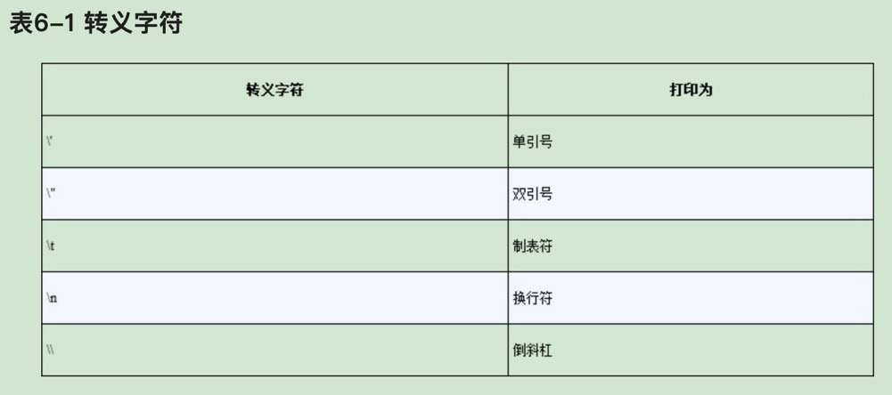

## 原始字符串

可以在字符串开始的引号之前加上r，使它成为原始字符串。“原始字符串”完全忽略所有的转义字符，打印出字符串中所有的倒斜杠

```python
# I\'m the king
print(r'I\'m the king')

```

## 三重引号

三个引号可以包括任何形式的字符串，包括单引号。

```python
print('''Dear darling
    I'm your king
your king''')

```

```
Dear darling
    I'm your king
your king
```

## 多行注释

两边用三个双引号包围的内容是多行文本注释。

## 字符串下标和切片

可以像操作列表一样操作字符串。但是下面的这些操作没有真正改变这些字符串的值。

```python
strs = 'Hello Python!'
# H
print(strs[0])
# o
print(strs[4])
# !
print(strs[-1])
# Hello Python!
print(strs)


```

## in和not in

```python
# True
print('Hello' in 'Hello World')
# True
print('Hello' in 'Hello')
# False
print('HELLO' in 'Hello World')
# True
print('' in 'spam')
# False
print('cats' not in 'cats and dogs')

```

## 常用字符串方法

- upper()：字符串转大写

- lower()：字符串转小写

- isupper()：是否全部是大写字符串，返回True或False

- islower()：是否全是小写字符串

- isalpha()返回True，如果字符串只包含字母，并且非空；

- isalnum()返回True，如果字符串只包含字母和数字，并且非空；

- isdecimal()返回True，如果字符串只包含数字字符，并且非空；

- isspace()返回True，如果字符串只包含空格、制表符和换行，并且非空；

- istitle()返回True，如果字符串仅包含以大写字母开头、后面都是小写字母的单词。

- startswith()：是否以参数中的字符串开始

- endswith()：是否以参数中的字符串结束

- join()：join()方法在一个字符串上调用，参数是一个字符串列表，返回一个字符串。', '.join(['cats', 'rats', 'bats'])这段代码，将输出'cats, rats, bats'

- split()：split()方法它针对一个字符串调用，返回一个字符串列表。

- rjust()和ljust（）：rjust()和ljust()字符串方法返回调用它们的字符串的填充版本，通过插入空格来对齐文本。这两个方法的第一个参数是一个整数长度，用于对齐字符串。比如'Hello'.rjust(10)，输出'      Hello'。这两个方法还可以加入第二个参数，也就是用来填充的字符串，'Hello'.rjust(10, '*')，输出' *****Hello'。

- center()：它表示居中对齐，用法同上。

- strip()、rstrip()和lstrip()：删除字符串的两边空格\制表符\换行符、右侧空格\制表符\换行符、左侧空格\制表符\换行符。

## pyperclip模块

pyperclip模块有copy()和paste()函数，可以向计算机的剪贴板发送文本，或从它接收文本。将程序的输出发送到剪贴板，使它很容易粘贴到邮件、文字处理程序或其他软件中。

```python
import pyperclip
pyperclip.copy('Hello world!')


```

在运行完这段代码后，直接使用粘贴快捷键将输出：'Hello world!'

# 模糊查找和正则表达式

Python中所有正则表达式的函数都在re模块中。向re.compile()传入一个字符串值，表示正则表达式，它将返回一个Regex模式对象（或者就简称为Regex对象).

Regex对象的search()方法查找传入的字符串，寻找该正则表达式的所有匹配。如果字符串中没有找到该正则表达式模式，search()方法将返回None。如果找到了该模式，search()方法将返回一个Match对象。Match对象有一个group()方法，它返回被查找字符串中实际匹配的文本。

```python
import re

phone_number_regex = re.compile(r'\d\d\d\d\d\d\d\d\d\d\d')
mo = phone_number_regex.search('我的电话号码是13888888888')
print(mo.group())


```

//todo

# 读写文件


## 文件夹分隔符

os.path.join()函数用来将参数中的路径使用操作系统的文件夹分隔符分割，然后返回一个路径字符串。但是如果使用的是类似linux的操作系统，得到路径的最前面是没有斜杠的。

```python
import os

# root/python
print(os.path.join('root', 'python'))

```

## 当前路径

使用os.getcwd()获取当前路径。

```python
import os

# /Users/xxx/zMe/python_workspace/day_one_study
print(os.getcwd())

```

## 绝对路径和相对路径

“绝对路径”，总是从根文件夹开始。

“相对路径”，它相对于程序的当前工作目录。

还有点（.）和点点（..）文件夹。它们不是真正的文件夹，而是可以在路径中使用的特殊名称。单个的句点（“点”）用作文件夹目名称时，是“这个目录”的缩写。两个句点（“点点”）意思是父文件夹。

相对路径开始处的.\是可选的。例如，.\spam.txt和spam.txt指的是同一个文件。


## 创建文件夹

os.makedirs()函数创建新文件夹

```python
import os

# 当前目录下新建了一个new_folder的文件夹。也可以使用绝对路径创建
os.mkdir('new_folder')

```

## 相对路径和绝对路径常用方法

- 调用os.path.abspath(path)将返回参数的绝对路径的字符串。这是将相对路径转换为绝对路径的简便方法。

- 调用os.path.isabs(path)，如果参数是一个绝对路径，就返回True，如果参数是一个相对路径，就返回False。

- 调用os.path.relpath(path, start)将返回从start路径到path的相对路径的字符串。如果没有提供start，就使用当前工作目录作为开始路径。

- 调用os.path.dirname(path)将返回一个字符串，它包含path参数中最后一个斜杠之前的所有内容。

- 调用os.path.basename(path)将返回一个字符串，它包含path 参数中最后一个斜杠之后的所有内容。

- 如果同时需要一个路径的目录名称和基本名称，就可以调用os.path.split()

- os.path.sep：根据操作系统获取文件夹分隔符

```python
import os

# /Users/xxx/zMe/python_workspace/day_one_study
print(os.path.abspath('.'))
# True.实际上当前并没有这个绝对路径。所以它更像一个正则验证，而无法判断路径实际是否存在
print(os.path.isabs('/Tester/my/python'))
# ../../../../..
print(os.path.relpath('/', '.'))
# .   一个点就是它返回的内容
print(os.path.dirname('./day_one_study-hello.py'))
# day_one_study-hello.py
print(os.path.basename('./day_one_study-hello.py'))
# ('/usr/lib/zsh/5.8.1/zsh', 'attr.so')
print(os.path.split('/usr/lib/zsh/5.8.1/zsh/attr.so'))
# ('/usr/lib/zsh/5.8.1', 'zsh')
print(os.path.split('/usr/lib/zsh/5.8.1/zsh'))
# /
print(os.path.sep)


```

## 查看文件大小和内容

- 调用os.path.getsize(path)将返回path参数中文件的字节数

- 调用os.listdir(path)将返回文件名字符串的列表，包含path参数中的每个文件（请注意，这个函数在os模块中，而不是os.path）

```python
import os

# 167520
print(os.path.getsize('/usr/lib/zsh/5.8.1/zsh/attr.so'))
# ['5.8.1']
print(os.listdir('/usr/lib/zsh'))

```

## 检查路径有效性

```python
import os

# False
print(os.path.exists('F:\\'))

```

## 文件读写过程

在Python中，读写文件有3个步骤：

1．调用open()函数，返回一个File对象。

2．调用File对象的read()或write()方法。

3．调用File对象的close()方法，关闭该文件。

### open()函数打开文件

要用open()函数打开一个文件，就要向它传递一个字符串路径，表明希望打开的文件。open默认是读模式，当文件以读模式打开时，Python只让你从文件中读取数据，你不能以任何方式写入或修改它。在Python中打开文件时，读模式是默认的模式。但如果你不希望依赖于Python的默认值，也可以明确指明该模式，向open()传入字符串'r'，作为第二个参数。所以open('路径', 'r')和open('路径')做的事情一样。

### 读取文件内容

如果你希望将整个文件的内容读取为一个字符串值，就使用File对象的read()方法。

或者，可以使用readlines()方法，从该文件取得一个字符串的列表。列表中的每个字符串就是文本中的每一行。

```python
import os.path

# 在当前路径创建一个hello_python.txt的文件，文件内容为：hello python! \n hello world!
file_path = os.path.abspath('hello_python.txt')
hello_file = open(file_path)
# hello python!
# hello world!
print(hello_file.read())
# [] 注释调上面一行将输出：['hello python!\n', 'hello world!']
print(hello_file.readlines())


```

### 写入文件

写模式将覆写原有的文件，从头开始，就像你用一个新值覆写一个变量的值。将'w'作为第二个参数传递给open()，以写模式打开该文件。

不同的是，添加模式将在已有文件的末尾添加文本。你可以认为这类似向一个变量中的列表添加内容，而不是完全覆写该变量。将'a'作为第二个参数传递给open()，以添加模式打开该文件。

如果传递给 open()的文件名不存在，写模式和添加模式都会创建一个新的空文件。在读取或写入文件后，调用close()方法，然后才能再次打开该文件。

```python
# 首先，以写模式打开当前目录的file_operate.txt文件（当前目录无此文件）
file_operate = open('file_operate.txt', 'w')
# 向文件中写入first of all, write something.\n  在写入前，由于文件不存在会先创建文件
# write()方法不会像print()函数那样，在字符串的末尾自动添加换行字符。必须自己添加该字符。
file_operate.write('first of all, write something.\n')
# 关闭文件
file_operate.close()
# 以添加模式打开文件
file_operate = open('file_operate.txt', 'a')
# 向文件中写入then, append some word.
file_operate.write('then, append some word.')
# 关闭文件
file_operate.close()
# 读取文件
file_operate = open('file_operate.txt', 'r')
content = file_operate.read()
print(content)


```

## 用shelve模块保存变量

利用shelve模块，程序可以从硬盘中恢复变量的数据，让你在程序中添加“保存”和“打开”功能。

```python
import shelve

# 将配置写入文件
config = shelve.open('config')
pets = ['cat', 'doy', 'slave']
config['pets'] = pets
config.close()
# 从配置文件读取
config = shelve.open('config')
# 打印类型 <class 'shelve.DbfilenameShelf'>
print(type(config))
# ['cat', 'doy', 'slave']
print(config['pets'])
config.close()

```

如果使用文本编辑器打开这个配置文件，无法正常阅读，如下所示。


## 用pprint.pformat()函数保存变量

pprint.pformat()函数与pprint.pprint()函数类似，将返回同样的文本字符串，但不是打印它。pprint.pformat()函数将提供一个字符串，你可以将它写入.py文件。

```python
import pprint

dogs = [{'name': 'Sophie', 'desc': 'chubby'}, {'name': 'Polka', 'desc': 'fluffy'}]
print(pprint.pformat(dogs))
file_obj = open('my_dogs.py', 'w')
file_obj.write('dogs=' + pprint.pformat(dogs) + '\n')
file_obj.close()

```

# 组织文件

## shutil模块

### 赋值文件和文件夹

调用shutil.copy(source, destination)，将路径source处的文件复制到路径destination处的文件夹（source和destination都是字符串）。

shutil.copytree()将复制整个文件夹，以及它包含的文件夹和文件。

```python
import os
import shutil

# 将my_dogs.py文件复制到当前目录的shutil文件夹。需要提前创建shutil文件夹，否则会报错No such file or directory: 'shutil/'
new_file_path = shutil.copy('my_dogs.py', os.path.join('shutil', ''))
# shutil/my_dogs.py
print(new_file_path)
# 将my_dogs.py文件复制到当前目录的shutil文件夹并命名为my_cats.py
new_file_path = shutil.copy('my_dogs.py', os.path.join('shutil', 'my_cats.py'))
# shutil/my_cats.py
print(new_file_path)
# 将shutil复制到20230721文件夹。20230721文件夹中也包含my_dogs.py和my_cats.py两个文件
new_file_path = shutil.copytree('shutil', '20230721')
# 20230721
print(new_file_path)

```

### 文件夹的移动和改名

调用shutil.move(source, destination)，将路径source处的文件夹移动到路径destination，并返回新位置的绝对路径的字符串。

```python
import os
import shutil

# 将my_dogs.py移动到shutil文件夹
# 如果shutil中存在这个文件，报错：Destination path 'shutil/my_dogs.py' already exists
shutil.move('my_dogs.py', 'shutil')
# 将shutil文件夹中的my_dogs.py移动到当前文件夹，并重命名为my_pets.py
shutil.move('shutil' + os.path.sep + 'my_dogs.py', 'my_pets.py')

```

### 永久删除文件和文件夹

用os.unlink(path)将删除path处的文件。
调用os.rmdir(path)将删除path处的文件夹。该文件夹必须为空，其中没有任何文件和文件夹。
调用shutil.rmtree(path)将删除path处的文件夹，它包含的所有文件和文件夹都会被删除。

```python
import os

for filename in os.listdir():
    if filename.endswith('.rts'):
        # 如果不确定有哪些文件夹，可以先进行打印print(filename)，并且把下面的删除语句去掉。笔者不小心把当前路径的py文件全部删除了，哭死
        os.unlink(filename)

```

### send2trash安全删除

因为Python内建的shutil.rmtree()函数不可恢复地删除文件和文件夹，所以用起来可能有危险。删除文件和文件夹的更好方法，是使用第三方的send2trash模块。你可以在终端窗口中运行pip install send2trash，安装该模块（参见附录A，其中更详细地解释了如何安装第三方模块）。


```python
import send2trash

# 创建一个bacon.txt文件
baconFile = open('bacon.txt', 'a')
# 写入文本
baconFile.write('Bacon is not a vegetable.')
baconFile.close()
# 被删除的bacon.txt文件可以在废纸篓（mac电脑）中找到
send2trash.send2trash('bacon.txt')

```

## 遍历目录树

os.walk()函数可以遍历目录下的所有文件和文件夹。

os.walk()在循环的每次迭代中，返回3个值：

1．当前文件夹名称的字符串。

2．当前文件夹中子文件夹的字符串的列表。

3．当前文件夹中文件的字符串的列表。

在当前文件夹创建main文件夹，main文件夹中创建sub1和sub2文件夹，在sub2文件夹中创建file.txt文件。然后执行下面代码。

```python
import os

for folderName, sub_folders, filenames in os.walk('main'):
    print('The current folder is ' + folderName)

    for sub_folder in sub_folders:
        print('SUB FOLDER OF ' + folderName + ': ' + sub_folder)
    for filename in filenames:
        print('FILE INSIDE ' + folderName + ': ' + filename)

```

```
The current folder is main
SUB FOLDER OF main: sub1
SUB FOLDER OF main: sub2
FILE INSIDE main: .DS_Store
The current folder is main/sub1
The current folder is main/sub2
FILE INSIDE main/sub2: file.txt
```

## 用zipfile模块解压文件

利用zipfile模块中的函数，Python程序可以创建和打开（或解压）ZIP文件。

ZipFile对象的extractall()方法从ZIP文件中解压缩所有文件和文件夹，放到当前工作目录中。

```python
import zipfile

# 在当前路径创建zip_folder文件夹，进入该文件夹创建inner_folder文件夹、file.txt文件、other_file.txt
zip_holder = zipfile.ZipFile('zip_folder.zip')
# ['zip_folder/', 'zip_folder/file.txt',
# 'zip_folder/.DS_Store', '__MACOSX/zip_folder/._.DS_Store', 'zip_folder/other_file.txt', 'zip_folder/inner_folder/']
# 有一些隐藏文件
print(zip_holder.namelist())
file_holder = zip_holder.getinfo('zip_folder/other_file.txt')
# 0 为什么是0和2这里没搞明白
print(file_holder.file_size)
# 2
print(file_holder.compress_size)
# 解压到当前文件夹
zip_holder.extractall()
zip_holder.close()


```


要创建你自己的压缩ZIP文件，必须以“写模式”打开ZipFile对象，即传入'w'作为第二个参数（这类似于向open()函数传入'w'，以写模式打开一个文本文件）。

```python
import zipfile

# 创建一个new.zip压缩文件
new_zip = zipfile.ZipFile('new.zip', 'w')
# 在压缩文件中写入hello_python.txt文件。这个文件必须是当前存在的
new_zip.write('hello_python.txt', compress_type=zipfile.ZIP_DEFLATED)
new_zip.close()

```

# 调试

## 抛出异常

抛出异常使用raise语句。在代码中，raise语句包含以下部分：

raise关键字；
对Exception函数的调用；
传递给Exception函数的字符串，包含有用的出错信息。

如果没有try和except语句覆盖抛出异常的raise语句，该程序就会崩溃，并显示异常的出错信息。

通常是调用该函数的代码知道如何处理异常，而不是该函数本身。

```python
def box_print(symbol, width, height):
    if len(symbol) != 1:
        raise Exception('Symbol must be a single character string.')
    if width <= 2:
        raise Exception('Width must be greater than 2.')
    if height <= 2:
        raise Exception('Height must be greater than 2.')
    print(symbol * width)
    for i in range(height - 2):
        print(symbol + (' ' * (width - 2)) + symbol)
        print(symbol * width)


for sym, w, h in (('*', 4, 4), ('O', 20, 5), ('x', 1, 3), ('ZZ', 3, 3)):
    try:
        box_print(sym, w, h)
    except Exception as err:
        print('An exception happened: ' + str(err)) 
```

## 错误写到日志文件

但你也可以调用traceback.format_exc()，得到它的字符串形式。

```python
import traceback

try:
    raise Exception('This is the error message')

except:
    error_file = open('error.txt', 'w')
    error_file.write(traceback.format_exc())
    error_file.close()
    print('the traceback info was written to error.txt.')

```

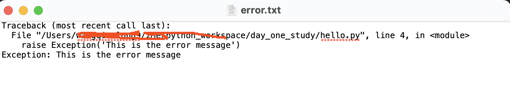


## 断言

assert语句包含以下部分：

assert关键字；
条件（即求值为True或False的表达式）；
逗号；
当条件为False时显示的字符串。

```python
open_status = 'open'
# 正常执行，不会输出任何字符串
assert open_status == 'open', 'the open status should be open'
open_status = 'close'
# AssertionError: the open status should be open
assert open_status == 'open', 'the open status should be open'

```

## 禁用断言

在运行Python时传入-O选项，可以禁用断言。如果你已完成了程序的编写和测试，不希望执行心智正常检测，从而减慢程序的速度，这样就很好（尽管大多数断言语句所花的时间，不会让你觉察到速度的差异）。


## 日志

### 使用日志模块

通过下面的代码片段，可以通过合适的日志进行调试

```python
import logging

logging.basicConfig(level=logging.DEBUG, format=' %(asctime)s - %(levelname)s-   %(message)s')
logging.debug('Start of program')


def factorial(n):
    logging.debug('Start of factorial(%s)' % n)
    total = 1
    # 错误写法
    for i in range(n + 1):
        # 正确下发是下面的，阶乘计算应该从1开始，上面的默认是从0开始
        # for i in range(1, n + 1):
        total *= i
        logging.debug('i is ' + str(i) + ', total is ' + str(total))
    logging.debug('End of factorial(%s)' % n)
    return total


print(factorial(5))
logging.debug('End of program')

```

```
2023-07-23 16:27:18,111 - DEBUG-   Start of program
 2023-07-23 16:27:18,111 - DEBUG-   Start of factorial(5)
 2023-07-23 16:27:18,111 - DEBUG-   i is 0, total is 0
 2023-07-23 16:27:18,111 - DEBUG-   i is 1, total is 0
 2023-07-23 16:27:18,111 - DEBUG-   i is 2, total is 0
 2023-07-23 16:27:18,111 - DEBUG-   i is 3, total is 0
 2023-07-23 16:27:18,111 - DEBUG-   i is 4, total is 0
 2023-07-23 16:27:18,111 - DEBUG-   i is 5, total is 0
 2023-07-23 16:27:18,111 - DEBUG-   End of factorial(5)
 2023-07-23 16:27:18,111 - DEBUG-   End of program
0
```

日志消息的好处在于，你可以随心所欲地在程序中想加多少就加多少，稍后只要加入一次logging.disable（logging.CRITICAL）调用，就可以禁止日志。不像print()，logging模块使得显示和隐藏日志信息之间的切换变得很容易。

### 日志级别

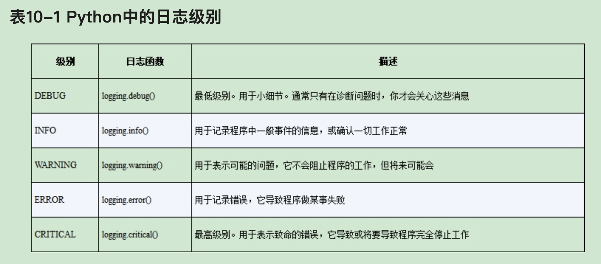

### 禁用日志

在调试完程序后，你可能不希望所有这些日志消息出现在屏幕上。logging. disable() 函数禁用了这些消息，这样就不必进入到程序中，手工删除所有的日志调用。只要向logging.disable() 传入一个日志级别，它就会禁止该级别和更低级别的所有日志消息

```python
import logging

logging.basicConfig(level=logging.DEBUG, format=' %(asctime)s - %(levelname)s-   %(message)s')

# 输出
logging.warning('warning error')
# 禁用WARNING 级别一下的日志
logging.disable(logging.WARNING)
# 不输出
logging.debug('debug message')
# 输出
logging.critical('Critical error!Critical error!')
# 输出
logging.error('Error!Error')

```

如果需要禁用所有日志，可以使用logging.disable(logging.CRITICAL)

## 将日志记录到文件

除了将日志消息显示在屏幕上，还可以将它们写入文本文件。logging.basic Config() 函数接受filename关键字参数。

```python
import logging
logging.basicConfig(level=logging.DEBUG, format=' %(asctime)s - %(levelname)s-   %(message)s')

logging.debug('record debug info to file')

```


## IDLE调试器

略

# 从Web抓取信息

## 通过浏览器打开指定URL

下面的代码将打开浏览器，并自动访问github。

```python
import webbrowser

webbrowser.open('https://www.github.com')

```

## 处理命令行参数

创建map_it.py文件

```python
#! python3
# map_it.py - Launches a map in the browser using an address from the
# command line or clipboard.

import sys
import webbrowser

import pyperclip

# sys.argv表示获取启动参数
if len(sys.argv) > 1:
    # 打印从命令行获取启动的参数
    print(sys.argv)
    # 1:表示从第一个元素开始截取，也就是说去掉第0个元素
    address = ''.join(sys.argv[1:])
    # 打印address
    print(address)
else:
    # 从剪切板获取地址
    address = pyperclip.paste()
# 打来浏览器地址，并且在后面拼接url参数
webbrowser.open('https://www.google.com/maps/place/' + address)


```

在命令行执行，看到如下输出，同时浏览器会打开代码中的地址。

```shell
python map_it.py 870 Valencia St, San Francisco, CA 94110
['map_it.py', '870', 'Valencia', 'St,', 'San', 'Francisco,', 'CA', '94110']
870ValenciaSt,SanFrancisco,CA94110
```


## 从web下载文件

requests模块让你很容易从Web下载文件，requests模块不是Python自带的，所以必须先安装。通过命令行，运行pip install requests。

### 使用requests下载一个网页

requests.get()函数接受一个要下载的URL字符串。通过在requests.get()的返回值上调用type()，你可以看到它返回一个Response对象，其中包含了Web服务器对你的请求做出的响应。

```python
import requests

res = requests.get('https://www.gutenberg.org/cache/epub/1112/pg1112.txt')
# 查看res的类型<class 'requests.models.Response'>
print(type(res))
# 判断返回码
success = res.status_code == requests.codes.ok
# True
print(success)
# 返回结果文本长度：179380
print(len(res.text))
# 打印文本的前250个字符
# The Project Gutenberg EBook of Romeo and Juliet, by William Shakespeare
#
#
# *******************************************************************
# THIS EBOOK WAS ONE OF PROJECT GUTENBERG'S EARLY FILES PRODUCED AT A
# TIME WHEN PROOFING METHODS AND TOO
print(res.text[:250])

```

### 检查错误

检查成功有一种简单的方法，就是在Response对象上调用raise_for_status()方法。如果下载文件出错，这将抛出异常。如果下载成功，就什么也不做。

```python
import requests

res = requests.get('https://inventwithpython.com/page_that_does_not_exist')
try:
    # requests.exceptions.HTTPError: 404 Client Error: Not Found for url: https://inventwithpython.com/page_that_does_not_exist
    res.raise_for_status()
except Exception as exc:
    # There was a problem: 404 Client Error: Not Found for url: https://inventwithpython.com/page_that_does_not_exist
    print('There was a problem: %s' % exc)


```

## 保存下载文件

为了将Web页面写入到一个文件，可以使用for循环和Response对象的iter_content()方法。

```python
import requests

# 获取URL资源
res = requests.get('https://www.gutenberg.org/cache/epub/1112/pg1112.txt')
# 判断是否成功
res.raise_for_status()
# 以二进制方式打开文件
# wb:二进制写入，如果该文件已存在则打开文件，并从开头开始编辑，即原有内容会被删除。如果该文件不存在，创建新文件。一般用于非文本文件如图片等
# https://blog.csdn.net/BJ1599449/article/details/125256878
play_file = open('RomeoAndJuliet.txt', 'wb')
# 每次读取100000字节，并写入文件
for chunk in res.iter_content(100000):
    play_file.write(chunk)
# 关闭文件
play_file.close()

```
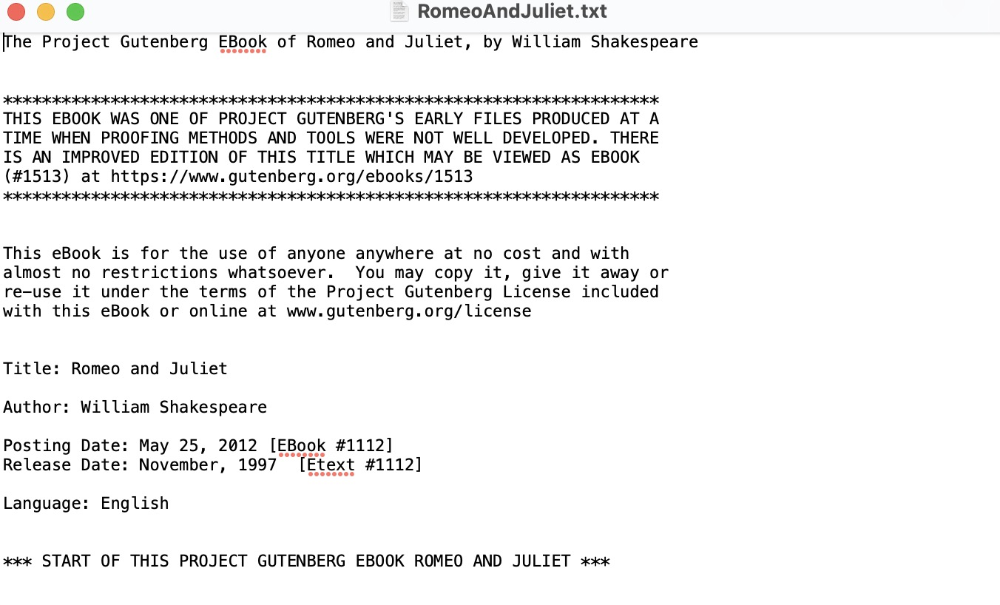

## 用BeautifulSoup模块解析HTML

BeautifulSoup模块的名称是bs4（表示Beautiful Soup，第4版）。要安装它，需要在命令行中运行pip install beautifulsoup4.

现在，先创建一个example.html文件，用来后面解析测试使用，代码如下.

```html
<!-- This is the example.html example file. -->

<html><head><title>The Website Title</title></head>
<body>
<p>Download my <strong>Python</strong> book from <a href="https://
inventwithpython.com">my website</a>.</p>
<p class="slogan">Learn Python the easy way!</p>
<p>By <span id="author">Al Sweigart</span></p>
</body></html>

```

### 从HTML创建一个BeautifulSoup对象

bs4.BeautifulSoup()函数调用时需要一个字符串，其中包含将要解析的HTML。

```python
import bs4
import requests

# 获取URL资源
res = requests.get('https://nostarch.com')
# 判断状态
res.raise_for_status()
# 创建BeautifulSoup对象
no_starch_soup = bs4.BeautifulSoup(res.text)
# 查看类型
print(type(no_starch_soup))

```

### 用select()方法寻找元素

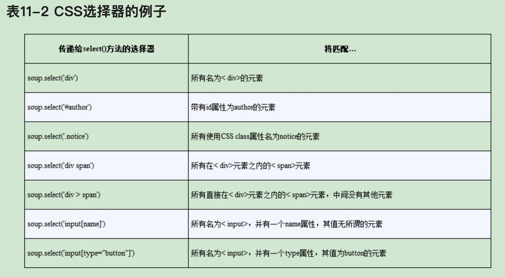

select()方法将返回一个Tag对象的列表，这是Beautiful Soup表示一个HTML元素的方式。针对BeautifulSoup对象中的HTML的每次匹配，列表中都有一个Tag对象。Tag值可以传递给str()函数，显示它们代表的HTML标签。Tag值也可以有attrs属性，它将该Tag的所有HTML属性作为一个字典。

```python
import bs4

# 打开example.html文件
exampleFile = open('example.html')
# 创建BeautifulSoup对象
exampleSoup = bs4.BeautifulSoup(exampleFile.read())
# 获取id属性为author的元素列表
elems = exampleSoup.select('#author')
# 打印元素类型 <class 'bs4.element.ResultSet'>
print(type(elems))
# 打印元素长度 1
print(len(elems))
# 打印第元素类型 <class 'bs4.element.Tag'>
print(type(elems[0]))
# 打印第一个元素的文本内容 Al Sweigart
print(elems[0].getText())
# 打印第一个元素的html代码 <span id="author">Al Sweigart</span>
print(str(elems[0]))
# 打印第一个元素的属性 {'id': 'author'}
print(elems[0].attrs)

```


### 通过元素的属性获取数据

Tag对象的get()方法让我们很容易从元素中获取属性值。向该方法传入一个属性名称的字符串，它将返回该属性的值。

```python
import bs4

soup = bs4.BeautifulSoup(open('example.html'))
# 查找span元素
spanElem = soup.select('span')[0]
# <span id="author">Al Sweigart</span>
print(str(spanElem))
id_element = spanElem.get('id')
# author
print(id_element)
# True
print(spanElem.get('some_nonexistent_addr') is None)
# {'id': 'author'}
print(spanElem.attrs)

```

## 用selenium模块控制浏览器

### 用selenium启动浏览器

导入selenium的模块import selenium，而是要运行from selenium import webdriver

```python
from selenium import webdriver
from selenium.webdriver.chrome.options import Options

# 设置浏览器不会自动关闭
opt = Options()
opt.add_experimental_option('detach', True)
browser = webdriver.Chrome(options=opt)
# <class 'selenium.webdriver.chrome.webdriver.WebDriver'>
print(type(browser))
# 使用浏览器打开参数中的地址
browser.get('https://www.baidu.com')

```

### 在页面中寻找元素

WebDriver对象有好几种方法，用于在页面中寻找元素。它们被分成findelement和findelements方法。findelement方法返回一个WebElement对象，代表页面中匹配查询的第一个元素。findelements方法返回WebElement_*对象的列表，包含页面中所有匹配的元素。

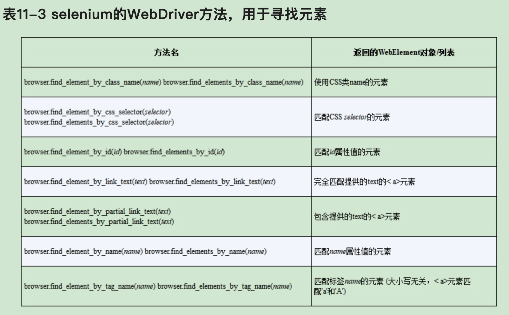

除了*_by_tag_name()方法，所有方法的参数都是区分大小写的。如果页面上没有元素匹配该方法要查找的元素，selenium模块就会抛出NoSuchElement异常。如果你不希望这个异常让程序崩溃，就在代码中添加try和except语句。

一旦有了WebElement对象，就可以读取表11-4中的属性，或调用其中的方法，了解它的更多功能。

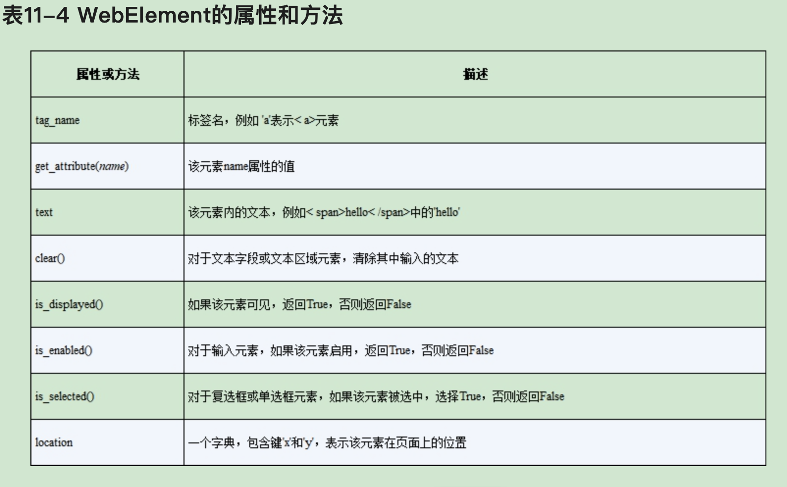

### 点击页面

findelement和findelements方法返回的WebElement对象有一个click()方法，模拟鼠标在该元素上点击。

下面的例子将打开springcloud的官网，并点击SAMPLES按钮。


```python
from selenium import webdriver
from selenium.webdriver.chrome.options import Options
from selenium.webdriver.common.by import By

# 设置浏览器不会自动关闭
opt = Options()
opt.add_experimental_option('detach', True)
browser = webdriver.Chrome(options=opt)
browser.get('https://spring.io/projects/spring-cloud')
link_elem = browser.find_element(By.XPATH, '//*[@id="main"]/div[1]/div/div[2]/div[1]/ul/li[3]/a')
print(type(link_elem))
link_elem.click()

```

### 填写并提交表单

向Web页面的文本字段发送击键，只要找到那个文本字段的< input>或< textarea>元素，然后调用send_keys()方法。

```python
from selenium import webdriver
from selenium.webdriver.chrome.options import Options
from selenium.webdriver.common.by import By

# 设置浏览器不会自动关闭
opt = Options()
opt.add_experimental_option('detach', True)
browser = webdriver.Chrome(options=opt)
# 自动登录139邮箱
browser.get('https://mail.10086.cn/')
email_elem = browser.find_element(By.ID, 'txtMobile')
email_elem.send_keys('not_my_real_email@gmail.com')
password_elem = browser.find_element(By.ID, 'txtSms')
password_elem.send_keys('123456')
password_elem.submit()

```

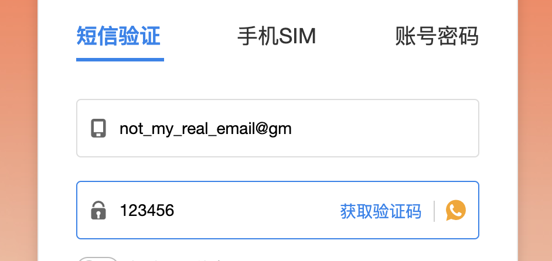


### 特殊键

selenium有一个模块，针对不能用字符串值输入的键盘击键。它的功能非常类似于转义字符。这些值保存在selenium.webdriver.common.keys模块的属性中。在程序顶部运行from selenium.webdriver. common.keys import Keys。

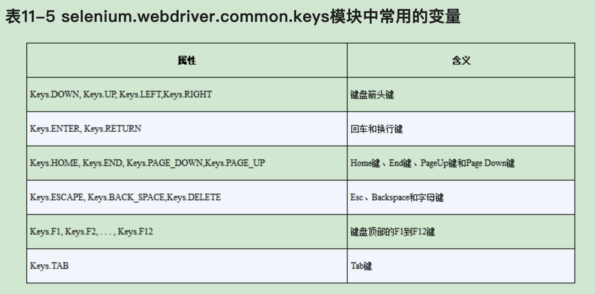


