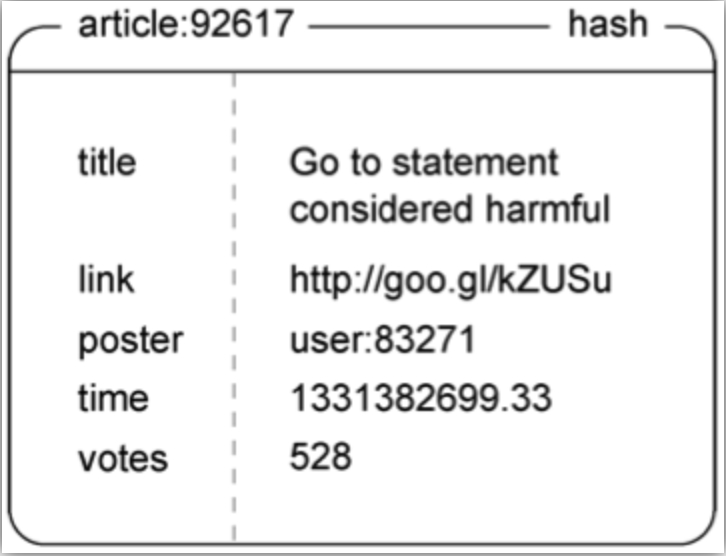
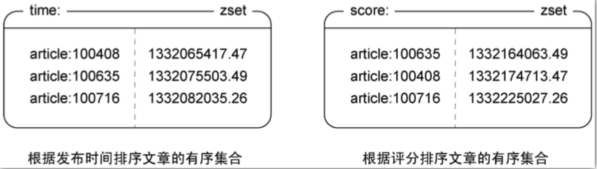
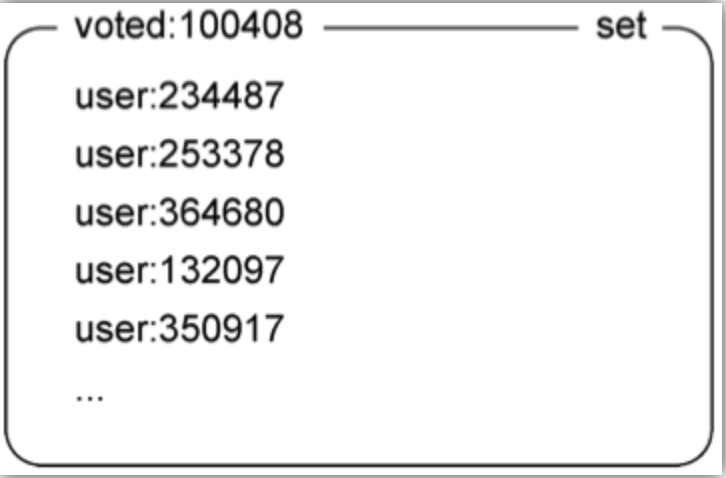
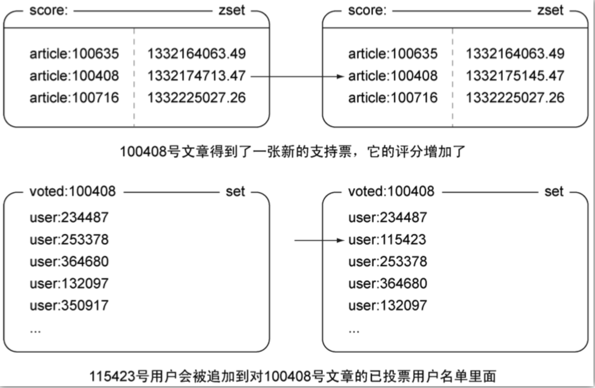

# 对文章进行投票

## 要求

- 一篇文章获得了至少200票，那么网站认为这篇文章是一篇有趣的文章。

- 假如这个网站每天发布1000篇文章，而其中的50篇复核网站对有趣文章的要求，那么网站要做的就是把这50篇文章放到文章课表前100位至少一天

- 暂不提供反对票功能。

- 文章评分随时间逐渐减少。具体的方法为：文章得到的支持票数量乘以一个常量，然后加上文章的发布时间，得出结果就是文章评分。

- 常量数值：一天的秒数除以文章展示一天所需的支持票 = 86400 / 200 = 432

- 评分规则：适用unix时间的秒数作为评分，如1331382699.33

- 分隔符：适用英文冒号作为分割符

## 数据结构设计



### 文章结构

- redis类型：hash

- 键：文章的命名空间 + 分隔符 + 文章id。如：article:92617

- title：文章标题

- link：文章链接

- poster：发布人

- time：发布时间

- votes：票数


### 排序结构





1. 按发布时间排序

- redis类型：zset

- 键 : time

- 元素：文章的hash键，如article:92617

- score：zset是具有分支权重的集合，每个元素的权重是文章发布时间，如1332065417.47。这样就可以把文章按照发布时间排序

2. 按分支排序

- redis类型：zset

- 键 : score

- 元素：文章的hash键，如article:92617

- score：每个元素的权重是文章的分值。

### 投票文章名单



为防止用户重复给同一个文章投票，需要某个用户是否已经投票过。为了节省内存，设置文章一周以后不在支持投票，并且删除投票文章名单。

- redis类型：set

- 键：投票命名空间+分隔符+文章id。如：voted:100408

- 元素：用户命名空间+分隔符+用户id。如：user:234487

## 发布文章

```shell
# 生成文章id
> incr articleCounter
(integer) 1
# 设置文章投票用户的set，作者不能自己投票自己
> sadd voted:1 user:666
(integer) 1
# 设置投票set的过期时间为1周
> expire voted:1 604800
(integer) 1
# 发布文章
> hmset article:1 title articleVote link www.baidu.com poster user:1 time time.time() votes 0
OK
> hgetall article:1
1) "title"
2) "articleVote"
3) "link"
4) "www.baidu.com"
5) "poster"
6) "user:1"
7) "time"
8) "time.time()"
9) "votes"
10) "0"
# 记录文章发表时间
> zadd articleTimer 1332164063.49 "article:1"
(integer) 1
# 记录文章排名（初始排名和当前时间一致）
> zadd articleScore 1332164063.49 "article:1"
(integer) 1
```

## 投票

1. 使用zscore查看文章是否发布一周

2. 使用sadd将投票用户增加到文章投票集合中

3. 如果添加成功说明有户是第一次投票，使用zincrby为文章评分增加432，并使用hincrby对文章的投票数进行更新（自增）。


