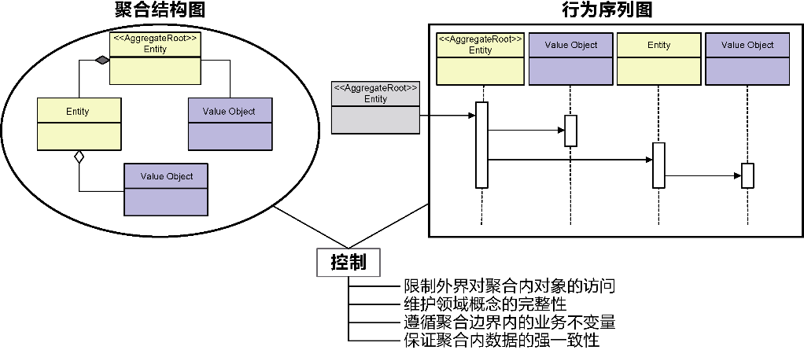

### 1.2.1 规模

软件开发的拥堵现象或许更严重，这是因为：函数存在副作用，调用时可能对函数的结果做了隐含的假设；类的职责繁多，导致开发人员不敢轻易修改，因为不知会影响到哪些模块；热点代码被频繁变更，职责被包裹了一层又一层，没有清晰的边界；在系统某个角落，隐藏着伺机而动的bug，当诱发条件具备时，就会让整条调用链瘫痪；不同的业务场景包含了不同的例外场景，每种例外场景的处理方式都各不相同；同步处理代码与异步处理代码纠缠在一起，不可预知程序执行的顺序。

我们在构建软件时无法避免技术债（technical debt）[2]。不管软件的架构师与开发人员有多么的优秀，他们针对目前需求做出的看似合理的技术决策，都会随着软件的演化变得不堪一击，区别仅在于债务的多少，以及偿还的利息有多高。

软件规模的一个显著特征是代码行数（lines of code）。然而，代码行数常常具有欺骗性。如果需求的功能数量与代码行数之间呈现出不成比例的关系，说明该系统的生命体征可能出现了异常，例如，代码行数的庞大其实可能是一种肥胖症，意味着可能出现了大量的重复代码。

例如使用面向对象设计质量评估的平台工具iPlasma，通过它生成的指标可以作为评价软件规模的要素

### 1.2.2 结构

康威定律（Conway’s law）[4]就指出：“任何组织在设计一套系统（广义概念上的系统）时，所交付的设计方案在结构上都与该组织的沟通结构保持一致。”

与设计方案相匹配的团队结构指的是负责开发的团队组织，而非使用软件产品的客户团队。

《架构之美》中第2章“两个系统的故事：现代软件神话”详细地罗列了无序设计系统的几种警告信号[5]34：代码没有显而易见的进入系统中的路径；不存在一致性，不存在风格，也没有能够将不同的部分组织在一起的统一概念；系统中的控制流让人觉得不舒服，无法预测；系统中有太多的“坏味道”；数据很少放在它被使用的地方，经常引入额外的巴洛克式缓存层，试图让数据停留在更方便的地方。

## 1.3 预测能力

毫无疑问，影响预测能力的关键要素在于变化。对变化的应对不妥，就会导致过度设计或设计不足。

### 1.3.2 设计不足

我们无法预知未来，自然就无法预测未来可能发生的变化，这就带来了软件系统的不可预测性。软件设计者不可能对变化听之任之，却又因为它的不可预测性而无可适从。在软件系统不断演化的过程中，面对变化，我们需要尽可能地保证方案的平衡：既要避免因为设计不足使得变化对系统产生根本影响，又要防止因为满足可扩展性让方案变得格外复杂，最后背上过度设计的坏名声。故而，变化之难，难在如何在设计不足与过度设计之间取得平衡。

# 第2章 领域驱动设计概览

领域驱动设计是一种思维方式，也是一组优先任务，它旨在加速那些必须处理复杂领域的软件项目的开发。为了实现这个目标，本书给出了一套完整的设计实践、技术和原则。

结合我们通过理解能力和预测能力两个维度对软件系统复杂度成因的剖析，确定了影响复杂度的3个要素：规模、结构与变化。控制复杂度的着力点就在这3个要素之上！

### 2.1.1 领域驱动设计元模型

领域驱动设计元模型是以模式的形式呈现在大家眼前的，由诸多松散的模式构成

### 2.1.2 问题空间和解空间

人类是通过在问题空间（problem space）中寻找解决方案来解决问题的”[9]，构建软件（世界）也就是从真实世界中的问题空间寻找解决方案，将其映射为理念世界的解空间（solution space）来满足问题空间的需求。因此，软件系统的构建实则是对问题空间的求解，以获得构成解空间的设计方案

对于客户提出的需求，要分清楚什么是问题，什么是解决方案，真正的需求才可能浮现出来。在看清了问题的真相之后，我们才能有据可依地寻找真正能解决问题的解决方案。软件构建过程中的需求分析，实际就是对问题空间的定位与探索。如果在问题空间还是一团迷雾的时候就贸然开始设计，带来的灾难性结果是可想而知的。徐锋认为，“要做好软件需求工作，业务驱动需求思想是核心。传统的需求分析是站在技术视角展开的，关注的是‘方案级需求’；而业务驱动的需求思想则是站在用户视角展开的，关注的是‘问题级需求’。”

### 2.1.3 战略设计和战术设计

战略设计阶段要从以下两个方面来考量。问题空间：对问题空间进行合理分解，识别出核心子领域、通用子领域和支撑子领域，并确定各个子领域的目标、边界和建模策略。解空间：对问题空间进行解决方案的架构映射，通过划分限界上下文，为统一语言提供知识语境，并在其边界内维护领域模型的统一。每个限界上下文的内部有着自己的架构，限界上下文之间的协作关系则通过上下文映射来体现和表达。

子领域的边界明确了问题空间中领域的优先级，限界上下文的边界则确保了领域建模的最大自由度。这也是战略设计在分治上起到的效用。当我们在战略层次从问题空间映射到解空间时，子领域也将映射到限界上下文，即可根据子领域的类型为限界上下文选择不同的建模方式。

战术设计阶段需要在限界上下文内部开展领域建模，前提是你为限界上下文选择了领域模型模式。在限界上下文内部，需要通过分层架构将领域独立出来，在排除技术实现的干扰下，通过与领域专家的协作在统一语言的指导下逐步获得领域模型。

从战略设计到战术设计是一个自顶向下的设计过程，体现为设计原则对设计决策的指导；将战术设计方案反馈给战略设计，则是自底向上的演化过程，体现为对领域概念的重构引起对战略架构的重构。二者形成不断演化、螺旋上升的设计循环。

## 3.1 领域驱动设计现存的不足[2]

领域驱动设计缺乏规范的统一过程，是其不足之一。

领域驱动设计缺乏规范化的、具有指导意义的架构体系，是其不足之三。

领域驱动设计缺乏与之匹配的需求分析方法，是其不足之二。

### 3.2.1 统一过程的二维模型

结合领域驱动设计对问题空间和解空间的阶段划分、对战略设计和战术设计的层次划分，整个统一过程分为3个连续的阶段：全局分析阶段；架构映射阶段；领域建模阶段。

## 4.1 全局分析的5W模型

要清晰地描述一件事情，可以遵循6W要素的情景叙述法：谁（Who）基于什么原因（Why）在什么地点（Where）什么时候（When）做了什么事情（What），是怎么做到的（hoW）。

6W要素中的前5个要素皆与问题空间需要探索的内容存在对应关系。Who：利益相关者。Why：系统愿景。Where：系统范围。When：业务流程。What：业务服务。

### 4.2.2 统一语言

使用统一语言可以帮助我们将参与讨论的利益相关者、领域专家和开发团队拉到同一个维度空间进行讨论。没有达成这种一致，那就是鸡同鸭讲，毫无沟通效率，甚至会造成误解。因此，在沟通需求时，团队中的每个人都应使用统一语言进行交流。一旦确定了统一语言，无论是与领域专家的讨论，还是最终的实现代码，都可以通过相同的术语清晰准确地定义和表达领域知识。重要的是，当我们建立了符合整个团队皆认同的一套统一语言后，就可以在此基础上寻找正确的领域概念，为建立领域模型提供重要参考。利用统一语言还可以对领域模型做完整性检查，保证团队中的每位成员共享相同的领域知识。

在维护领域术语表时，建议给出对应的英文术语，否则可能直接影响到代码实现，因为从中文到英文的翻译可能多种多样，甚至千奇百怪。翻译得不够纯正地道倒也罢了，糟糕的是针对同一个确定无疑的领域概念形成了多套英文术语。例如在数据分析领域，针对“维度”与“指标”两个术语，可能会衍生出两套英文定义，分别为dimension与metric、category与measure。这种混乱人为地制造了沟通障碍。

### 6.3.1 子领域元模型

经过领域驱动设计十多年的发展，社区就子领域达成了如下共识：子领域属于问题空间的范畴；子领域用于分辨问题空间的核心问题和次要问题。

核心子领域[8]是目标系统最为核心的业务资产，体现了目标系统的核心价值。核心子领域体现了问题空间的核心问题，它的成败直接影响了系统愿景，而通用子领域和支撑子领域则体现了问题空间的次要问题，它们包含的内容并非利益相关者的主要关注点：通用子领域包含的内容缺乏领域个性，例如各行各业的领域都需要授权认证、企业组织等业务；支撑子领域包含的内容往往为核心子领域的功能提供了支撑，例如物流系统的路径规划业务需要用到地图服务，则地图功能就属于支撑子领域。

全局分析阶段是在确定了目标系统的范围之后才开始确定子领域。我们划分出核心子领域、通用子领域和支撑子领域，其目的是促进团队对问题空间的共同理解，包括确定业务功能的优先级。至于这些子领域该如何构建，选择什么样的解决方案，究竟是购买现有产品还是交给外包团队，诸如此类的问题都属于解空间的内容，通常会在架构映射阶段解决。全局分析阶段要解决的应是子领域的识别与划分。

### 6.3.2 子领域的划分

要划分子领域，关键在于确定核心子领域。Eric Evans给出的方法是领域愿景描述（domain vision statement），即“写一份核心子领域的简短描述以及它将会创造的价值，也就是‘价值主张’”[8]288。这实际上就是价值需求分析中需要确定的系统愿景，以及组成系统范围的业务目标列表。

价值需求的指引可以帮助团队确定哪些是核心子领域，哪些是通用或支撑子领域。至于问题空间到底该分为哪些子领域，就需要团队对目标系统整体进行探索，然后根据目标系统的功能分类策略对其进行子领域的分解。这些功能分类策略有以下几种。业务职能：当目标系统运用于企业的生产和管理时，与目标系统业务有关的职能部门往往会影响目标系统的子领域划分，并形成一种简单的映射关系。业务产品：当目标系统为客户提供诸多具有业务价值的产品时，可以按照产品的内容与方向进行子领域划分。业务环节：对贯穿目标系统的核心业务流进行阶段划分，然后按照划分出来的每个环节确定子领域。业务概念：捕捉目标系统中一目了然的业务概念，将其作为子领域。

### 6.3.3 子领域映射图

分析问题空间时，必须从业务角度进行沟通和交流，对子领域的划分也不例外。如果将技术方案带入这个过程中，全局分析就会变味，获得的子领域就会掺杂解决方案的内容，或者干脆受到解决方案的影响，形成一些偏技术的子领域[9]

# 第三篇 架构映射

本阶段，映射成为获得架构的主要设计手段。价值需求中利益相关者、系统愿景和系统范围可映射为系统上下文，业务服务通过对业务相关性的归类与归纳可映射为限界上下文，系统上下文与限界上下文共同构成了系统架构的重要层次，前者勾勒出解空间的控制边界，后者勾勒出领域模型的知识边界，组成了一个稳定而又具有演进能力的领域驱动架构。

限界上下文是架构映射阶段的基本架构单元，封装了领域知识的领域对象在知识语境的界定下，扮演不同的角色，执行不同的活动，对外公开相对完整的业务能力，此为限界上下文的定义。

这一定义充分说明了限界上下文的本质特征：它是领域模型的知识语境，又是业务能力的纵向切分。设计限界上下文时，需要满足自治单元的4个要素：最小完备、自我履行、稳定空间、独立进化。一个自治的限界上下文一定遵循菱形对称架构模式。

菱形对称架构模式将整个限界上下文分为内部的领域层和外部的网关层，网关层根据调用方向分为北向网关和南向网关。北向网关体现了“封装”的设计思想，根据通信方式的不同分为远程服务与应用服务；南向网关体现了“抽象”的设计思想，将抽象与实现分离，分为端口与适配器。在诸多上下文映射模式中，除了共享内核与遵奉者模式，其余模式都应在菱形对称架构网关层的控制下进行协作。

系统上下文对应解空间的范围，它站在组织层面思考利益相关者、目标系统和伴生系统之间的关系。它通过系统分层架构体现目标系统的逻辑结构，并按照子领域价值的不同，为限界上下文确定了不同的层次。根据康威定律的规定，系统分层架构可以映射为由前端组件团队、领域特性团队和组件团队组成的开发团队。限界上下文是顺应业务变化进行功能分解的软件元素，菱形对称架构规定了限界上下文之间、限界上下文与外部环境之间的关系，由系统分层架构模式与菱形对称架构模式组成的领域驱动架构风格则是指导架构设计与演进的原则。这些内容符合架构的定义，同时也是对控制软件复杂度的呼应。领域建模要在架构的约束下进行，系统上下文和限界上下文的边界对领域模型起到了设计约束的作用。根据限界上下文的价值高低，属于支撑子领域和通用子领域的限界上下文，往往因为业务简单而无须进行领域建模，以实现快速开发，降低开发成本。因此，架构映射是领域建模的前提，也可以被认为是战略对战术的设计指导。

# 第7章 同构系统

整个架构映射阶段由如下3组同构系统构成。架构定义的概念系统与架构设计的模式系统：对应架构映射阶段的概念层次。问题空间的真实系统与解空间的软件系统：对应架构映射阶段的设计层次。设计方案的架构系统与团队组织的管理系统：对应架构映射阶段的管理层次。

所谓同构系统，就是“两个复杂结构可以互相映射，并且每一个结构的每一部分在另一个结构中都有一个相应的部分”[21]67，这说明，同构系统的组成部分可以形成一一对应的映射关系，这正是架构映射的存在前提。

### 7.1.1 架构的定义

IEEE 1471对架构的定义为：“架构是以组件、组件之间的关系、组件与环境之间的关系为内容的某一系统的基本组织结构，以及指导上述内容设计与演化的原则。”[32]

系统的软件架构是对系统进行推演获得的一组结构，每个结构均由软件元素、这些元素的关系以及它们的属性组成。

一个设计良好的架构应具有如下基本设计要素：功能分解的软件元素；软件元素之间的关系；软件元素与外部环境之间的关系；指导架构设计与演化的原则。

软件元素的分解能够有效地控制规模；梳理软件元素及外部环境的关系可以清晰结构；架构设计与演化原则保证了架构能够响应变化。

### 7.1.2 架构方案的推演

企业架构的内容：业务架构、信息系统架构（分为应用架构和数据架构）和技术架构。它们分别对应架构模型的3个层次：业务层、应用层和技术层

当变化不可避免时，一种行之有效的方法是共同顺应变化的方向，如此就能降低变化带来的影响。若能寻找到一种“软件元素”将业务架构与应用架构绑定起来，就能让它们共同顺应业务需求变化的方向。在领域驱动设计中，这样的软件元素就是限界上下文

## 8.2 系统上下文

系统上下文（system context）属于Simon Brown提出的C4模型[1]，该模型“通过在不同的抽象层次上重新定义方块和虚线框的含义来将我们的表达限制在一个抽象层次上，从而避免在表达的时候产生抽象层次混乱的问题[2]”。不同的抽象层次关注点不同，需要考虑的细节也有所不同。系统上下文代表了目标系统的解空间。要注意，问题空间和解空间的边界并不一定完全重叠。在确定系统上下文时，可以从目标系统向外延伸，寻找那些虽然不是本系统的部件，却对系统的价值体现具有重要意义的对象：这些对象就是目标系统范围之外的伴生系统（accompanying system）[19]75。伴生系统位于系统上下文的边界之外，但它提供的功能可能属于问题空间的业务需求范畴。

### 8.2.2 系统上下文图

绘制系统上下文图时，需要弄明白目标系统与伴生系统之间的依赖方向。北向依赖意味着伴生系统会调用目标系统的服务，需要考虑目标系统定义了什么样的服务契约；南向依赖意味着目标系统调用伴生系统的服务，需要了解伴生系统定义的接口、调用方式、通信机制，甚至判断当伴生系统出现故障时，目标系统该如何处理。

### 8.3.2 业务序列图

系统上下文图虽然直观体现了企业级的利益相关者、目标系统和伴生系统之间的关系，但它主要体现的是这些参与对象的静态视图。要展现目标系统与伴生系统之间的动态协作关系，可以引入业务序列图。

无论是系统上下文图还是业务序列图，核心的目标都是明确目标系统解空间的范围，也就是勾勒出界定系统外与系统内的那条边界线。在确定了解空间的范围后，目标系统就固定下来，由系统上下文明确它与利益相关者、伴生系统之间的关系，以便正确地建立目标系统位于解空间的架构。

## 9.1 限界上下文的定义

上下文表现了业务流程的场景片段，整个业务流程由诸多具有时序的活动组成，随着流程的进行，不同的活动需要不同的角色参与，并导致上下文因为某个活动的执行发生切换，形成了场景的边界。因而，上下文其实是动态的业务流程被边界静态切分的产物。

上下文在流程中的切换犹如同一个演员在不同电影扮演了不同的角色，参与了不同的活动。由于活动的目标发生了改变，履行的职责亦有所不同。

每个限界上下文提供了不同的业务能力，以满足当前上下文中各个角色的目标。这些角色只会执行满足当前限界上下文业务能力的活动，因为限界上下文划定了领域知识的边界，不同的限界上下文需要不同的领域知识，形成了各自的知识语境。业务能力与领域知识存在业务相关性，要提供该业务能力，需要具备对应的领域知识。领域知识由限界上下文的领域对象所拥有，或者说，这些领域对象共同提供了符合当前知识语境的业务能力，并被分散到对象扮演的各个角色之上，由角色履行的活动来体现。如果该角色执行该活动却不具备对应的领域知识，说明对活动的分配不合理；如果该活动的目标与该限界上下文保持一致，却缺乏相应知识，说明该活动需要与别的限界上下文协作。

封装了领域知识的领域对象组成了领域模型，在知识语境的界定下，不同的领域对象扮演不同的角色，执行不同的业务活动，并与限界上下文内的其他非领域模型对象[1]一起，对外提供完整的业务能力。

限界上下文之间业务能力的协作是复用性的体现，显然，限界上下文之间的复用体现为对业务能力的复用，而非对知识语境边界内领域模型的复用。

## 9.2 限界上下文的特征

在识别限界上下文时，必须考虑它的业务特征：它是领域模型的知识语境；它是业务能力的纵向切分。

在设计限界上下文时，必须考虑它的设计特征：它是自治的架构单元。

### 9.2.1 领域模型的知识语境

限界上下文形成的这种知识语境就好似对领域对象指定了“定语”。在代码中，就是类的命名空间。

没有限界上下文的边界保护，建立的领域模型就会面向整个系统乃至整个企业，要保证领域概念的一致性，就需要为那些出现知识冲突的领域概念添加显式的定语修饰

模型最基本的要求是它应该保持内部一致，术语总具有相同的意义，并且不包含互相矛盾的规则：虽然我们很少明确地考虑这些要求。模型的内部一致性又叫作统一（unification），在这种情况下，每个术语都不会有模棱两可的意义，也不会有规则冲突。除非模型在逻辑上是一致的，否则它就没有意义。

统一语言在解空间的作用域针对每个限界上下文。

### 9.2.2 业务能力的纵向切分

Neal Ford认为：“模块意味着逻辑分组，而组件意味着物理划分。” [31]39且组件有两种物理划分形式，分别为库和服务：“库……往往和调用代码在相同的内存地址内运行，通过编程语言的函数调用机制进行通信……服务倾向于在自己的地址空间中运行，通过低级网络协议（比如TCP/IP）、更高级的网络协议（比如SOAP），或REST进行通信。”[31]39

业务模块不具备独立的业务能力，只有把分散在各层中与对应领域维度有关的业务模块、数据访问模块以及数据库层的数据库或数据表整合起来，才能为展现层的页面模块提供完整的业务能力支撑——这正是业务模块的致命缺陷。分散在分层架构各个层次的领域维度切片也说明了模块的划分没有按照同一个业务变化方向进行，一旦该领域维度的业务逻辑发生变化，就需要更改整个系统的每一层。这正是我所谓的“模块缺乏一套完整架构体系支撑”的原因所在。

这意味着限界上下文边界的控制力不只限于业务，还包括实现业务能力的技术内容，如代码与数据库模式。它是对目标系统架构的纵向切分，切分的依据是从业务进行考虑的领域维度。

，模块与限界上下文在设计思想上有本质区别。模块：先从技术维度进行横向切分，再从领域维度针对领域层进行纵向切分。业务模块仅包含业务逻辑，需要其他层模块的支持才能提供完整的业务能力。这样的架构没有将业务架构、应用架构、数据架构绑定起来，一旦业务发生变化，就会影响到横向层次的各个模块。限界上下文：先从领域维度进行纵向切分，再从技术维度对限界上下文进行横向切分，因此限界上下文是一个对外暴露业务能力的架构整体。无论是业务架构、应用架构，还是数据架构，都在一个边界中，一旦业务发生变化，只会影响到与该业务相关的限界上下文。

限界上下文自身又可视为一个小型的应用系统。按照关注点分离原则进行横向切分，把蕴含业务逻辑的领域层单独剥离出来，形成清晰的结构，隔离业务复杂度与技术复杂度。

限界上下文是领域驱动设计战略层面最重要、最基本的架构设计单元。对外，限界上下文提供了清晰的边界，在边界保护下，整个目标系统的业务架构、应用架构与数据架构才能统一起来；对内，限界上下文的内部架构又确定了业务与技术的边界，实现了对技术架构的解耦。内外结合，就形成了业务能力的纵向切分。

### 9.2.3 自治的架构单元

限界上下文作为基本的架构设计单元，既要体现领域模型的知识语境，又要能独立提供业务能力。这就要求它具有自治性，形成自治的架构单元。自治的架构单元具备4个要素，即最小完备、自我履行、稳定空间和独立进化

最小完备是实现限界上下文自治的基本条件。所谓“完备”，是指限界上下文在履行属于自己的业务能力时，拥有的领域知识是完整的，无须针对自己的信息去求助别的限界上下文，这就避免了不必要的领域模型依赖。

自我履行意味着由限界上下文自己决定要做什么。限界上下文就好似拥有了智能，能够根据自我拥有的知识对外部请求做出符合自身利益的明智判断。分配业务功能时，设计者就应该化身为限界上下文，模拟它的思考过程：“我拥有足够的领域知识来履行这一业务能力吗？”如果没有，而领域知识的分配又是合理的，就说明该业务能力不该由当前限界上下文独立承担。

稳定空间要求限界上下文必须防止和减少外部变化带来的影响。在满足了“最小完备”与“自我履行”特征的前提下，一个限界上下文已经拥有了必备的领域知识。这些领域知识代表的逻辑即使发生了变化，也是可控的。只有面对发生在限界上下文外界的变化，限界上下文才鞭长莫及、力不从心。因此，要保证内部空间的稳定性，就是要解除或降低对外部软件元素的依赖，包括必须访问的环境资源如数据库、文件、消息队列等，也包括当前限界上下文之外的其他限界上下文或伴生系统。解决之道就是通过抽象的方式降低耦合，只要保证访问接口的稳定性，外界的变化就不会产生影响。

独立进化则与稳定空间相反，指减少限界上下文内部变化对外界产生的影响。这体现了边界的控制力，对外公开稳定的接口，而将内部领域模型的变化封装在限界上下文的内部。显然，满足独立进化的核心思想是封装。抽象与封装都要求限界上下文划分合理而清晰的内外层次，在其边界内部形成独立的架构空间，即通过菱形对称架构的网关层（参见第12章）满足限界上下文响应变化的能力。

### 9.2.4 案例：供应链的商品模型

代表商品概念的Product类在整个领域模型中唯一表达了真实世界的商品概念，但在采购、订单、运输、库存等不同视角中，商品却呈现了不同的面貌。例如，采购员在采购商品时，并不需要了解与运输相关的商品知识，如商品的高度、宽度和深度；运输商品时，配送人员并不关心商品的进价、最小起订量和供货周期。在没有边界的领域模型中，Product类若要完整呈现这些差异性，就必须包含与之相关的领域知识，使得Product领域模型变得越发臃肿

Product类涵盖了整个供应链系统范围的商品知识。没有边界限定这些知识，就可能因为定义的模棱两可引起领域概念的冲突。例如，管理库存时，仓储团队需要知道商品的高度，以便确定它在仓库的存放空间。于是，仓储团队在建模时为Product类定义了height属性来代表商品的高度。运输商品时，运输团队也需要知道商品的高度，目的是计算每个包裹的占用空间。同样都是高度，却在库存和运输这两个场景中，代表了不同的含义：前者是商品的实际高度，后者为商品的包装高度。如果将它们混为一谈，就会引起计算错误。在同一模型下为了避免这种冲突，只能为属性添加定语来修饰，图9-9中的模型就将高度分别定义为productHeight和shippingHeight。这样一个庞大的Product类必然违背了“单一职责原则”[26]，包含了多个引起它变化的原因。当采购功能对商品的需求发生变化时，需要修改它；当运输功能对商品的需求发生变化时，也需要修改它……它成了一个极不稳定的热点。

调用Product的业务模块都需要依赖整个商品模块，一个类的复用导致了多个业务模块紧紧地耦合在一起。随着需求不断变化，这些业务模块的边界会变得越来越模糊。模块之间存在若有若无的依赖，原本的内聚力缺乏了边界的有效隔离，就会慢慢吸附上诸多灰尘，渐渐填补模块之间的空隙，变成一个“大泥球”。一个直观的现象就是庞大的Product类在各个模块之间传来传去，而在Product类的实现中，随处可见采购、订单、运输和库存等业务逻辑的踪影，形成了“你中有我、我中有你”的狎昵关系

究其原因，业务模块没有按照领域模型的知识语境划分商品概念的边界，使得商品的领域知识被汇聚到了一处。在不同的业务场景下，不同的业务能力需要商品的不同知识，但这样一个集中的Product类显然无法做到业务能力的纵向切分。模块缺失了自治能力，使得它控制边界的能力太弱，无法满足大型项目响应业务变化的架构需求。

不同的限界上下文都定义了Product类。理解领域模型时，应基于当前上下文的知识语境，如ShoppingListItem关联的Product类表达了与采购相关的商品领域知识。倘若要确认多个限界上下文的商品是否属于同一件商品，可由商品上下文统一维护商品的唯一身份标识，将限界上下文之间对Product类的依赖更改为对productId的依赖，并以此维持商品的唯一性。

为了确保“独立进化”的能力，菱形对称架构的北向网关保护了领域模型，不允许领域模型“穿透”限界上下文的边界。一个限界上下文不能直接访问另一个限界上下文的领域模型，而是需要调用北向网关的服务，该服务体现了限界上下文对外公开的业务能力，服务返回了满足该请求需要的消息契约模型。

要想维持限界上下文的“稳定空间”，可以通过菱形对称架构的南向网关建立抽象的客户端端口，将变化封装在适配器的实现中。例如，订单上下文需要调用库存上下文公开的“检查库存量”服务，为了抵御该服务可能的变化，就需要通过抽象的客户端端口InventoryClient，将变化封装在适配器InventoryClientAdapter中。库存上下文为了检查库存量，需要访问库存数据库。数据库属于外部的环境资源，为了不让它的变化影响领域模型，亦需要定义抽象的资源库端口InventoryRepository，隔离访问数据库的实现。

对比业务模块，限界上下文更加淋漓尽致地展现了“自治”的特征。它通过其边界维持了各自领域模型的一致性，避免出现一个庞大而臃肿的领域模型，并利用内部的菱形对称架构保证了限界上下文之间的松耦合，支撑它对业务能力的实现，建立了保证领域模型不受污染的边界屏障。

### 9.3.1 业务维度

业务相关性主要体现为：语义相关性；功能相关性。

语义相关性意味着存在相同或相似的领域概念，对应于业务服务描述的名词，如果不同的业务服务操作了相同或相似的对象，即可认为它们存在语义相关性。功能相关性体现为领域行为的相关性，但它并非设计意义上领域行为之间的功能依赖，而是指业务服务是否服务于同一个业务目标。

### 9.3.2 验证原则

正交性要求：“如果两个或更多事物中的一个发生变化，不会影响其他事物，这些事物就是正交的。”

限界上下文之间存在调用关系，当被调用的限界上下文公开的接口发生变化，自然会影响调用方。这一影响是合理的，也是软件设计很难避免的依赖。故而限界上下文存在正交性，指的是各自边界封装的业务知识不存在变化的传递性。要破除变化的传递性，就要保证每个限界上下文对外提供的业务能力不能出现雷同，这就需要保证为完成该业务能力需要的领域知识不能出现交叉；要让领域知识不能出现交叉，就要保证封装了领域知识的领域模型不能出现重叠。业务能力、领域知识、领域模型，三者之间存在层次的递进关系，无论是自顶向下去推演，还是自底向上来概括，都不允许同一层次之间存在非正交的事物

单一抽象层次原则（Single Level of Abstraction Principle，SLAP）来自Kent Beck的编码实践，他在组合方法（Composed Method）模式中要求：“保证一个方法中的所有操作都在同一个抽象层次”

如果对识别出来的限界上下文的准确性依然心存疑虑，比较务实的做法是保证限界上下文具备一定的粗粒度。

这正是奥卡姆剃刀原理的体现，即“切勿浪费较多东西去做用较少的东西同样可以做好的事情”，更文雅的说法就是“如无必要，勿增实体”

### 9.3.3 管理维度

如果团队的工作边界与限界上下文的业务边界不匹配，就需要调整团队或限界上下文的边界，使得二者的分配更加合理，降低沟通成本，提高开发效率。

一个领域特性团队与限界上下文形成一对一或者一对多的关系，意味着项目经理需要将一个或多个限界上下文分配给6～9人的领域特性团队。对限界上下文的粒度识别就变成了对团队工作量的估算。基于管理维度判断限界上下文工作边界划分是否合理时，还可以依据限界上下文之间是否允许并行开发进行判断。无法并行开发，意味着限界上下文之间的依赖太强，违背了“高内聚松耦合”原则。

一个高效的团队需要满足两点要求[2]：共同的目标；团队的边界。

建立一个良好的领域特性团队，需要保证如下两点。团队成员应对团队的边界形成共识。这意味着团队成员需要了解自己负责的限界上下文边界，以及该限界上下文如何与外部的资源以及其他限界上下文进行通信；同时，限界上下文内的领域模型也是在统一语言指导下达成的共识。团队的边界不能太封闭（拒绝外部输入），也不能太开放（失去内聚力），即所谓的“渗透性边界”[2]。这种渗透性边界恰恰与“高内聚松耦合”的设计原则完全契合。

### 9.3.4 技术维度

领域驱动设计要求：识别限界上下文时，应首先考虑业务需求对边界的影响，在限界上下文满足了业务需求之后，再考虑质量属性的影响；技术因素在影响限界上下文的边界时，仍然要保证领域模型的完整性与一致性。

具体的技术手段，可以参考曹林华的51CTO博客“秒杀架构设计”。

# 第10章 上下文映射

随着变化不断发生，难免会在协作过程中产生边界的裂隙，导致限界上下文之间产生无人管控的灰色地带。当灰色地带逐渐陷入混沌时，就需要引入上下文映射（context map）让其恢复有序。

## 10.1 上下文映射概述

上下文映射的目的是让软件模型、团队组织和通信集成之间的协作关系能够清晰呈现，为整个系统的各个领域特性团队提供一个清晰的视图。呈现出来的这个视图就是上下文映射图。

为了更好地理解上下文映射模式，分析这些模式的特征与应用场景，我将它们归纳为两个类别：通信集成模式与团队协作模式。

### 10.2.1 防腐层

“计算机科学中的大多数问题都可以通过增加一层间接性来解决。”防腐层（anti corruption layer，ACL）的引入正是“间接”设计思想的一种体现。在架构层面，为限界上下文之间的协作引入一个间接的层，就可以有效隔离彼此的耦合。

当上游限界上下文存在多个下游时，倘若都需要隔离变化，就需要在每个下游限界上下文的自治边界内定义相同的防腐层，造成防腐层代码的重复。如果该防腐层封装的转换逻辑较为复杂，重复的成本就太大了。为了避免这种重复，可以考虑将防腐层的内容升级为一个独立的限界上下文。

不要将这个由防腐层升级成的限界上下文与其他提供了业务能力的限界上下文混为一谈。说起来，防腐层升级成的限界上下文更像伴生系统放在系统上下文内部的一个代理。

### 10.2.2 开放主机服务

如果说防腐层是下游限界上下文对抗上游变化的利器，开放主机服务（open host service，OHS）就是上游服务招徕更多下游调用者的“诱饵”。设计开放主机服务，就是定义公开服务的协议，包括通信的方式、传递消息的格式（协议）。同时，开放主机服务也可被视为一种承诺，保证开放的服务不会轻易做出变化。

之所以将“进程”作为划分通信边界的标准，是因为它代表了两种不同的编程模式：进程内组件之间的调用方式；跨进程组件之间的调用方式。这两种编程模式直接影响了限界上下文之间的通信集成模式，可以以进程为单位将通信边界分为进程内与进程间两种边界。对开放主机服务而言，服务的契约定义可能完全相同，进程内与进程间的调用形式却大相径庭。为示区别，我将进程内的开放主机服务称为本地服务（即领域驱动设计概念中的应用服务[3]），将进程间的开放主机服务称为远程服务，它们应尽可能地共享同一套对外公开的服务契约。

### 10.2.3 发布语言

遵循发布语言模式的消息契约模型为领域模型提供了一层隔离和封装。这样做除了能避免领域模型的外泄，也在于二者变化的原因和方向并不一致。粒度不同：开放主机服务通常设计为粗粒度服务，位于领域模型的领域服务则需要满足单一职责原则，粒度更细。细粒度的领域服务操作领域模型，粗粒度的开放主机服务操作消息契约模型。例如，下订单领域服务或许只需要完成对订单的验证与创建，而下订单开放主机服务有可能还需要在成功创建订单之后，通知下订单的买家以及商品的卖家。持有的信息完整度不同：开放主机服务面向限界上下文外部的调用者。调用者在发起请求消息时，了解的信息并不完整，基于“最小知识原则”，不应苛求调用者提供太多的信息。例如，提供转账功能的开放主机服务，请求消息只需提供转出账户与转入账户的ID，并不需要整个Account领域模型对象。调用者在获得服务返回的响应消息时，可能只需要转换后的信息，例如在获取客户信息时，调用者需要的客户名可能就是一个全名。有的服务调用者还可能需要多个领域对象的组合，例如查询航班信息时，除了需要获得航班的基本信息，还需要了解航班动态与航班资源信息，客户端希望发起一次调用请求，就能获得所有完整的信息。稳定性不同：因为开放主机服务要公开给外部调用者，所以应尽量保证服务契约的稳定性。消息契约作为服务契约的组成部分，它的稳定性实际上决定了服务契约的稳定性。一个频繁变更的开放主机服务是无法讨取调用者“欢心”的。领域模型则不然。设计时本身就应该考虑领域模型对需求变化的响应，即使没有需求变化，我们也要允许它遵循统一语言或者满足代码可读性而对其进行频繁的重构。

### 10.2.4 共享内核

任何软件设计决策都要考量成本与收益，只有收益高于成本，决策才是合理的。

## 10.3 团队协作模式

在确定限界上下文的团队协作模式时，需要更多站在团队管理与角色配合的角度去思考。

### 10.3.1 合作者

Vaughn Vernon将合作者（partnership）模式定义为：“如果两个限界上下文的团队要么一起成功，要么一起失败，此时他们需要建立起一种合作关系。他们需要一起协调开发计划和集成管理。两个团队应该在接口的演化上进行合作以同时满足两个系统的需求。应该为相互关联的软件功能制订好计划表，这样可以确保这些功能在同一个发布中完成。”[37]

团队之间的良好协作当然是好事，可要是变为一起成功或一起失败的“同生共死”关系，就未必是好事了：那样只能说明两个团队分别开发的限界上下文存在强耦合关系，正是设计限界上下文时需要竭力避免的。同生共死，意味着彼此影响，设计上就是双向依赖或循环依赖的体现。解决的办法通常有如下3种。合并：既然限界上下文存在如此紧密的合作关系，就说明当初拆分的理由较为牵强。与其让它们因为分开而“难分难舍”，不如干脆让它们合在一起。重新分配：将产生特性依赖的职责分配到正确的位置，尽力移除一个方向的多余依赖，减少两个团队之间不必要的沟通。抽取：识别产生双向（循环）依赖的原因，然后将它们从各个限界上下文中抽取出来，并为其建立单独的限界上下文。

### 10.3.2 客户方/供应方

当一个限界上下文单向地为另一个限界上下文提供服务时，它们对应的团队就形成了客户方/供应方（customer/supplier）模式。这是最为常见的团队协作模式，客户方作为下游团队，供应方作为上游团队，二者协作的主要内容包括：下游团队对上游团队提出的服务调用需求；上游团队提供的服务采用什么样的协议与调用方式；下游团队针对上游服务的测试策略；上游团队给下游团队承诺的交付日期；当上游服务的协议或调用方式发生变更时，如何控制变更。

协商服务接口的定义时，还需要根据限界上下文拥有的领域知识，维持各自的职责边界。

客户方对供应方服务的调用形成了两个限界上下文之间的集成点，因此应采用持续集成分别为上、下游限界上下文建立集成测试、API测试等自动化测试，完成从构建、测试到发布的持续集成管道，规避两个限界上下文之间的集成风险，及时而持续地反馈上游服务的变更。若二者位于不同的进程边界，还需要跟踪和监控调用链，并考虑引入熔断器，避免引起服务失败带来的连锁反应。

### 10.3.3 发布者/订阅者

发布者/订阅者（publisher/subscriber）模式并不在Eric Evans提出的上下文映射模式之列，但在事件成为领域驱动设计建模的“一等公民”[8]之后，发布者/订阅者模式也被普遍用于处理限界上下文之间的协作关系，因此，我认为是时候将它列入上下文映射模式了。

发布者/订阅者模式本身是一种通信集成模式。本质上，它脱胎于设计模式中的观察者（observer）模式[31]194，当它用于系统之间的集成时，即企业集成模式中的发布者-订阅者通道（publisher-subscriber channel）模式[38]71。

很明显，采用发布者/订阅者映射模式的这两个团队，他们互为发布者和订阅者，这样的协作方式看起来更像合作者模式，但协作的紧密程度却远远没有达到“同生共死”的关系；若说是客户方/供应方模式也有不妥，因为两个不同的事件决定的上下游关系是互逆的。这正体现了发布者/订阅者模式有别于其他协作模式的特殊性。

### 10.3.4 分离方式

分离方式（separate way）的团队协作模式是指两个限界上下文之间没有一丁点儿的关系。这种“无关系”仍然是一种关系，而且是一种最好的关系，意味着我们无须考虑它们之间的集成与依赖，它们可以独立变化，互相不影响。

在领域驱动设计中，我们遵循的原则应该是“只有在一个限界上下文中才能消除重复”[8]249。

如果我们深为它产生的重复感到羞愧，还可以运用“共享内核”模式。

当重复的代价太高，且该模型属于一个稳定的领域概念时，共享内核能以更优雅的方式平衡重复与耦合的冲突。

一旦系统的领域知识变得越来越复杂，导致多个限界上下文之间存在错综复杂的关系时，要识别两个限界上下文之间压根没有一点关系，就需要敏锐的“视力”了。同时，要将两个限界上下文的团队协作定义为“分离方式”模式，也需要承担设计的压力，一旦确定有误，就可能因为隐含的关系没有发现，导致遗漏必要的服务定义。有时候，我们也会刻意追求这种模式，如果解耦的价值远远大于复用的价值，即使两个限界上下文之间存在复用形成的上下游关系，也可以通过引入少许重复，彻底解除它们之间的耦合。

### 10.3.5 遵奉者

一旦控制权发生了反转，服务的定义与实现交由上游团队全权负责时，遵奉者（conformist）模式就产生了。

这种情形在现实的团队合作中可谓频频发生，尤其当两个团队分属于不同的管理者时，牵涉到的因素不仅仅与技术有关。限界上下文影响的不仅仅是设计决策与技术实现，还与企业文化、组织结构直接有关。

当上游团队不积极响应下游团队的需求时，下游团队该如何应对？Eric Evan给出了如下3种可能的解决途径[8]253。分离方式：下游团队切断对上游团队的依赖，由自己来实现。防腐层：如果自行实现的代价太高，可以考虑复用上游的服务，但领域模型由下游团队自行开发，然后由防腐层实现模型之间的转换。遵奉者：严格遵从上游团队的模型，以消除复杂的转换逻辑。

当下游团队选择“遵奉”于上游团队设计的模型时，意味着：可以直接复用上游上下文的模型（好的）；减少了两个限界上下文之间模型的转换成本（好的）；使得下游限界上下文对上游产生了模型上的强依赖（坏的）。

限界上下文之间的代码复用是很危险的，应该避免。”[8]241如果不是因为重复开发的成本太高，应避免出现遵奉者模式。

### 10.4.1 语义关系形成的误区

对象履行职责的方式有3种，Rebecca Wirfs-Brock将其总结为3种形式[39]：亲自完成所有的工作；请求其他对象帮忙完成部分工作（和其他对象协作）；将整个服务请求委托给另外的帮助对象。

## 10.5 上下文映射的确定

只有当一个领域行为成为另一个领域行为“内嵌”的执行步骤，二者操作的领域逻辑分属不同的限界上下文，才会产生真正的协作，形成除“分离方式”之外的上下文映射模式。

### 10.4.2 对象模型形成的误区

Customer类属于客户上下文，Order类属于订单上下文，遵循二者的一对多关系，就会产生两个限界上下文的依赖。但在设计领域模型时，实际并非如此。Customer与Order之间的关系通过CustomerId来维持彼此的关联。虽然Customer与Order之间共享了CustomerId，但这种共享仅限于值而非类型，不会产生领域模型的依赖

### 10.5.1 任务分解的影响

对比几种任务分解的方式，最小知识法则（principle of least knowledge）成了最后的胜者。它好像一个魅惑的精灵，让限界上下文乐意屈从，甘心成为一个了解最少知识的快乐“傻子”。有舍才有得，限界上下文克制住了刺探别人隐私的好奇心，反而保全了属于自己的自治权。

以计算订单总价为例，它需要根据客户类别确定促销策略，计算促销折扣，从而计算出订单的总价。计算订单总价是当前场景最高层次的目标，可以分解为以下任务：获得客户类别；确定促销策略；计算促销折扣。这3个任务为“计算订单总价”提供了功能支撑，形成了所谓的“内嵌”执行步骤。根据职责分配的原则，计算订单总价属于订单上下文，获得客户类别属于客户上下文，确定促销策略并计算促销折扣属于促销上下文。这些领域行为彼此内嵌，形成一种“犬牙交错”的协作方式，横跨了3个不同的限界上下文。

### 10.5.2 呈现上下文映射

在确定了上下文映射后，还需要将其可视化，以便直观地呈现目标系统限界上下文关系的全貌，这个可视化工具就是上下文映射图。

上下文映射图利用椭圆框代表限界上下文，连线代表限界上下文之间的关系，并在连线上通过文字标记出上下游关系或选择的上下文映射模式

上下文映射图可对各个图例进行明确规定：菱形或椭圆代表限界上下文，无须说明它们之间采用的通信集成模式；连线代表限界上下文之间的协作关系，其中虚线仅适用于发布者/订阅者模式；连线两端，若C和S结合，代表客户方/供应方（Customer /Supplier）模式；若P和S结合，代表发布者/订阅者（Publisher /Subscriber）模式；遵奉者模式需要在连线上清晰说明为遵奉者（conformist）；没有连线，说明为分离方式模式；有连线无说明文字，则为合作者模式，也可用带有双向箭头的连线表示。以一个供应链项目为例，图10-18是它的上下文映射图。

## 11.1 消息契约

消息契约对应上下文映射的发布语言模式，根据客户端发起对服务操作的类型，分为命令、查询和事件[2]。命令：是一个动作，要求其他服务完成某些操作，会改变系统的状态。查询：是一个请求，查看是否发生了什么事。重要的是，查询操作没有副作用，也不会改变系统的状态。事件：既是事实又是触发器，用通知的方式向外部表明发生了某些事。

不同的操作类型决定了客户端与服务端不同的协作模式，常见的协作模式包括请求/响应（request/response）模式、即发即忘（fire-and-forget）模式与发布/订阅（publish/subscribe）模式。查询操作采用请求/响应模式。命令操作如果需要返回操作结果，也需选择请求/响应模式，否则可以选择即发即忘模式，并结合业务场景选择定义为同步或异步操作。至于事件，自然选择发布/订阅模式。

### 11.1.1 消息契约模型

操作类型与协作模式决定了消息契约模型。遵循请求/响应协作模式的消息契约分为请求消息与响应消息。请求消息按照操作类型的不同分为查询请求（query request）和命令请求（command request）。若操作为命令，返回的响应消息为命令结果（command result）；若操作为查询，返回的响应消息又分为两种：面向前端UI的视图模型（view model）与面向下游限界上下文的数据契约（data contract）。遵循即发即忘协作模式的消息契约只有命令请求消息，遵循发布/订阅协作模式的消息契约就是事件本身。

对于请求消息，我建议以“动名词+Request”的形式命名，例如，将查询商品请求命名为QueryingProductRequest，将下订单请求命名为PlacingOrderRequest，有的实践通过Query与Command后缀来区分查询操作与命令操作，也是很好的做法，尤其在CQRS架构模式（参见第18章）中，这样的命名能更清晰地区分操作类型。

对于响应消息，建议视图模型以Presentation或View为后缀，数据契约以Response为后缀，命令结果以Result为后缀。例如，查询订单返回的数据契约命名为OrderResponse，向前端UI返回的视图模型则为OrderPresentation或OrderView，取消订单的命令结果命名为OrderCancellingResult。

之所以引入消息契约模型而非直接暴露领域模型，不只是“为了减少方法调用的数量”。以下原因说明了远程服务直接调用领域模型对象的坏处。通信机制：领域模型对象在进程内传递，无须序列化和反序列化。为了支持分布式通信，需要让领域模型对象支持序列化，这就造成了对领域模型的污染。安全因素：领域驱动设计提倡避免贫血模型，且多数领域实体对象并非不可变的值对象。若直接暴露给外部服务，调用者可能会绕过服务方法直接调用领域对象封装的行为，或者通过set方法修改其数据。变化隔离：若将领域对象直接暴露，就可能受到外部调用请求变化的影响。领域逻辑与外部调用的变化方向往往不一致，需要一层间接的对象来隔离这种变化。

引入专门的消息契约对象自然也有付出。在大多数业务场景中，消息契约对象与对应的领域模型对象之间的相似度极高，会造成一定程度的代码重复，也会增加二者之间的转换成本。

### 11.1.2 消息契约的转换

领域模型对象与消息契约对象之间的转换应基于信息专家模式，优先考虑将转换行为分配给消息契约对象，因为它最了解自己的数据结构。相反，领域模型对象位于限界上下文的内部领域层，遵循“整洁架构”[43]（参见第12章）思想，它不应该知道消息契约对象。

转换行为分为两个方向。一个方向是将消息契约对象转换为领域模型对象。

另一个方向是将领域模型对象转换为消息契约对象。

领域模型对象往往以聚合（参见第15章）为单位，聚合的设计原则要求聚合之间通过根实体的ID进行关联。如果消息契约需要组装多个聚合，又未提供聚合的信息，就需要求助于南向网关的端口访问外部资源。例如，当Order聚合的OrderItem仅持有productId时，如果客户端执行查询请求时希望返回具有产品信息的订单，就需要在组装OrderResponse消息对象时通过ProductClient端口获得产品信息。为了避免消息契约对象依赖南向网关的端口，最好由专门的装配器（assembler）对象[12]负责消息契约对象的装配

### 11.2.1 应用服务

应用层定义的内容主要为应用服务（application service），它是外观（facade）模式的体现，即“为子系统中的一组接口提供一个一致的界面，外观模式定义了一个高层接口，这个接口使得这一子系统更加容易使用”[31]122。使用外观模式的场景主要包括：当你要为一个复杂子系统提供一个简单接口时；当客户程序与抽象类的实现部分之间存在着很大的依赖性时；当你需要构建一个层次结构的子系统时，使用外观模式定义子系统中每层的入口点。

对外，应用服务为外部调用者提供了一个简单统一的接口，该接口为一个完整的业务服务提供了自给自足的功能，使得调用者无须求助于别的接口就能满足服务请求；对内，应用服务自身并不包含任何领域逻辑，仅负责协调领域模型对象，通过其领域能力来组合完成一个完整的应用目标。应用服务是调用领域层的入口点，通过它降低客户程序与领域层之间的依赖，自身不应该包含任何领域逻辑。由此可得到应用服务设计的第一条准则：不包含领域逻辑的业务服务应被定义为应用服务。

横切关注点与具体的业务无关，与核心关注点在逻辑上应该是分离的。为保证领域逻辑的纯粹性，应尽量避免将横切关注点放在领域模型对象中。于是，应用服务就成了与横切关注点协作的最佳位置。由此，可以得到应用服务设计的第二条准则：与横切关注点协作的服务应被定义为应用服务。

虽然说应用服务被推出到领域层外，放到了一个单独的应用层中，但它对领域模型对象的包装也常常让人无法区分这些包装逻辑算不算领域逻辑的一部分。于是，在领域驱动设计社区，就产生了应用服务与领域服务之辩。例如，对“下订单”用例而言，我们在各自的领域对象中定义了如下行为：验证订单是否有效；提交订单；移除购物车中已购商品；发送邮件通知买家。

这些行为的组合正好满足了“下订单”这个完整用例的需求，同时，为了保证客户调用的简便性，我们需要协调这4个领域行为。这一协调行为牵涉到不同的领域对象，因此只能定义为服务。此时，这个服务应该定义为应用服务，还是领域服务？

如果这些步骤可以用若干方式重新组合，可能它就不是一个领域概念。”[11]690这一判断标准大约是基于“任务编制”得出的结论。如果领域逻辑的步骤必须一起发生，就说明这些逻辑不存在“任务编制”的可能，因为它们在本质上是一个整体，只是基于单一职责原则与分治原则进行了分解，做到对象各司其职而已。如果领域步骤可以用若干方式重新组合，就意味着可以有多种方式进行“任务编制”。因此，任务编制逻辑就属于应用逻辑的范畴，编制的每个任务则属于领域逻辑的范畴。前者由应用服务来承担，后者由领域模型对象来承担。

到底选择应用服务还是领域服务，就看它的实现到底属于应用逻辑的范畴，还是领域逻辑的范畴，判断标准就是看服务代码蕴含的知识是否与它所处的限界上下文要解决的问题关注点直接有关。如此说来，针对“下订单”业务服务，在前面列出的4个领域行为中，只有“发送邮件”与购买子领域没有关系，因此可考虑将其作为要编制的任务放到应用服务中。

### 11.2.2 远程服务

建立服务模型的思想不同，定义的远程服务也不同，由此驱动出来的服务契约模型也有所不同。大体而言，可分为：面向资源的服务建模思想驱动出服务资源契约，它又根据调用者的不同分为资源服务和控制器服务；面向行为的服务建模思想驱动出服务行为契约，采用了面向服务架构（service-oriented architecture，SOA）的概念模型，被定义为提供者服务；面向事件的服务建模思想驱动出服务事件契约，该契约的消费者反而成了限界上下文的开放主机服务，即订阅者服务。

面向资源的服务建模思想，遵循了REST架构风格。Jim Webber等人认为REST服务设计的关键是从资源的角度思考服务设计：“资源是基于Web系统的基础构建块，在某种程度上，Web经常被称作是‘面向资源的’。

服务本身是一种行为，但面向资源的服务建模思想要求我们将关注点放在该行为要操作的目标对象上，由此识别出服务资源来组成服务模型。例如查询订单服务行为操作的目标对象为订单，资源就应该是Orders[5]。有的服务看起来似乎只有行为没有资源，这就驱使我们去寻找那个隐含的资源概念，而不能通过行为建立服务模型。例如执行一次统计分析，不能将服务资源建模为AnalysisService，而应该尝试识别资源对象：执行统计分析就是创建一个分析结果，资源为AnalysisResults。

如果服务资源面向下游限界上下文，可以将该服务以“＜资源名＞+Resource”格式命名，例如OrderResource；如果服务资源面向前端UI，可遵循模型-视图-控制器（Model-View-Controller，MVC）模式，资源就是模型，服务为控制器，可以以“＜模型名＞+Controller”格式命名，例如OrderController。无论是资源还是模型，结合领域驱动设计，都可以映射为领域模型中的聚合，即以聚合根实体为入口，将聚合内的领域模型当作资源。

资源作为名词，是对一组领域概念的映射；动词是在资源上执行的动作。服务端在执行完该动词后，返回给客户端的内容则以某种表述形式呈现，它们共同组成了一个完整的服务资源契约。

为了满足统一接口的约束，REST采用标准的HTTP语义，即GET、POST、PUT、DELETE、PATCH、HEAD、OPTION、TRACE这8种不同类型的HTTP动词，来描述客户端和服务端的交互。到底选择哪一类型的动词，除了从业务行为的特性进行判断，还需要考虑两个指标：幂等性，即一次或多次执行该操作产生的结果是否一致；安全性，即操作是否改变服务器的状态，产生了副作用。

由于REST风格服务遵循了统一接口的约束，使得它具有扩展性的同时，也牺牲了对业务语义的表达。例如，OrderResource资源的URI定义为https://dddexplained.com/cafe/orders/ 12345，HTTP动词为PUT，由此组成的服务契约无法说明该服务到底做了什么。如前所述，一个完整的服务资源契约需要包含资源、动词和表述形式，其中，表述形式就是该服务契约对应的消息契约，即消息契约中的请求消息和响应消息。请求消息可能是包含在URI中的变量或者参数，也可能包含在HTTP请求消息的消息体中；响应消息除了包含客户端需要获得的信息，还包含与HTTP动词对应的HTTP状态码。

如果将服务视为一种行为，那么客户端与服务之间的协作更像一种方法调用关系。服务行为的调用者可以认为是服务消费者（service consumer），提供服务行为的对象则是服务提供者（service provider）。为了让服务消费者能够发现服务，还需要提供者发布已经公开的服务，需要引入服务注册（service registry），从而满足图11-3所示的SOA概念模型。

以服务行为驱动服务契约的定义，需要根据消费者与提供者之间的协作关系来确定。消费者发起服务请求，提供者履行职责并返回结果，构成了服务行为契约。服务行为契约体现了协作双方的义务与权力，它的定义应遵循Bertrand Meyer提出的契约式设计（design by contract）思想。

在定义服务行为模型时，我们也可以问自己以下几个问题。假如服务行为已经存在，它的前置条件与后置条件应该是什么？服务消费者应该承担的最小义务包括哪些，而它又应该享有什么样的权利？该用什么样的名字才能表达服务行为的价值？

倘若客户端与服务端协作双方不再关注服务的行为，也无须操作服务资源，而是就状态变更触发的事件达成协作契约，就形成了服务事件契约。

服务端的服务事件契约通过发布事件达成通知状态变更的目的；客户端的调用者会订阅事件，当事件到达后对事件进行处理。这意味着服务事件契约就是事件，是客户端与服务端之间传递的唯一媒介。这正是典型的事件驱动架构（event-driven architecture，EDA）风格

既然契约就是事件，意味着发布者与订阅者之间的耦合仅限于事件。发布者不需要知道究竟有哪些限界上下文需要订阅该事件，只需要按照自己的心意，在业务状态发生变更时发布事件；订阅方也不需要关心它所订阅的事件究竟来自何方，只需要主动拉取事件总线的事件消息，或等着事件总线将来自上游的事件消息根据事先设定的路由推送给它。事件存在两种不同的定义风格：事件通知（event notification）和事件携带状态迁移（event-carried state transfer）。

一个定义良好的应用事件应具备如下特征：事件属性应以基本类型为主，保证事件的平台中立性，减少甚至消除对领域模型的依赖；发布者的聚合ID作为构成应用事件的主要内容；保证应用事件属性的最小集；为应用事件定义版本号，支持应用事件的版本管理；为应用事件定义唯一的ID；为应用事件定义创建时间戳，支持对事件的按序处理；应用事件应是不变的对象。

### 11.3.1 业务服务的细化

设计服务契约时，需要注意区分以下概念：公开给UI前端或外部调用者的服务契约；公开给下游限界上下文的服务契约。

### 12.1.1 六边形架构

六边形架构（hexagonal architecture）又被称为端口适配器（port and adapter），由Alistair Cockburn提出。Cockburn给出的定义为：无论是被用户、程序、还是自动化测试或批处理脚本驱动，应用程序都能一视同仁地对待，最终使得应用程序能独立于运行时设备和数据库进行开发与测试。[1]应用程序封装了领域逻辑，并将其放在六边形的边界内，使得它与外界的通信只能通过端口和适配器进行。端口存在两个方向：入口和出口。与之相连的适配器自然也存在两种适配器：入口适配器（inbound adapter，又称driving adapter）和出口适配器（outbound adapter，又称driven adaptor）。入口适配器负责处理系统外部发送的请求（即驱动应用程序运行的用户、程序、自动化测试或批处理脚本向入口适配器发起），将该请求适配为符合内部应用程序执行的输入格式，转交给端口，再由端口调用应用程序。出口适配器负责接收内部应用程序通过出口端口传递的请求，对其进行适配后，向位于外部的运行时设备和数据库发起请求。

六边形架构清晰地勾勒出限界上下文的两个边界。外部边界：通过外部六边形将单独的业务能力抽离出来，隔离了不同的业务关注点。我将此六边形称为“应用六边形”。内部边界：通过内部六边形将领域单独抽离出来，隔离了业务复杂度与技术复杂度。我将此六边形称为“领域六边形”。

六边形架构中的端口是解耦的关键。入口端口体现了“封装”的思想，既隔离了外部请求转换必需的技术实现，如REST风格服务的序列化机制与HTTP请求路由等基础设施功能，又防止了领域模型向外泄露，因为端口公开的服务接口方法已经抹掉了领域模型的信息。出口端口体现了“抽象”的思想，它通常被定义为抽象接口，不包含任何具体访问外部设备和数据库的实现。入口端口抵御了外部资源可能对当前限界上下文造成的侵蚀，因此，入口适配器与入口端口之间的关系是一个依赖调用关系；出口端口隔离了领域逻辑对技术实现以及外部框架或环境的依赖，因此，出口适配器与出口端口之间的关系是接口实现关系。

### 12.1.2 整洁架构思想

限界上下文同样是对软件系统的切割：外部切割的方向是领域维度的业务能力；内部切割的方向是技术维度的关注点，体现清晰的层次结构。内部切割的层次结构也应遵循整洁架构（clean architecture）[43]的思想。

遵循整洁架构思想的限界上下文就是要根据变化的速率与特征进行切割，定义一个由同心圆组成的内外分离的架构模型。该模型的每个层次体现了不同的关注点，维持了清晰的职责边界。在这个架构模型中，外层圆代表的是机制，内层圆代表的是策略[43]。机制属于技术实现的细节，容易受到外界环境变化的影响；策略与业务有关，封装了限界上下文最为核心的领域模型，最不容易受到外界影响而变化。遵循稳定依赖原则（stable dependencies principle）[26]，一个软件元素应该依赖于比自己更稳定的软件元素，因此，依赖方向应该从外层圆指向内层圆，以保证核心的领域模型更加纯粹，不对外部易于变化的事物形成依赖，隔离了外部变化的影响。

六边形架构仅仅区分了内外边界，提炼了端口与适配器角色，却没有规划限界上下文内部各个层次与各个对象之间的关系；整洁架构又是通用的架构思想，提炼的是企业系统架构设计的基本规则与主体。二者都无法完美地契合限界上下文的架构诉求。因此，当我们将六边形架构与整洁架构思想引入限界上下文时，还需要引入分层架构给出更为细致的设计指导，即确定层、模块和角色构造型（参见第16章）之间的关系。

### 12.1.3 分层架构

分层架构是运用最为广泛的架构模式，几乎每个软件系统都需要通过层（layer）来隔离不同的关注点（concern point），以此应对不同需求的变化，使得这种变化可以独立进行。

引起技术实现发生变化的原因与引起领域逻辑发生变化的原因显然不同，这就导致基础设施和领域逻辑问题会以不同速率发生变化。”[11]104

引起变化的原因不同导致了变化的速率不同，体现了单一职责原则（single-responsibility principle，SRP）。Robert Martin认为单一职责原则就是“一个类应该只有一个引起它变化的原因”[26]，换言之，如果有两个引起类变化的原因，就需要将类分离。若将单一职责原则运用到分层架构模式，考虑的变化粒度就是层。

软件的经典三层架构自顶向下由用户界面层（user interface layer）、业务逻辑层（business logic layer）和数据访问层（data access layer）组成

领域驱动设计在经典三层架构的基础上做了改良，在用户界面层与业务逻辑层之间引入了新的一层，即应用层。同时，层次的命名也发生了变化。业务逻辑层被更名为领域层自然是题中应有之义，而将数据访问层更名为基础设施层，则突破了之前数据库管理系统的限制，扩大了这个负责封装技术复杂度的基础逻辑层的内涵。

分层的第一个依据是基于关注点为不同的调用目的划分层次。领域驱动设计的分层架构之所以要引入应用层，目的就是给调用者提供完整的业务用例，使调用者无须与细粒度的领域模型对象直接协作。

分层的第二个依据是面对变化。分层时应针对不同的变化原因确定层次的边界，严禁层次之间互相干扰，或者至少将变化对各层带来的影响降到最低。

依赖倒置原则（dependency inversion principle，DIP）[26]提出了对自顶向下依赖的挑战，要求高层模块不应该依赖于低层模块，二者都应该依赖于抽象。

层与层之间的关系应该是正交的。我们还应该遵循单一抽象层次原则（SLAP），运用到分层架构，就是确保同一层的组件处于同一个抽象层次。

依赖倒置原则隐含的本质是，我们要依赖不变或稳定的元素（类、模块或层），也就是该原则的第二句话：抽象不应该依赖于细节，细节应该依赖于抽象。

这一原则实际是面向接口设计原则的体现，即“针对接口编程，而不是针对实现编程”[31]。遵循这一原则，作为调用者的高层模块只知道低层模块的抽象，而懵然不知其实现。这样带来的好处是：低层模块的细节实现可以独立变化，避免变化对高层模块产生污染；编译时，高层模块可以独立于低层模块单独存在；对高层模块而言，低层模块的实现是可替换的。

层之间的协作还有可能是自底向上通信，例如在计算机集成制造系统中，往往会由低层的设备监测系统去监测设备状态的变化。当状态发生变化时，需要将变化的状态通知到上层的业务系统。如果说自顶向下的消息传递被描述为“请求”（或调用），则自底向上的消息传递则被形象地称为“通知”。倘若颠倒一下方向，自然也可以视为这是上层对下层的观察，故而可以运用观察者（observer）模式，在上层定义Observer接口，并提供update()方法供下层主体（subject）在感知状态发生变更时调用。

面向接口设计带来了低层实现对高层抽象的依赖，观察者模式带来了低层主体对高层观察者的依赖。它们都体现了分层架构中低层对高层的依赖，颠覆了固有思维形成的自顶向下的依赖方向。

### 12.1.4 演进为菱形对称架构

从关注点分离的角度看，六边形架构实则为隔离内外的分层架构，因此我们完全可以将两个六边形隔离出来的3个区域映射到领域驱动设计的分层架构上。映射时，自然要依据设计元素承担的职责来划分层次。入口适配器：响应边界外客户端的请求，需要实现进程间通信以及消息的序列化和反序列化。这些功能皆与具体的通信技术有关，故而映射到基础设施层。入口端口：负责协调外部客户端请求与内部应用程序之间的交互，恰好与应用层的协调能力相配，故而映射到应用层。应用程序：承担了整个限界上下文的领域逻辑，包含了当前限界上下文的领域模型，毫无疑问，应该映射到领域层。出口端口：作为一个抽象的接口，封装了对外部设备和数据库的访问，由于它会被应用程序调用，遵循整洁架构内部层次不能依赖外部层次的原则，只能映射到领域层。出口适配器：访问外部设备和数据库的真正实现，与具体的技术实现有关，应该映射到基础设施层。

我们可以将六边形架构看作一个对称的架构：以领域为轴心，入口适配器与出口适配器是对称的，入口端口与出口端口也是对称的。同时，适配器又必须和端口对应，如此方可保证架构的松耦合。剖析端口与适配器的本质，实质上都是对外部系统或外部资源的处理，只是处理的方向各有不同。

引入限界上下文的内部架构，就代表了领域层与外部环境之间交互的出入口，即：网关 = 端口 + 适配器网关统一了端口和适配器。根据入口与出口方向的不同，为了体现它所处的方位，我将网关分别命名为北向网关（northbound gateway）与南向网关（southbound gateway）。北向网关提供了由外向内的访问通道。这一访问方向符合整洁架构的依赖方向，因此不必对北向网关元素进行抽象[7]，只需为外部的调用者提供服务契约。

南向网关负责封装领域层对外部环境的访问。所谓“外部环境”，包括如数据库、消息队列、文件系统之类的环境资源，也包括目标系统内的上游限界上下文与目标系统外的伴生系统，它们也是组成整洁架构的最外层圆环，包含了具体的技术细节。这些外部环境变化的方向和频率与领域模型完全不同，需要分离抽象接口与具体实现，也就是六边形架构的出口端口与出口适配器，它们共同组成了南向网关。南向网关的命名已经代表了出口方向，因此无须区分入口和出口，可直接命名为端口与适配器。端口未提供任何实现，即使被领域层的领域模型调用，也不会将技术实现混入领域逻辑中。运行时，系统通过依赖注入将适配器实现注入领域层，满足领域逻辑对外部设备的访问需求。整个对称架构的结构如下所示：北向网关远程本地领域南向网关端口适配器六

为了更好地体现这一架构模式的对称特质，我换用菱形结构来表达，将其称为菱形对称架构[8]（rhomboid symmetric architecture），如图12-11所示。图12-11　菱形对称架构

### 12.1.5 菱形对称架构的组成

限界上下文边界并未将前端UI包含在内。一个遵循了菱形对称架构的限界上下文包括的设计元素有：北向网关的远程网关；北向网关的本地网关；领域层的领域模型；南向网关的端口抽象；南向网关的适配器实现。

菱形对称架构规定，只有外部网关层可以访问内部的领域层。这符合整洁架构的设计原则，唯一的例外是内部领域层对外部南向网关端口的依赖。但由于端口都是抽象的，它仍然遵循稳定依赖原则和依赖倒置原则。菱形对称架构完全满足限界上下文的自治特征。菱形的边界即限界上下文的边界，以最小完备的方式实现了领域模型的知识语境；内部的领域模型自成一体，以自我履行的方式响应外部网关对它的调用，满足业务能力的服务要求；远程网关与本地网关对领域模型的封装，避免了内部的变化对外部的调用者产生影响，满足了限界上下文的独立进化能力；端口对外部资源访问的抽象，防止了外部的变化对领域模型的影响，使得限界上下文的内部成为稳定空间。显然，菱形对称架构对自治架构单元的呼应，能够更好地保证限界上下文具有响应变化的演进能力。

资源库作为端口资源库作为南向网关的端口，颠覆了领域驱动设计对资源库的定位。资源库的作用在于管理聚合的生命周期，将资源库接口视为领域模型的一部分，是领域驱动设计的一条重要指导原则。即便如此，我仍然愿意将资源库放到南向网关。无论资源库是什么，它本质上起到了分离领域行为与持久化行为的作用。它的操作单元是聚合，一个聚合对应一个资源库。聚合是领域模型中最小的自治单元，为了保证领域模型的稳定性，它不会依赖于任何外部资源，甚至不应该感知到资源库的存在，只有领域服务才需要与资源库协作。为了隔离领域模型与数据库的持久化，有必要对资源库进行抽象，这不正是端口与适配器应该履行的职责吗？数据库如此，其他外部资源与环境同样如此。如果我们对所有的外部环境一视同仁，皆以端口抽象之，以适配器封装内部的技术细节，就能保证架构方案的简单性。资源库需要操作领域模型，领域模型中的领域服务又依赖抽象的端口，这可能导致领域层与南向网关的端口之间形成双向依赖。考虑到菱形对称架构的领域层与网关层仅仅是一种逻辑划分，只要确保二者在编译时放在同一个模块中，这样的双向依赖就是可以接受的。为了保证领域模型的纯粹性，端口与适配器之间的分离才是至关重要的。

### 12.1.6 引入上下文映射

对比上下文映射的通信集成模式，开放主机服务模式的设计目标与菱形对称架构的北向网关完全一致。开放主机服务为限界上下文提供对外公开的一组服务，以便下游限界上下文方便地调用它。根据限界上下文通信边界的不同，进程内通信调用本地网关，进程间通信调用远程网关。二者都遵循开放主机服务模式。

根据服务契约与调用方的不同，远程服务可以分为如下4种。资源（resource）服务：服务资源契约，面向下游限界上下文或第三方调用者，服务的消息契约模型由请求消息与响应消息组成。控制器（controller）服务：服务资源契约，面向UI前端，服务的消息契约模型为面向前端的展现（presentation）模型。提供者（provider）服务：服务行为契约，面向下游限界上下文或第三方调用者，服务的消息契约模型由请求消息与响应消息组成。订阅者（subscriber）服务：服务事件契约，服务的消息契约模型就是事件。无论是什么类型的远程服务，一旦它接收到外部请求，都必须经由应用服务才能发起对领域层的调用请求。

如果将防腐层防止腐化的目标从上游限界上下文扩大至当前限界上下文的所有外部环境，包括如数据库、消息队列这样的环境资源，也包括目标系统外的伴生系统，防腐层就承担了菱形对称架构南向网关的角色。其中，南向网关的端口提供了抽象，并由适配器封装访问外部环境的具体实现，它们共同组成了防腐层。

根据一个限界上下文与之协作的外部环境的不同，端口可以分为如下3种。资源库（repository）端口：隔离对外部数据库的访问，对应的适配器提供聚合的持久化能力。客户端（client）端口：隔离对上游限界上下文或第三方服务的访问，对应的适配器提供对服务的调用能力。发布者（publisher）端口：隔离对外部事件总线的访问，对应的适配器提供发布事件消息的能力。若限界上下文还需要与其他外部环境，如文件、网络，也可以定义其他对应的端口。

南向网关需要访问上游的限界上下文时，倘若上游也采用了菱形对称架构，南向网关的客户端就需要调用（复用）上游限界上下文定义的消息契约模型。如果这两个限界上下文不在同一进程，下游无法复用上游的消息契约模型，则需要定义与之对应的消息契约模型。

引入发布语言后，通常由北向网关的应用服务完成（或调用）消息契约模型与领域模型之间的转换。有时，远程服务与它调用的应用服务采用的消息契约模型并不相同，还需要完成两种不同消息契约模型的转换。同理，南向网关的客户端适配器也可能需要完成消息契约模型与领域模型之间的转换。

### 12.1.8 菱形对称架构的价值

上述3种场景以及对上下文映射模式的运用，模拟了模型依赖的3种形式。消息契约模型依赖：上下文映射采用防腐层与开放主机服务模式结合的模式，下游上下文可以直接复用上游上下文的消息契约模型，也可以各自定义，但在逻辑概念上仍然存在依赖关系。领域模型依赖：上下文映射采用共享内核或遵奉者模式，下游上下文的领域模型直接复用上游上下文的领域模型。无模型依赖：上下文映射采用分离方式模式，限界上下文根据自己的知识语境定义自己的领域模型，从而解除了对上游的模型依赖关系。

当把这一方式运用到两种团队协作模式上时，既能促进上下游团队之间的合作，又能保证各个团队相对的独立性。这两种团队协作模式就是：客户方/供应方模式；发布者/订阅者模式。客户方/供应方模式采用同步通信实现上下游团队的协作，参与协作的角色包括下游客户方和上游供应方。下游客户方：防腐层的客户端端口代表上游服务的接口，客户端适配器封装了对上游服务的调用逻辑。上游供应方：开放主机服务的远程服务与本地的应用服务为下游提供具有业务价值的服务。

发布者/订阅者模式是采用异步通信实现上下游团队协作的模式，参与协作的角色包括上游发布者和下游订阅者。上游发布者：防腐层的发布者端口负责发布事件。它并不需要关心下游订阅者如何消费事件，但需要就事件契约与下游团队沟通达成一致。下游订阅者：开放主机服务的订阅者远程服务需要监听事件总线，获取发布者发布的事件，然后将事件传递给应用服务，应用服务担任事件处理器的角色对事件进行处理。

发布者/订阅者模式的上下游关系及参与协作的网关方向和客户方/供应方模式完全不同。发布者虽然是上游，却由南向网关的防腐层负责发布事件；订阅者虽然是下游，却由北向网关的开放主机服务负责订阅事件，进而处理事件。

### 12.2.2 映射子领域

我们需要改变分层架构的技术视角，从价值的角度将所有的限界上下文分为两个层次。业务价值层（value-added layer）：映射核心子领域。基础层（foundation layer）：映射通用子领域和支撑子领域。

不要将基础层与领域驱动设计的基础设施层混为一谈，因为在菱形对称架构中，基础设施层实际上是网关层。

### 12.2.3 边缘层

虽然前端UI被推到限界上下文的边界之外，但系统上下文层次的架构必须考虑它，毕竟前端UI的实现也属于目标系统解空间的范围。在限界上下文北向网关的远程服务中，控制器服务专门用于与前端UI的交互，提供代表视图展现的消息契约模型。

边缘层的定义更加抽象。只要满足边缘含义的职责，事实上都可以封装在这一层。例如微服务架构风格所需的API网关，也属于介于后端与前端的边缘。整个系统分层架构的演进如图12-27所示。图12-27　系统分层架构

# 第四篇 领域建模

聚合是领域建模阶段的基本设计单元。领域分析模型向领域设计模型的演进是通过识别聚合完成的。聚合边界的约束能力使得领域设计模型在保证细粒度对象定义的同时，又能通过封装实体与值对象的细节简化对象模型，降低领域模型的复杂度。一旦确定了聚合，就可以由此定义资源库端口和领域服务，并按照信息专家模式将体现领域逻辑的原子任务分配给聚合，建立富领域模型。聚合是纯粹的，它不依赖于任何访问外部资源的端口，因此它也是稳定的；因为聚合是稳定的，所以以它为核心建立的领域模型也变得更加稳定。

### 13.3.1 领域模型

领域模型应该具备以下特征：运用统一语言来表达领域中的概念；蕴含业务活动和规则等领域知识；对领域知识进行适度的提炼和抽象；由一个迭代的演进的过程建立；有助于业务人员与技术人员的交流。

### 13.3.3 领域模型与统一语言

让领域分析模型服务于开发团队与领域专家，领域设计模型服务于软件设计人员，领域实现模型服务于开发人员。3个模型各司其职，各取所需，共同组成了领域模型。

### 13.3.4 迭代建模

我将领域模型驱动设计的过程定义为领域建模阶段，主要执行3个过程工作流：领域分析建模；领域设计建模；领域实现建模。

## 14.2 快速建模法

由于领域分析建模应由领域专家主导开发团队共同建模，为防引起交流上的障碍，应尽量避免引入软件设计要素。我一直认为，在分析之初，不考虑任何技术实现手段，一切围绕着领域知识进行建模，是领域模型驱动设计的关键。

对动词建模并非为领域模型对象分配职责、定义方法，而是将识别出来的动词当作一个领域行为，然后看它是否产生了影响管理、法律或财务的过程数据。该过程数据表现的概念同样属于领域分析模型，实际是Peter Coad定义的时标架构型（moment-interval archetype）。

时标架构型的核心要素包括时刻/时段和重大事件，二者缺一不可。

具有时标架构型特征的对象可称之为“时标对象”，时标对象的时刻或时段是代表业务含义的关键属性，不能将记录数据的创建或修改时间戳与时标属性混为一谈，也不可认为属于日期/时间类型的业务属性是时标属性。例如，一个员工具有出生日期属性，但员工的出生日期对一个企业而言，没有重要意义，因而不是时标属性。即使一个对象具有时标属性，也未必就是时标对象。例如，员工入职日期是值得记录的关键时标属性，但员工却并非时标对象，因为员工这个对象并非入职日期这个时刻发生的事件，入职OnBoarding对象才是。

结合时标对象的特征，可以将其理解为一个领域行为在某个时刻或时段生成的过程数据。

为了区别Russell Abbott提出的“名词动词法”，同时也希望快速推进领域分析建模的过程，响应迭代建模的精神，我将这一分析建模方法称之为快速建模法，它的建模过程分为4个步骤，如图14-1所示。图14-1　快速建模法的建模过程

### 14.2.1 名词建模

通过名词建模时，不要犹豫。只要名词属于领域概念，符合统一语言的要求，就快速将它拈出来，放到领域分析模型中。

业务服务规约的用词表达要遵循统一语言的标准要求。当然，自然语言的表达形式往往不够精确，因而在将名词转换为领域概念时，需要进一步分析和甄别，尤其要注意描述不当带来的分析陷阱，或者要善于发觉描述中可能隐藏的概念。例如“购物车对应商品被移除”描述了购物车中的商品，但实际指的是“购物车项被移除”。只不过在买家心中，并不存在“购物车项”这一概念。

### 14.2.2 动词建模

名词之后是动词。再次强调，识别动词并非为领域模型对象分配职责、定义方法，而是将识别出来的动词当作一个领域行为，然后看它是否产生了影响管理、法律或财务的过程数据，从而获得时标对象并将其放到领域分析模型中。

通过动词寻找时标对象时，可以针对动词对应的领域行为发起与领域专家之间的问答，当然也可以是设计者自己的自问自答。提问的模式如下所示。针对动词代表的领域行为，是否需要记录过程数据？如果缺少了过程数据，会否影响运营管理、引起法律纠纷或造成经济损失？

### 14.2.3 归纳抽象

通过名词建模和动词建模快速确定领域分析模型后，为提高模型的质量，可对已有领域概念进行归纳抽象。归纳抽象时，主要针对那些由定语修饰的领域概念。名词建模直接将业务服务描述中的名词转换为领域模型，其中，可能包含那些有定语修饰的名词，如配送地址、家庭地址、已付款金额、冻结资金等。要注意分辨它们是类型的差异，还是值的差异。如果是值的差异，类型就应该相同，应归并为一个领域概念。例如，收货地址与家庭地址表达了不同的值，但它们其实都是地址Address类型；订单状态和商品状态似乎修饰的都是状态，但实际上代表完全不同的值，两个概念不能合并。

倘若修饰名词的定语也是一个名词，且为领域分析模型中的领域概念，它对应的领域概念就可能是另一个领域概念的属性，如账户状态、开户行地址，可认为是账户（Account）和开户行（AccountBank）领域概念的属性。可以确认一下这样的属性是否有单独定义领域概念的必要。领域驱动设计鼓励在领域分析建模阶段形成细粒度的领域概念。

有些定语的修饰比较隐晦，要注意对主要名词的甄别。例如收款行与付款行，看起来好像两个完整的词，实则可以定义为“收款的银行”与“付款的银行”。如此一来，就清晰地体现了它们都是银行Bank类型，区别在于职责（角色）的不同。

## 14.3 领域分析模型的精炼

分析模式是一组概念，这些概念反映了业务建模中的通用结构。它可以只与某个特定的领域相关，也可以跨越多个领域。”[35]分析模式独立于软件技术。领域专家可以理解这些模式，这是领域分析建模尤为关键的一点。

建立领域分析模型时，可参考别人已经总结好的分析模式，如Martin Fowler在《分析模式：可复用的对象模型》中介绍的模式覆盖了组织结构、单位数量、财务模型、库存与账务、计划以及合同（期权、期货、产品以及交易）等领域，Peter Coad等人在《彩色UML建模》一书中也针对制造和采购、销售、人力资源管理、项目管理、会计管理等领域给出了领域模型。这些领域模型皆可视为分析模式的一种体现，可作为我们建立领域分析模型的参考。

### 14.2.3 归纳抽象

整体看来，领域分析建模提炼出来的领域概念是多比少好，在分不清楚一个领域概念该保留还是删除时，应优先考虑保留，待到领域设计建模时再做进一步甄别。

## 14.3 领域分析模型的精炼

注意，模式并非模型，它的抽象层次要高于模型，故而具有一定通用性。正因为此，它无法真实传递完整的领域知识。分析模式是领域分析建模的参考，利用一些模式与建模原则，可以帮助我们进一步精炼领域分析模型，使其变得更加稳定，又具有足够的弹性。

## 14.4 领域分析模型与限界上下文

统一语言在这个过程也发挥着重要的作用，尤其当不同的领域特性团队针对不同的业务流程与业务服务进行分析建模时，各自提炼出来的领域概念可能出现以下3种情况。名称不同、含义相同的类：订单上下文的领域特性团队根据自己的业务服务提炼出支付凭条领域概念，支付上下文的领域特性团队则提炼出交易记录领域概念。在电商平台中，这两个概念代表相同的含义，需要达成一致。名称相同、含义不同的类：在配送商品业务服务中，提及了配货员通过订单对商品进行配送。它和订单上下文提炼出来的订单概念名称相同，但在库存上下文中，配货员是按照配货单进行拣货的，需要按照统一语言的要求，在库存上下文中将订单概念更名为配货单。名称相同、含义相同的类：在提交订单业务服务中，提炼出了参与该业务服务的买家服务为领域概念，并根据统一语言的要求统一命名为客户，同时，在管理客户的若干业务服务中，对应的领域特性团队也定义了该概念。它们的名称相同，含义也相同，需要根据知识语境判断这样的概念是否需要在多个限界上下文中重复定义。

## 15.1 领域设计模型

领域驱动设计强调以“领域”为核心驱动力。领域模型不应包含任何技术实现因素，模型中的对象真实地表达了领域概念，却不受技术实现的约束。我将这样由对象组成的领域模型，称为理想的对象模型。

### 15.1.2 战术设计元模型

设计元模型规定：只能由实体、值对象、领域服务和领域事件表示模型，如此即可避免将领域逻辑泄露到领域层外的其他地方，例如菱形对称架构的外部网关层。聚合用于封装实体和值对象，并维持自己边界内所有对象的完整性。要访问聚合，只能通过聚合根的资源库，这就隐式地划定了边界和入口，有效控制了聚合内所有类型的领域对象。若聚合的创建逻辑较为复杂或存在可变性，可引入工厂来创建聚合内的领域对象。若牵涉到实体的状态变更，领域元模型建议通过领域事件来推动。

（1）领域模型对象如何实现数据的持久化？资源库模式隔离了领域逻辑与数据库实现，并将领域模型对象当作生命周期管理的资源，将持久化领域对象的介质抽象为资源库。（2）领域模型对象的加载以及对象间的关系该如何处理？领域驱动设计引入聚合划分领域模型对象的边界，并在边界内管理所有领域模型对象之间的关系，使其在对象的协作与完整性之间取得平衡。（3）领域模型对象在身份上是否存在明确的差别？领域驱动设计使用实体与值对象区分领域模型对象的身份，避免了不必要的身份跟踪与额外的并发控制要求。（4）领域模型对象彼此之间如何能弱依赖地完成状态的变更通知？领域驱动设计引入了领域事件，通过发布与订阅领域事件解除聚合与聚合之间的依赖，体现状态变迁的特性。

### 15.1.3 模型元素的哲学依据

实体：实体范畴，是谓语描述的主体。它包含了其他范畴，包括引起属性变化和状态迁移的动作。值对象：为主体对象的属性，通常代表分量、性质、关系、场所、时间或位置/姿态。领域事件：封装了主体的状态，代表了因为动作导致的状态变迁产生的被动遭遇，即过去发生的事实。领域服务：其他范畴必须“内居”于一主体，若动作代表的业务行为无法找到一个主体对象来“内居”，就以领域服务作为特殊主体封装。

## 15.2 实体

一个典型的实体应该具备3个要素：身份标识；属性；领域行为。

### 15.2.1 身份标识

身份标识（identity，简称为ID）是实体对象的必要标志，在领域驱动设计中，没有身份标识的领域对象就不是实体。实体的身份标识就好像每个公民的身份号码，用以判断相同类型的不同对象是否代表同一个实体。除了帮助我们识别实体的同一性，身份标识的主要目的还是管理实体的生命周期。实体的状态可以变更，这意味着我们不能根据实体的属性值判断其身份，如果没有唯一的身份标识，就无法跟踪实体的状态变更，也就无法正确地保证实体从创建、更改到消亡的生命过程。一些实体只要求身份标识具有唯一性即可，如评论（Comment）实体、博客（Blog）实体或文章（Article）实体的身份标识，都可以使用自动增长的Long类型、随机数、UUID或GUID。这样的身份标识并无任何业务含义。

有些实体的身份标识规定了一定的组合规则，例如公民（Citizen）实体、员工（Employee）实体与订单（Order）实体的身份标识，遵循了一定的业务规则。这样的身份标识蕴含了领域知识，体现了领域概念，如订单（Order）实体可能会将下单渠道号、支付渠道号、业务类型、下单日期组装在订单ID中，公民（Citizen）实体的身份标识就是“公民身份号码”这一领域概念。定义规则的好处在于我们可以通过解析身份标识获取有用的领域信息，例如解析订单号即可获知该订单的下单渠道、支付渠道、业务类型与下单日期等，解析一个公民的身份号码可以直接获得该公民的部分基础信息，如出生日期、性别等。

正因如此，在设计实体的身份标识时，通常可以将身份标识的类型分为两种类型：通用类型与领域类型。通用类型的ID值没有业务含义，采用了一些常用的技术手段来满足其唯一性，例如基于随机数的标识、数据库自增长的标识、根据机器MAC地址和时间戳生成的标识等。既然与具体业务无关，就意味它可以不限于领域，形成一种通用的功能。为避免重复，可以事先实现各种通用类型的ID，然后将其作为基础层共享内核的一部分，让各个限界上下文的领域模型都能复用。

通用类型和领域类型ID的区别仅在于值是否代表了业务含义。作为实体的身份标识，它们都具有业务价值。

我的建议是将实体类自身的ID定义为ID类，而将它引用的别的实体ID定义为语言的基本类型，同时，为领域类型的ID类定义一个静态的工厂方法，方便二者之间的转换。例如顾客Customer实体的身份标识定义为值对象CustomerId，它继承自UUIDIdentity通用类型，本质上是一个字符串，那么在订单Order实体内部，需要引用的就不是CustomerId类，而是String类型的customerId

### 15.2.2 属性

实体的属性用来说明主体的静态特征，并持有数据与状态。通常，我们会依据粒度的粗细将属性分为原子属性与组合属性。定义为开发语言内建类型的属性就是原子属性，如整型、布尔型、字符串类型等，表述了不可再分的属性概念。与之相反，组合属性则通过自定义类型来表现，可以封装高内聚的一系列属性，实则也体现了主体内嵌的领域概念。

两种属性间是否存在分界线？例如，能否将category定义为String类型，将weight定义为double类型？又或者，能不能将name定义为Name类型，将quantity定义为Quantity类型？划定这条边界线的标准就是：该属性是否存在约束规则、组合因子或属于自己的领域行为。

先看约束规则。相较于产品的名称（name）属性而言，产品的类别（category）属性具有更强的约束性。产品的类别多而细，且存在一个复杂的层次结构，单单靠一个字符串无法表达如此丰富的约束条件与层次结构。当然，如果需求对产品名称也有明确的约束，例如长度约束、字符内容约束，自然也应该将其定义为Name类型。

再看组合因子。判断属性是否不可再分，如重量（weight）与体积（volume）属性有着明显的特征：需要值与计数单位共同组合。如果只有值而无单位，就会因为单位不同导致计算错误、概念混乱

最后来看领域行为。多数静态语言不支持为内建类型扩展自定义行为[2]，要为属性添加属于自己的领域行为，只能选择组合属性。如Product的价格（price）属性需要提供针对该领域概念的运算行为，若不定义为Price组合属性，就无法封装这些领域行为。

当我们学会将实体的属性尽可能定义为组合属性时，就会在实体内部形成各自的抽象层次。每个抽象层次对应的类型都专注于做自己的事情，各司其职，依据各自持有的数据与状态以及和领域概念之间的黏度分配职责，实体类就能变得更加内聚，承担的职责也就更单一。

为实体定义更小概念的组合属性，就好像雕刻师不断凿去多余的内容来清晰地呈现雕刻物的模样。把这些细小的概念以及与之对应的职责推给各自的属性类，当前实体才能专注于自身概念的身份。

### 15.2.3 领域行为

实体拥有领域行为，可以更好地说明其作为主体的动态特征。一个不具备动态特征的对象，是一个哑对象，一个“蠢”对象。

根据不同的行为特征，我将实体拥有的领域行为分为：变更状态的领域行为；自给自足的领域行为；互为协作的领域行为。

实体对象的状态由属性持有。与值对象不同，实体对象允许调用者更改其状态。

自给自足意味着实体对象只操作了自己的属性，不外求于别的对象。这种领域行为最容易管理，因为它不会和别的实体对象产生依赖。即使实现逻辑发生了变化，只要定义好的接口无须调整，就不会将变化传递出去。

实体不可能都做到自给自足，有时也需要调用者提供必要的信息。这些信息往往通过方法参数传入，这就形成了领域对象之间互为协作的领域行为。

实体无须承担“增删改查”的职责。实体拥有的变更状态的领域行为，修改的只是对象的内存状态，与持久化无关。

## 15.3 值对象

在进行领域设计建模时，可优先考虑使用值对象而非实体对象建模。值对象没有唯一标识，就可以卸下管理身份标识的负担。值对象设计为不变的，就不用考虑并发访问带来的问题，因此比实体对象更容易维护，更容易测试，更容易优化，也更容易使用，它是设计建模模型元素的第一选择。

当我们只关心一个模型元素的属性时，应把它归类为值对象。我们应该使这个模型元素能够表示出其属性的意义，并为它提供相关功能。值对象应该是不可变的。不要为它分配任何标识，而且不要把它设计成像实体那么复杂。

### 15.3.1 值对象与实体的本质区别

一个领域概念到底该用值对象还是实体类型，第一个判断依据是看业务的参与者对它的相等判断是依据值还是依据身份标识。——前者是值对象，后者是实体。

第二个判断依据是确定对象的属性值是否会发生变化，如果变化了，究竟是产生一个完全不同的对象，还是维持相同的身份标识。——前者是值对象，后者是实体。

最后一个判断依据是生命周期的管理。值对象没有身份标识，意味着无须管理其生命周期。从对象的角度看，它可以随时被创建或被销毁，甚至也可以被随意克隆用到不同的业务场景。实体则不同，在创建之后，系统就需要负责跟踪它状态的变化情况，直到它被删除。有的对象虽然通过值进行相等性判断，但在具体业务场景中，又可能面对生命周期管理的需求。这时，就需要将该对象定义为实体。

实体与值对象的本质区别在于是否拥有唯一的身份标识。因为实体拥有身份标识，资源库才能管理和控制它的生命周期；因为值对象没有身份标识，就可以不用考虑值对象的生命周期，可以随时创建、随时销毁一个值对象，无须跟踪它的状态变更。值对象缺乏身份标识，在领域设计模型中，往往作为实体的附庸，表达实体的属性。

### 15.3.2 不变性

不变类定义需满足的几个条件[55]38：对象创建以后其状态就不能修改；对象的所有字段都是final类型；对象是正确创建的（创建期间没有this引用溢出）。如下Money值对象的定义就保证了不变性[6]：@Immutablepublic final class Money { private final double faceValue; private final Currency currency; public Money() { this(0d, Currency.RMB) } public Money(double value, Currency currency) { this.faceValue = value; this.currency = currency; } public Money add(Money toAdd) { if (!currency.equals(toAdd.getCurrency())) { throw new NonMatchingCurrencyException("You cannot add money with different currencies."); } return new Money(faceValue + toAdd.getFaceValue(), currency); } public Money minus(Money toMinus) { if (!currency.equals(toMinus.getCurrency())) { throw new NonMatchingCurrencyException("You cannot remove money with different currencies."); } return new Money(faceValue - toMinus.getFaceValue(), currency); }}Money类的faceValue与currency字段均被声明为final字段，由构造函数初始化。faceValue字段的类型为不变的double类型，currency字段为不变的枚举类型。add()与minus()方法并没有直接修改当前对象的值，而是返回了一个新的Money对象。

### 15.3.3 领域行为

值对象拥有的往往是“自给自足的领域行为”。这些领域行为能够让值对象的表现能力变得更加丰富，更加智能。它们通常为值对象提供如下能力：自我验证；自我组合；自我运算。

领域驱动设计对异常的处理不管是遵循分层架构，还是菱形对称架构，都可以针对异常划分层次，并通过为异常建立统一的层超类，来统一对异常的处理。领域层的异常层超类为DomainException，北向网关应用层的异常层超类为ApplicationException，南向网关层不需要考虑自定义异常，因为它的实现代码抛出的异常属于访问外部资源的基础设施框架。异常的划分方式体现了分层架构对异常的考虑。领域层通过自定义异常表现领域校验逻辑与错误消息，到了应用层，又保证了异常的统一性。异常分层机制确保了代码的健壮性与简单性。领域层作为整洁架构的内部核心，无须关注基础设施层抛出的系统异常，而是将自定义异常当作领域逻辑的一部分。在编写领域层的代码时，对异常的态度为“只抛出，不捕获”，将所有领域层的异常带来的错误和隐患，都交给外层的应用服务。应用服务对待异常的态度迥然不同，采用了“捕获底层异常，抛出应用异常”的设计原则。为了让应用服务告知远程服务调用者究竟是什么样的错误导致异常抛出，可以分别为应用层定义如下3种异常子类，均派生自ApplicationException类型：ApplicationDomainException，由领域逻辑错误导致的异常；ApplicationValidationException，由输入参数验证错误导致的异常；ApplicationInfrastructureException，由基础设施访问错误导致的异常。遵循了分层的异常设计原则后，可以考虑将异常的层超类定义为非受控异常RuntimeException的子类，如此就可以避免异常对接口方法的污染。

自我验证方法保证了值对象的正确性。如果我们将每个组成实体属性的值对象都定义为具有自我验证能力的类，就可以使得组成程序的基本单元变得更加健壮，间接提高了整个软件系统的健壮性。值对象的验证逻辑是领域逻辑的一部分，我们应为其编写单元测试。自我验证的领域行为仅验证外部传入的设置值。倘若验证功能还需求助外部资源，例如查询数据库以检查name是否已经存在，这样的验证逻辑就不再是“自给自足”的，不能交由值对象承担。

值对象往往牵涉对数据值的运算。为了更好地表达其运算能力，可定义相同类型值对象的组合运算方法，使得值对象具备自我组合能力。

例如，Money值对象的add()与minus()方法验证了不同货币的错误场景，避免了直接计算两种不同货币的Money。注意，Money类的组合方法并没有妄求对货币进行汇率换算，因为汇率计算牵涉到对外部汇率服务的调用，不符合值对象领域行为“自给自足”的特性。

自我运算是根据业务规则对属性值进行运算的行为。根据需要，参与运算的值也可以通过参数传入。例如，Location值对象拥有longitude与latitude属性值，只需再提供另一个地理位置，就可计算两个地理位置之间的直线距离：@Immutablepublic final class Location { private final double longitude; private final double latitude; public Location(double longitude, double latitude) { this.longitude = longitude; this.latitude = latitude; } public double getLongitude() { return this.longitude; } public double getLatitude() { return this.latitude; } public double distanceOf(Location location) { double radiansOfStartLongitude = Math.toRadians(longitude); double radiansOfStartDimension = Math.toRadians(latitude); double radiansOfEndLongitude = Math.toRadians(location.getLongitude()); double raidansOfEndDimension = Math.toRadians(location.getLatitude()); return Math.acos( Math.sin(radiansOfStartLongitude) * Math.sin(radiansOfEndLongitude) + Math.cos(radiansOfStartLongitude) * Math.cos(radiansOfEndLongitude) * Math.cos(raidansOfEndLatitude - radiansOfStartLatitude) ); }}在定义了计算距离的领域行为后，Location值对象就拥有了运算的能力，可以与其他领域模型对象产生行为的协作。例如，要查询距当前位置最近的餐厅，领域服务RestaurantService调用了Location的distanceOf()方法：public class RestaurantService { private static long RADIUS = 3000; private RestaurantRepository restaurantRepo; @Override public Restaurant neareastRestaurant(Location location) { List restaurants = restaurantRepo.allRestaurantsOf(location, RADIUS); if (restaurants.isEmpty()) { throw new RestaurantException("Required restaurants not found."); } Collections.sort(restaurants, new RestaurantComparator(location)); return restaurants.get(0); } private final class RestaurantComparator implements Comparator { private Location currentLocation; public RestaurantComparator(Location currentLocation) { this.currentLocation = currentLocation; } @Override public int compar

一个拥有合理领域行为的值对象可以分摊担在实体身上的重任，让实体的职责变得更单一。由于无须管理值对象的生命周期，因此值对象可能被多个实体类调用

### 15.3.4 值对象的优势

在进行领域设计建模时，要善于运用值对象而非内建类型去表达那些细粒度的领域概念（仅就静态语言而言）。相较于内建类型，值对象的优势更加明显。内建类型无法展现领域概念，值对象则不然。例如String与Name、int与Age相比，显然后者更加直观地体现了业务含义。内建类型无法封装显而易见的领域逻辑，值对象则不然。除了少数语言提供了为已有类型扩展方法的机制，内建类型都是封闭的。如果属性定义为内建类型，就无法封装领域行为，只能将其交给拥有属性的主对象，导致作为主对象的实体变得很臃肿。内建类型缺乏验证能力，值对象则不然。对强类型语言而言，类型的验证包括两方面：对类型的自身验证和对值的验证。如前所述，值对象具有自我验证的能力，其定义的类型自身也是一种隐含的验证。例如，分别定义书名与书号为Title与ISBN值对象后，如果调用者将书的编号误传给书名，编译器会检查到类型不匹配的错误；如果这两个属性都定义为String类型，编译器就检查不到这种错误。学会定义值类型表达细粒度的领域概念，是领域驱动设计更加推崇的实践。

### 15.4.1 类的关系

泛化关系体现了通用的父类与特定的子类之间的关系。在编程语言中往往表示为子类继承父类或子类派生自父类。父类定义通用的特征，特化的子类在继承了父类的特征之外，定义了符合自身特性的特殊实现。泛化关系在UML类图中以空心三角形加实线的形式表现。

泛化关系会导致子类与父类之间的强耦合，父类发生的任何变更都会传递给子类，形成所谓的“脆弱的基（父）类”。

在面向对象设计要素中，我们往往使用继承这一术语来表示泛化关系。

关联关系代表了类之间的一种结构关系，用以指定一个类的对象与另一个类的对象之间存在连接关系[16]141。关联关系包括一对一、一对多和多对多关系，在UML类图中分别用连线和数字标记关联关系和关系的数量。如果两个类之间的关联关系存在方向，则需要使用箭头表示关联的导航方向。如果没有箭头，就表示存在双向关联。

存在一种特殊的关联关系：关联双方分别体现整体与部分的特征，代表整体的对象包含了代表部分的对象。这就是组合关系。依据关系的强弱，组合关系又分为合成（composition）关系与聚合（aggregation）关系。

合成关系不仅代表了整体与部分的包含关系，还体现了强烈的“所有权”（ownership）特征。这种所有权使得二者的生命周期存在一种啮合关系，即组成合成关系的两个对象属于同一个生命周期。当代表整体概念的主对象被销毁时，代表部分概念的从对象也将随之而被销毁。在UML类图中，使用实心的菱形标记合成关系，菱形标记位于代表整体概念的主类一侧。例如，图15-4中School和Classroom的关系就是合成关系：学校拥有对教室的所有权，学校被销毁了，教室也就不存在了。

聚合关系同样代表了整体和部分的包含关系，却没有所有权特征，不会约束它们的生命周期，故而关联强度要弱于合成关系。在UML类图中，使用空心的菱形标记聚合关系。例如，图15-5中Classroom和Student存在聚合关系：教室并未拥有学生的所有权，教室被销毁了，学生依旧存在。

依赖关系代表一个类使用了另一个类的信息或服务。依赖关系存在方向，因此在UML类图中，往往用一个带箭头的虚线线条表示。虚线线条也说明了依赖的双方耦合较弱。依赖关系产生于[7]：类的方法接收了另一个类的参数；类的方法返回了另一个类的对象；类的方法内部创建了另一个类的实例；类的方法内部使用了另一个类的成员。

### 15.4.2 模型的设计约束

领域对象模型表达了领域概念映射的类以及类之间的关系，类的关系导致了对象之间的耦合。如果不对类的关系加以控制，耦合就会蔓延。一旦需要考虑数据持久化、一致性、对象之间的通信机制以及加载数据的性能等设计约束，网状的耦合关系就会成为致命毒药，直接影响领域设计模型的质量。

控制类的关系无非从以下3点入手：去除不必要的关系；降低耦合的强度；避免双向耦合。

倘若关系不可避免，就需要考虑降低耦合的强度。一种策略是引入泛化提取通用特征，形成更弱的依赖或关联关系，如Car对汽车的泛化使得Driver可以驾驶各种汽车。

正确识别合成还是聚合的关联关系，也能降低耦合强度。Grady Booch将合成表达的整体/部分关系定义为“物理包容”，即整体在物理上包容了部分。这也意味着部分不能脱离于整体单独存在。

例如，订单Order与订单项OrderItem就体现了物理包容的特征，一方面Order对象的创建与销毁意味着OrderItem对象的创建与销毁，另一方面OrderItem也不能脱离Order单独存在，因为没有Order对象，OrderItem对象是没有意义的。

与“物理包容”关系相对的是聚合代表的“逻辑包容”关系，即它们在逻辑上（概念上）存在组合关系，但在物理上整体并未包容部分，例如Customer与Order。虽然客户拥有订单，但客户并没有在物理上包容拥有的订单。客户与订单的生命周期完全独立。

存在双向关联的两个类必然会带来双向耦合，因此需要在建立对象模型时注意保持类的单一导航方向。例如，Student与Course存在多对多关系，一个学生可以参加多门课程，一门课程可以有多名学生参加。它们的关系如图15-8所示。图15-8　Student与Course的关系在代码中，学生与课程的双向关联可以通过为各自类引入集合属性来表达：public class Student { private Set courses = new HashSet<>(); public Set getCourses() { return this.courses; }}public class Course { private Set students = new HashSet<>(); public Set getStudents() { return this.students; }}Student与Course之间彼此引用形成了双向导航。从调用者角度看，双向导航是一种“福音”，因为无论从哪个方向获取信息都很便利。

领域设计模型并非真实世界的直接映射。如果真实世界缺乏清晰的边界，在设计时，我们就应该给它清晰地划定边界。划定边界时，同样需要依据“高内聚松耦合”原则，让一些高内聚的类居住在一个“社区”内，彼此友好地相处；不相干或者松耦合的类分开居住，各自守住自己的边界，在开放“社交通道”的同时，随时注意抵御不正当的访问要求。如此一来，就能形成睦邻友好的协作条约。

这种边界不是限界上下文形成的控制边界，因为它限制的粒度更细，可以认为是类层次的边界。每个边界都有一个主对象作为“社区的外交发言人”，总体负责与外部社区的协作。一旦引入这种类层次的边界，就可以去掉一些类的关系，仅保留主对象之间的关系，原本错综复杂的对象网就变成了如图15-10所示的由各个对象社区组成的对象图，图中的关系变得更加简单而清晰。图15-10　对象社区组成的对象图如果规定边界外的对象只能访问边界内的主对象，即将边界视为对内部细节的隐藏，就可以去掉外界不关心的对象，使得图15-10可以进一步简化为如图15-11所示的对象模型。图15-11　简化的对象模型忽略图15-11的边界，只需体现主对象的关系，可以使对象图变得更精简，如图15-12所示。图15-12　由主对象构成的对象模型Eric Evans将这种类层次的边界称为聚合，边界内的主对象称为聚合根。

### 15.4.3 聚合的定义与特征

将实体和值对象划分为聚合并围绕着聚合定义边界。选择一个实体作为每个聚合的根，并允许外部对象仅能持有聚合根的引用。作为一个整体来定义聚合的属性和不变量，并将执行职责赋予聚合根或指定的框架机制。”[8]这一定义说明了聚合的基本特征。聚合是包含了实体和值对象的一个边界。聚合内包含的实体和值对象形成一棵树，只有实体才能作为这棵树的根。这个根称为聚合根（aggregate root），这个实体称为根实体（root entity）。外部对象只允许持有聚合根的引用，以起到边界的控制作用。聚合作为一个完整的领域概念整体，其内部会维护这个领域概念的完整性，体现业务上的不变量约束。由聚合根统一对外提供履行该领域概念职责的行为方法，实现内部各个对象之间的行为协作。如图15-13所示，左侧的聚合结构图体现了以AggregateRoot为根的对象树，右侧的行为序列图则通过聚合根向外暴露整体的领域行为，内部由聚合边界内的实体和值对象共同协作。聚合的边界体现了聚合的控制能力。图15-13　聚合的基本特征

聚合内部可以包含实体和值对象。由于聚合必须选择实体作为根[9]，因此一个最小的聚合就只有一个实体。聚合根是整个聚合的出入口，通过它控制外界对边界内其他对象的访问。在进行领域设计建模时，我们往往以根实体的名称指代整个聚合，如一个聚合的根实体为订单，则称其为订单聚合。但这并不意味着存在一个订单聚合对象。聚合是边界，不是对象。订单根实体本质上仍然属于实体类型。

### 15.4.4 聚合的设计原则

聚合作为一个受到边界控制的领域共同体，对外由聚合根体现为一个统一的概念，对内则管理和维护着高内聚的对象关系。对内与对外具有一致的生命周期。例如，订单聚合由Order聚合根实体体现订单的领域概念，调用者可以不需要知道订单项OrderItem，也不会认为配送地址Address是一个可以脱离订单单独存在的领域概念。要创建订单，订单项、配送地址等聚合边界内的对象也需要一并创建，否则这个订单对象就不完整。同理，销毁订单对象乃至删除订单对象（倘若设计为可删除）时，在订单聚合边界内的其他对象也需要被销毁乃至删除。

Vaughn Vernon建议“设计小聚合”[37]。这主要从系统的性能和可伸缩性角度考虑的，因为维护一个庞大的聚合需要考虑事务的同步成本、数据加载的内存成本等。且不说这个所谓的“小”到底该多小，至少，“过分的小”带来的危害要远远小于“不当的大”。两害相权取其轻，根据领域概念的完整性与独立性划分聚合边界时，应先保证独立性，再考虑完整性。

确保聚合的独立性可以指导我们设计出小聚合。聚合的边界本身是为了约束对象图，当我们一个不慎混淆了聚合的边界，就会将对象图的混乱关系蔓延到更高的架构层次，这时，设计小聚合的原则就彰显其价值了。

对比完整性与独立性，我认为：当聚合边界存在模糊之处时，小聚合显然要优于大聚合。换言之，独立性对聚合边界的影响要高于完整性。

Eric Evans将不变量定义为“在数据变化时必须保持的一致性规则，涉及聚合成员之间的内部关系”[8]83。这句话传递了3个重要概念：数据变化；内部关系；一致。聚合边界内的实体与值对象都是产生数据变化的因子，不变量要在数据发生变化时保证它们之间的关系仍然保持一致。

例如，在构造函数中遵循配方公式，只允许创建出满足配方公式不变量的配方奶粉，如此就能保证公开的add(PowderedFormula)方法不会破坏聚合内部的不变量。

不变量就像数学中的“不变式”（英文同样为invariant）或者“方程式”（formula）。例如等式3x + y=100要求x和y无论怎么变化，都必须恒定地满足等号两边的值的相等关系。等式中的x和y可类比为聚合内的对象，等式就是施加在聚合上的业务约束。如此就可将聚合的不变量定义为施加在聚合边界内部各个对象之上，使其遵守一种恒定关系的业务约束，以公式来表达就是：Aggregate = IV(Root Entity, {Entities}, {Value Objects})其中的IV就是聚合的不变量。

不变量代表了领域逻辑中的业务规则或验证条件，有时也可将不变量理解为“不变条件”或“固定规则”。这是一个充分条件，反过来就未必成立了。

例如，“报表类别的名称不可短于8个字符，且不允许重复”是验证条件，对报表聚合内部报表类别值对象的Name属性值进行单独验证，没有对聚合内对象之间的关系进行约束，自然也非不变量。

例如，在航班计划限界上下文中，编写“修改航班计划起飞时间与计划到达时间”这一业务服务规约时，给出了如下验收标准：若该航班有共享航班，在修改航班计划起飞时间与计划到达时间时，关联的所有共享航班的计划起飞时间与计划到达时间也要随之修改，以保持与主航班的一致，反之亦然。这一验收标准实则可以视为航班与共享航班之间的不变量。针对这一业务场景，需要将Flight与SharedFlight两个实体放入同一个聚合，且以Flight实体为聚合根。

聚合需要保证聚合边界内的所有对象满足不变量约束，其中一个最重要的不变量就是一致性约束，因此也可认为一致性是一种特殊的不变量。一致性约束可以理解为事务的一致性，即在事务开始前和事务结束后，数据库的完整性约束没有被破坏。

基于一致性原则，可以将事务的范围与聚合的边界对等来看。事实上，事务的ACID特性[10]与聚合的特性确乎存在对应关系，如表15-1所示。表15-1　事务特性与聚合特性的对应关系表特性事务聚合原子性事务是一个不可再分割的工作单元聚合需要保证领域概念的完整性，若有独立的领域类，应分解为专门的聚合。这意味着聚合是不可再分的领域概念一致性在事务开始之前和事务结束以后，数据库的完整性约束没有被破坏聚合需要保证聚合边界内的所有对象满足不变量约束，其中最重要的不变量就是一致性约束隔离性多个事务并发访问时，事务之间是隔离的，一个事务不应该影响其他事务运行效果聚合与聚合之间应该是隔离的，聚合的设计原则要求通过唯一的身份标识进行聚合关联持久性事务对数据库所做的更改持久地保存在数据库之中，不会被回滚一个聚合只有一个资源库，由资源库保证聚合整体的持久化Vaughn Vernon认为：“在单个事务中，只允许对一个聚合实例进行修改，由此产生的其他改变必须在单独的事务中完成。”[37]这不失为设计良好聚合的规范，且隐含地表述了事务边界与聚合边界的重叠关系。倘若发现一个事务对聚合实例的修改违背了该原则，需酌情考虑修改。合并两个聚合：例如在执行分配问题的操作时，需要在修改问题（Issue）状态的同时，生成一条分配记录（Assignment）；若Issue和Assignment被设计为两个聚合，根据本原则，可考虑将二者合并。实现最终一致性：例如在执行取款操作时，需要扣除账户（Account）的余额（Balance），并创建一条新的交易记录（Transaction）；若Account和Transaction被设计为两个聚合，而业务操作又要求二者保证事务的一致性，可考虑在二者之间引入事件，实现事务的最终一致。

在确定聚合一致性原则时，可以结合事务的特征辅助我们做出判断，但事务对于一致性的实现却不能作为确定聚合边界的绝对标准。

事务范围对聚合边界的影响可从以下几个方面综合考虑。简单性：若参与事务范围的多个聚合位于同一进程，引入事件实现事务的最终一致性，会增加方案的复杂度。响应能力：虽然参与事务范围的多个聚合位于同一进程，但由此形成的事务范围变大，可能导致长时间事务，影响系统的响应能力。演进能力：聚合的边界比限界上下文的边界更稳定，若限界上下文的边界发生了变化，只要保证聚合边界不受影响，引入事件的方式就不会受到限界上下文边界变化的影响，保证了领域模型的稳定性。一个聚合必须满足事务的一致性，反之则不尽然[11]。

领域驱动设计还规定：只有聚合根才是访问聚合边界的唯一入口。这是聚合设计的最高原则。Eric Evans明确提出：“聚合外部的对象不能引用除根实体之外的任何内部对象。

作为这一规则的推论，只有聚合的根才能直接通过数据库查询获取。所有其他内部对象必须通过遍历关联来发现。”[8]83

例如，订单聚合外的对象要修改订单项的商品数量，就需要通过获得Order聚合根实体，然后通过Order操作OrderItem对象进行修改。考虑如下代码：Order order = orderRepo.orderOf(orderId).get(); //通过资源库获得订单聚合order.changeItemQuantity(orderItemId, quantity); //调用Order聚合根实体的方法修改内存中的订单项orderRepo.save(order); //将内存中的修改持久化到数据库changeItemQuantity()方法的封装符合信息专家模式的要求，会促使聚合与外部对象的协作尽量以行为协作方式进行，同时也避免了作为聚合隐私的内部对象暴露到聚合之外，促进了聚合边界的保护作用。

### 15.4.5 聚合的协作

论及聚合的协作，无非就是判断彼此之间的引用采用什么形式。形式分为两种：聚合根的对象引用；聚合根身份标识的引用。

聚合是一个封装了领域逻辑的基本自治单元，但它的粒度无法保证它的独立性，聚合之间产生关联关系也就不可避免。引入聚合的其中一个目的就是控制对象模型因为关联关系导致的依赖蔓延。对于聚合的关联，也当慎重对待。

对象引用往往极具诱惑力，因为它可以使得一个聚合遍历到另一个聚合非常方便，仿佛这才是面向对象设计的正确方式。例如，当Customer引用了由Order聚合根组成的集合对象时，就可通过Customer直接获得该客户所有的订单：public class Customer implements AggregateRoot { private List orders; public List getOrders() { return this.orders; }}只要坚持不要在Order中定义对Customer的引用，就能避免双向导航。这样的引用关系是否合理呢？关键在于该由谁来获得客户的订单。在前面讲解上下文映射时，我已阐述了职责分配与履行的原则，由Customer履行订单的查询是不合理的，更何况，Customer聚合与Order聚合并不在同一个限界上下文，如此设计还会导致两个限界上下文的领域模型复用。在领域驱动设计中，资源库才是Order聚合生命周期的真正主宰！要获得客户的订单，需从订单资源库而非客户导向订单：//clientList orders = orderRepo.allOrdersBy(customerId);Order和Customer并非对对方一无所知。既然不允许通过对象引用，唯一的方法就是通过身份标识建立关联。只有如此，OrderRepository才能通过customerId获得该客户拥有的所有订单。这种关联是非常隐晦的，也可保证限界上下文之间的解耦，如图15-19所示。图15-19　Order通过CustomerId建立关联

然而，两个关联的聚合若属于同一个限界上下文，且属于整体/部分的组合关系，是否也需要通过身份标识建立关联呢？是的！原因就在于生命周期的管理。

在代码模型中，当你将一个聚合或聚合的集合定义为另一个聚合的字段时，就意味着主聚合需要承担其字段的生命周期管理工作。这一做法已经违背了聚合的设计原则。

既然不允许聚合根之间以对象引用方式建立关联，那么聚合内部的对象就更不能关联外部的聚合根了，这在一定程度上会影响编码的实现。考虑Order聚合内OrderItem实体与Product聚合根之间的关系。毫无疑问，采用对象引用更加简单直接：public class OrderItem extends Entity { // Product为商品聚合的根实体 private Product product; private Quantity quantity; public Product getProduct() { return this.product; }}直接通过OrderItem引用的Product聚合根实例即可遍历商品信息：List orderItems = order.getOrderItems();orderItems.forEach(oi -> System.out.println(oi.getProduct().getName() + " : " + oi.getProduct().getPrice());问题在于，Order聚合的资源库无法管理Product聚合的生命周期，也就是说，OrderRepository在获得订单时，无法获得对应的Product对象。既然如此，就应该在OrderItem内部引用Product聚合的身份标识：public class OrderItem extends Entity { // Product聚合的身份标识 private String productId; public String getProductId() { return this.productId; }}通过身份标识引用外部的聚合根，就能解除彼此之间强生命周期的依赖，也避免了加载引用的聚合对象。

若遵循菱形对称架构，订单要获得商品的值都需要通过南向网关的端口获取，区别仅在于调用的是资源库端口，还是客户端端口。只要OrderItem拥有了Product的身份标识，就可以在领域服务或应用服务通过端口获得商品的详细信息。

若担心每次根据商品ID获取商品信息带来性能损耗，可以考虑为ProductClient的实现引入缓存功能。倘若订单上下文与商品上下文被定义为单独运行的微服务，这一调用还需要跨进程通信，需考虑网络通信的成本。此时，引入缓存就更有必要了。

在建立领域设计模型时，我们不能照搬面向对象设计得来的经验，直接通过对象引用建立关联，必须让聚合边界的约束力产生价值。

依赖关系产生的耦合要弱于关联关系，也不要求管理被依赖对象的生命周期。只要存在依赖关系的聚合位于同一个限界上下文，就应该允许一个聚合的根实体直接引用另一个聚合的根实体，以形成良好的行为协作。聚合之间的依赖关系通常分为两种形式：职责的委派；聚合的创建。

一个聚合作为另一个聚合方法的参数，就会形成职责的委派。

## 15.5 聚合生命周期的管理

所谓“生命周期”，就是聚合对象从创建开始，在成长过程中经历各种状态的变化，直至最终消亡的过程。在软件系统中，生命周期经历的各种状态取决于存储介质，分为两个层次：内存与硬盘，分别对应对象的实例化与数据的持久化。

### 15.5.2 资源库

资源库（repository）是对数据访问的一种业务抽象。在菱形对称架构中，它是南向网关的端口，可以解耦领域层与外部环境，使领域层变得更为纯粹。资源库可以代表任何可以获取资源的仓库，例如网络或其他硬件环境，而不局限于数据库

聚合是领域建模阶段的基本设计单元，因此，管理领域模型对象生命周期的基本单元就是聚合，领域驱动设计规定：一个聚合对应一个资源库。如果要访问聚合内的非根实体，也只能通过资源库获得整个聚合后，将根实体作为入口，在内存中访问封装在聚合边界内的非根实体对象。

资源库与数据访问对象的区别同样都是访问数据，资源库与数据访问对象（data access object，DAO）有何区别呢？数据访问对象封装了管理数据库连接以及存取数据的逻辑，对外为调用者提供了统一的访问接口。在为数据访问对象建立抽象接口后，利用依赖注入改变依赖方向，即可解除领域层对数据访问技术细节的依赖，满足“整洁架构”思想，隔离业务逻辑与数据访问逻辑。从对技术的隔离和访问逻辑的职责分配来看，二者没有区别。根本区别在于，数据访问对象在访问数据时，并无聚合的概念，也就是没有定义聚合的边界约束领域模型对象，使得数据访问对象的操作粒度可以针对领域层的任何模型对象。这就为调用者打开了“方便之门”，使其能够自由自在地操作实体和值对象。没有聚合边界控制的数据访问，会在不经意间破坏领域概念的完整性，突破聚合不变量的约束，也无法保证聚合对象的独立访问与内部数据的一致性。资源库是完美匹配聚合的设计模式，要管理一个聚合的生命周期，不能绕开资源库。同时，资源库也不能绕开聚合根实体直接操作聚合边界内的其他非根实体。例如，要为订单添加订单项，不能为OrderItem定义专门的资源库。如下做法是错误的：OrderItemRepository oderItemRepo;orderItemRepo.add(orderId, orderItem);OrderItem作为Order聚合的内部实体，添加订单项要以Order根实体作为唯一的操作入口：OrderRepository orderRepo;Order order = orderRepo.orderOf(orderId).get(); //orderOf()返回的是Optionalorder.addItem(orderItem);orderRepo.update(order);

Eric Evans认为：“它（指资源库）的行为类似于集合（collection），只是具有更复杂的查询功能。在添加和删除相应类型的对象时，资源库的后台机制负责将对象添加到数据库中，或从数据库中删除对象。这个定义将一组紧密相关的职责集中在一起，这些职责提供了对聚合根的整个生命周期的全程访问。”[8]100既然认为资源库是“聚合集合”的隐喻，在设计资源库端口时，亦可参考此特征定义接口方法的名称。例如，定义通用的Repository：public interface Repository { // 查询 Optional findById(Identity id); List findAll(); List findAllMatching(Criteria criteria); boolean contains(T t); // 新增 void add(T t); void addAll(Collection entities); // 更新 void replace(T t); void replaceAll(Collection entities); // 删除 void remove(T t); void removeAll(); void removeAll(Collection entities); void removeAllMatching(Criteria criteria); }资源库端口定义的接口使用了泛型，泛型约束为AggregateRoot类型，它的接口方法涵盖了与聚合生命周期有关的所有“增删改查”操作。理论上，所有聚合的资源库都可以实现该接口，如Order聚合的资源库为Repository图15-23　通用的资源库接口

这么一个通用的资源库接口看似美好，实则具有天生的缺陷。其一，并非所有聚合的资源库都愿意拥有大而全的资源库接口方法。例如，Order聚合不需要删除方法，又或者虽然对外公开为delete()，内部却按照需求执行了订单状态的变更操作。该如何让Repository其二，过于通用的接口无法体现特定的业务需求。接口定义的查询或删除方法可以接收条件参数Criteria，目的是满足各种不同的查询与删除需求，但Criteria的组装无疑加重了调用者的负担。例如，查询指定顾客正在处理中的订单：Criteria customerIdCriteria = new EquationCriteria("customerId", customerId);Criteria inProgressCriteria = new EquationCriteria("orderStatus", OrderStatus.InProgress);orderRepository.findAllMatching(customerIdCriteria.and(inProgressCriteria));虽然通用的资源库接口有种种不足，但它的通用意义与复用价值仍有可取之处。要在复用、封装和代码可读性之间取得平衡，需将南向网关的端口与适配器视为两个不同的关注点。扮演端口角色的资源库接口面向以聚合为基本自治单元的领域逻辑，扮演适配器角色的资源库实现则面向持久化框架，负责完成整个聚合的生命周期管理。由于通用的资源库接口未体现业务含义，不应视为资源库端口的一部分，需转移到适配器层，被不同的资源库适配器复用。

以订单聚合为例。它的资源库端口面向聚合：package com.dddexplained.ecommerce.ordercontext.southbound.port.repository;public interface OrderRepository { // 查询方法的命名更加倾向于自然语言，不必体现find的技术含义 Optional orderOf(OrderId orderId); // 以下两个方法在内部实现时，需要组装为通用接口的criteria Collection allOrdersOfCustomer(CustomerId customerId); Collection allInProgressOrdersOfCustomer(CustomerId customerId); void add(Order order); void addAll(Iterable orders); // 业务上是更新(update)，而非替换(replace) void update(Order order); void updateAll(Iterable orders); // 根据订单的需求，不提供删除方法}对应的资源库适配器提供了具体的实现：package com.dddexplained.ecommerce.ordercontext.southbound.adapter.repository;public class OrderRepositoryAdapter implements OrderRepository { // 以委派形式复用通用的资源库接口 private Repository repository; // 注入真正的资源库实现 public OrderRepositoryAdapter(Repository repository) { this.repository = repository; } public Optional orderOf(OrderId orderId) { return repository.findById(orderId); } public Collection allOrdersOfCustomer(CustomerId customerId) { // 封装了组装查询条件的逻辑 Criteria customerIdCriteria = new EquationCriteria("customerId", customerId); return repository.findAllMatching(customerIdCriteria); } public Collection allInProgressOrdersOfCustomer(CustomerId customerId) { Criteria customerIdCriteria = new EquationCriteria("customerId", customerId); Criteria inProgressCriteria = new EquationCriteria("orderStatus",OrderStatus.InProgress); return repository.findAllMatching(customerIdCriteria.and(inProgressCriteria)); } public void add(Order order) { repository.save(order); } public void addAll(Collection orders) { repository.saveAll(orders); } public void update(Order order) { repository.save(order); } public void updateAll(Collection orders) { repository.saveAll(orders); }}OrderReposito

针对资源库查询方法的设计，社区存在争议。大致可分为两派。一派支持设计简单通用的资源库查询接口，让资源库回归本质，老老实实做好查询的工作。条件查询接口保持通用性，将查询条件的组装工作交由调用者，不然，资源库接口就需要穷举所有可能的查询条件。一旦业务增加了新的查询条件，就要修改资源库接口。如订单聚合的接口定义，在定义了allInProgressOrdersOfCustomer(customerId)方法之后，是否意味着还需要定义allCancelledOrdersOfCustomer(customerId)之类的方法呢？另一派坚持将查询接口明确化，根据资源库的个性需求定义查询方法，方法命名也体现了领域逻辑。封装了查询条件的查询接口不会将Criteria泄露出去，归根结底，Criteria的定义本身并不属于领域层。这样的查询方法既有其业务含义，又能通过封装减轻调用者的负担。两派观点各有其道理。一派以通用性换取接口的可扩展，却牺牲了接口方法的可读性；另一派以封装获得接口的可读性，却因为方法过于具体导致接口膨胀与不稳定。

### 15.6.1 聚合的问题

聚合的已知数据并不一定满足完整的领域需求，为了保证聚合的自治性，需要将不足的部分作为方法的参数传入。可认为参数传入的外部数据是聚合的未知数据，如果未知数据属于别的聚合，聚合之间就会产生协作。问题在于，这两个聚合之间的协作该由谁负责发起？

### 15.6.2 领域服务的特征

根据Eric Evans定义的设计要素，领域服务与实体、值对象一样，表示了领域模型，不过，它并没有代表一个具体的领域概念，而是封装了领域行为，前提是，这一领域行为在实体或值对象中找不到栖身之地。换言之，当我们针对领域行为建模时，需要优先考虑使用值对象和实体来封装领域行为，只有确定无法寻觅到合适的对象来承担时，才将该行为建模为领域服务的方法。领域服务是领域设计建模的最后选择。

长此以往，领域服务就会成为存放领域逻辑的“超级大筐”，失去了设计约束的领域服务，会在看似合理的职责分配下变得越来越庞大。渐渐地，整个领域服务就会变得无所不能。当领域服务“抢”走越来越多的领域逻辑后，聚合内的实体与值对象就会被削弱，最后，领域模型的设计又走回了贫血模型加事务脚本的老路。

### 15.6.3 领域服务的运用场景

为何不让聚合直接调用资源库端口获得另一个聚合呢？资源库的职责是管理聚合的生命周期，如果在聚合内部又使用了资源库端口，意味着资源库在“重建”聚合根对象时，还需要将该聚合根对象依赖的资源库适配器对象提供给它。这就好像蛋生鸡、鸡生蛋，可能陷入对象循环创建的怪圈。

### 15.6.2 领域服务的特征

为了对付这一行为，我们对应用中的所有服务进行了代码评审，并进行重构，将逻辑移到适当的领域对象中。我们还制订了一个新的规则：任何服务对象在其名称中必须包含一个动词。这一简单的规则阻止了开发人员去创建类似于ArticleService的类。取而代之，我们创建ArticlePublishingService和ArticleDeletionService这样的类。推动这一简单的命名规范的确帮助我们将领域逻辑移到了正确的地方，但我们仍要求对服务进行定期的代码评审，以确保我们在正轨上，以及对领域的建模接近于实际的业务观点。

### 15.6.3 领域服务的运用场景

既然领域服务可以直接依赖南向网关端口，在协调和控制多个聚合对象时，就可以让服务方法变得更简单，甚至让调用者体会不到聚合的存在。

银行的转账服务发生在两个相同类型的聚合对象之间，即转出账户和转入账户，它们都是Account类型的聚合根实体对象。由于TransferingService可以通过AccountRepository获得Account聚合对象，转账服务方法只需传递转出账户与转入账户的ID以及转账金额即可：public class TransferingService { private AccountRepository accountRepo; private TransactionRepository transactionRepo; public void transfer(AccountId sourceAccountId, AccountId targetAccountId, Money amount) { SourceAccount sourceAccount = accountRepo.accountOf(sourceAccountId); TargetAccount targetAccount = accountRepo.accountOf(targetAccountId); // 账户余额是否大于amount值，由Account聚合负责 Transaction transaction = sourceAccount.transferTo(targetAccount, amount); accountRepo.save(sourceAccount); accountRepo.save(targetAccount); transactionRepo.save(transaction); } }public class Account extends Entity implements AggregateRoot, SourceAccount, TargetAccount { private final const TRANSFERING_THRESHOLD = new BigDecimal(10000); private Money balance; public Account(AccountId accountId, Money balance) { this.id = accountId; this.balance = balance; } @Override public Transaction transferTo(TargetAccount target, Money transferAmount) { if (transferAmount.greaterThan(balance)) { throw new InsufficientFundsException("Insufficient funds."); } if (amount.greaterThan(TRANSFERING_THRESHOLD)) { throw new AccountException("Amount can not ...")); } decrease(transferAmount); target.transferMoneyFrom(transferAmount); return Transaction.createTransferingTransaction(accountId, target.getAccountId(),amount); } @Override public void transferFrom(Money transferAmount) { increase(transferAmount); } private void increase(Money amount) { balance.add(amount); } private void decrease(Money amount) { balance.subtract(amount); }}

领域服务、端口和聚合非常默契地履行各自的职责：聚合操作属于它以及它边界内的数据，履行自治的领域行为；端口通过适配器封装与外部环境交互的行为，又通过抽象隔离对具体技术实现的依赖；领域服务对外提供完整的业务功能，对内负责聚合和端口之间的协调。它们的协作机制如图15-27所示。图15-27　领域服务、聚合和端口的协作

### 20.1.2 纪律是关键

总结了领域驱动设计的“三大纪律八项注意”，可作为团队的纪律规范。三大纪律：领域专家与开发团队在一起工作；领域模型必须遵循统一语言；时刻坚守两重分析边界与四重设计边界。八项注意：问题空间与解空间不要混为一谈；一个限界上下文不能由多个特性团队开发；跨进程协作通过远程服务，进程内协作通过应用服务；保证领域分析模型、领域设计模型与领域实现模型的一致；不要将领域模型暴露在网关层之外，共享内核除外；先有领域模型，后有数据模型，保证二者的一致；聚合的关联关系只能通过聚合根ID引用；聚合不能依赖访问外部资源的南向网关。“

### 20.1.1 边界是核心

领域模型引入了聚合这一最小的设计单元。它从完整性与一致性对领域模型进行了有效的隔离，成了领域驱动设计解空间的第四重边界。

在限界上下文内部，网关层与领域层的隔离成了领域驱动设计解空间的第三重边界。

通过业务级映射获得的限界上下文是领域驱动设计解空间的第二重边界，可以有效地降低系统规模。

到了架构映射阶段，利用组织级映射获得的系统上下文成了领域驱动设计解空间的第一重边界。

无论从问题空间到解空间，还是从战略设计推进到战术设计，领域驱动设计一直强调的核心思想，就是对边界的界定与控制。

### 19.1.3 领域驱动设计的设计统一语言

设计统一语言如下。领域模型对象包含实体、值对象、领域服务和领域事件，有时候也可以单指组成聚合的实体与值对象。领域模型必须是富领域模型。远程服务与应用服务接口的输入参数和返回值为遵循DTO模式的消息契约模型，若客户端为前端UI，则消息契约模型又称为视图模型。领域模型对象中的实体与值对象同时作为持久化对象。只有资源库对象，没有数据访问对象。资源库对象以聚合为单位进行领域模型对象的持久化，事件存储对象则负责完成领域事件的持久化。

### 19.2.4 领域模型与数据模型

在领域模型内部，聚合是最小的设计单元，资源库是持久化实现的抽象。一个资源库对应一个聚合，故而聚合也是领域模型最小的持久化单元。

### 19.1.2 诸多“XO”

对象字段持有的数据需要被持久化到数据表中，参与到持久化操作的对象就被称为持久化对象（persistence object，PO）。注意，持久化对象并不一定就是数据对象，相反，在领域驱动设计中，持久化对象往往指的就是领域模型对象[3]。领域模型对象与持久化对象并不矛盾，它们只是不同场景下扮演的不同角色：在领域层，不需要考虑领域模型对象的持久化，故而将其称为领域模型对象；在对象持久化时，许多满足ORM规范的持久化框架操作的仍然是领域模型对象，只是它们并不关心领域对象封装的领域行为逻辑罢了。只要对象需要持久化，就会成为持久化对象，这与采用什么样的建模方法、什么样的设计方法没有关系。即使没有采用领域驱动设计，也可能需要持久化对象。区别在于由谁负责持久化。

领域驱动设计将业务逻辑层分解为应用层和领域层，业务对象在领域层中就变成了领域对象（domain object，DO）。领域驱动设计的准确说法是领域模型对象。领域模型对象包括聚合边界内的实体和值对象、领域事件和领域服务，游离在聚合之外的瞬态对象（往往定义为值对象）只要封装了领域逻辑，也可认为是领域模型对象。

业务对象（business object，BO）是企业领域用来描述业务概念的语义对象。这是一个非常宽泛的定义。

视图对象（view object，VO）其实是消息契约模型中的一种，往往遵循MVC模式，为前端UI提供了视图呈现所需要的数据，我将其称为“视图模型对象”。当然，我们也可以沿用DTO模式。由于它主要用于后端控制器服务和前端UI之间的数据传递，这样的视图模型对象自然也属于DTO对象的范畴。

为了支持进程间的数据传递，消息契约模型必须支持序列化。最好将其设计为一个Java Bean，即定义为公开的类，具有默认构造函数和getter/setter方法，这样就有利于一些框架通过反射来创建与组装消息契约对象。消息契约对象通常还应该是一个贫血对象，因为它的目的是传输数据，没有必要定义封装逻辑的方法，但考虑到它与领域模型之间的映射关系，可能需要为其定义转换方法。

在菱形对称架构中，我根据发布语言模式和限界上下文的稳定空间特性，提出了消息契约模型的概念。它实际上就是DTO模式的体现，通常定义在北向网关的本地服务层，远程服务和应用服务都以消息契约模型对象作为接口方法的输入参数和返回值。

数据传输对象（data transfer object，DTO）是一种模式，最早运用于J2EE。Martin Fowler将其定义为：“用于在进程间传递数据的对象，目的是减少方法调用的数量。”

### 19.1.1 设计术语的统一

一个设计良好的领域模型，需要满足两点要求：领域模型仅仅封装领域逻辑，尽可能不掺杂访问外部资源的技术实现；根据角色构造型分配职责，各司其职，共同协作。

Java Bean是一种Java开发规范，要求一个Java Bean类必须同时满足以下3个条件：类必须是具体的、公共的；具有无参构造函数；提供一致性设计模式的公共方法将内部字段暴露为成员属性，即为内部字段提供规范的get和set方法。认真解读这3个条件，你会发现它们都是为支持反射访问类成员而准备的前置条件，包括创建Java Bean实例和操作内部字段。只要遵循Java Bean规范，就可以采用完全统一的一套代码实现对Java Bean的访问。这一规范并没有提及业务方法的定义，这是因为规范无法对公开的方法做出任何一致性的限制，意味着框架使用Java Bean，看重的其实是对象携带数据的能力，可通过反射访问对象的字段值来简化代码的编写。

追本溯源，可发现POJO与Java Bean并没有任何关系。一个POJO如果遵循了Java Bean的设计规范，可以成为一个Java Bean，但并不意味着POJO一定是Java Bean。反过来，一个Java Bean如果没有依赖任何框架，也可以认为是一个POJO，但Enterprise Java Bean一定不是一个POJO。POJO可以封装业务逻辑，Java Bean的规范也没有限制它不能封装业务逻辑。一个提供了丰富领域逻辑的Java对象，如果同时又遵循了Java Bean的设计规范，也可以认为是一个Java Bean。

Plain Old Java Object（POJO）的概念来自Martin Fowler、Rebecca Parsons和Josh MacKenzie在2000年一次大会的讨论。它的本来含义是指一个常规的、不受任何框架、平台的约束和限制的Java对象。除了遵守Java语法，它不应该继承预先设定的类、实现预先设定的接口或者包含预先指定的注解。可以认为，如果一个模块定义的对象皆为POJO，那么除了依赖JDK，它不会依赖任何框架或平台。借助这个概念，.NET框架也提出了Plain Old CLR Object（POCO）的概念。

### 18.4.3 柔性事务

业界常用的柔性事务模式包括：可靠事件模式；TCC模式；Saga模式。

### 18.3.2 CQRS模式的架构

CQRS模式做出的革命性改变是将模型分为命令模型和查询模型。同时，根据命令操作的特性以及质量属性的要求，酌情考虑引入命令总线、事件总线和事件存储。遵循CQRS模式的架构如图18-9所示，图中的虚线框表示元素可选。图18-9　CQRS模式的架构

### 18.3.1 CQS模式

Bertrand Meyer认为：“一个方法要么是执行某种动作的命令，要么是返回数据的查询，而不能两者皆是。换句话说，问题不应该对答案进行修改。更正式的解释是，一个方法只有在具有引用透明（referential transparent）时才能返回数据，此时该方法不会产生副作用。”这就是命令查询分离（command query separation，CQS）模式。

### 18.3 命令查询职责的分离

命令与查询是否需要分离，这一设计决策会对系统架构、限界上下文乃至领域模型产生直接影响。在领域驱动设计中，是否选择引入该模式是一个重要的战略考量。在大多数领域场景中，针对领域模型对象的命令操作和查询操作具有不同的关注点，二者具有以下差异。查询操作没有副作用，具有幂等性；命令操作会修改状态，其中新增操作若不加约束则不具有幂等性。查询操作发起同步请求，需要实时返回查询结果，往往为阻塞式的请求/响应操作；命令操作可以发起异步请求，甚至可以不用返回结果，即采用非阻塞式的即发即忘操作。查询结果往往需要面向UI表示层，命令操作只是引起状态的变更，无须呈现操作结果。查询操作的频率要远远高于命令操作，领域复杂度又要低于命令操作。

### 18.2.2 分布式通信机制

虽然有多种不同的分布式通信机制，但在微服务架构风格下，主要采用的分布式通信机制包括：REST；RPC；消息传递。

### 18.2.1 分布式通信的设计因素

一旦决定采用分布式通信，就需要考虑如下3个因素。通信协议：用于数据或对象的传输。数据协议：为满足不同节点之间的统一通信，需确定统一的数据协议。接口定义：接口要满足一致性与稳定性，它的定义受到通信框架的影响。

### 18.1.3 限界上下文与微服务的关系

一种审慎的做法是在无法明确微服务边界的合理性时，考虑将微服务的粒度设计得更粗一些，而在服务内部，通过限界上下文的边界对代码模型进行控制。微服务内部存在的多个限界上下文自然采用进程内通信，如此可降低微服务的管理成本，也避免了不必要的分布式通信成本。与数据库共享风格相似，这可以算是一种折中的服务设计模式。整个软件系统仍然由多个微服务组成，但每个微服务的粒度并不均衡，内部的限界上下文边界却又保留了继续拆分的可能性，增强了架构的演进能力。这可认为是混合了单体架构与微服务架构的混合架构风格，如图18-5所示。图18-5　混合架构风格[4]

### 18.1.2 进程间的通信边界

数据库共享架构是一种折中的手段。划分限界上下文时，可能出现一种状况：代码的运行是进程分离的，数据库却共享彼此的数据，即多个限界上下文共享同一个数据库。共享数据库可以更加便利地保证数据的一致性，这或许是该方案最有说服力的证据，但也可以视为对一致性约束的妥协。

如果限界上下文的边界就是进程的边界，限界上下文之间的协作就必须采用分布式的通信方式。在物理上，限界上下文的代码模型与数据库是完全分开的，考虑协作时，因为数据库共享方式的不同，产生两种不同的风格：数据库共享架构；零共享架构。

### 17.2 测试优先的领域实现建模

软件的绝大部分成本都是在第一次部署以后才产生的。从我自己修改代码的经验出发，我花在阅读既有代码的时间要比编写全新的代码长得多。如果我想减少代码所带来的开销，我就应该让它容易读懂。

### 17.1.3 单元测试

一个编写良好的单元测试需要遵循如下FIRST原则。Fast（快速）：测试要非常快，每秒能执行几百或几千个。Isolated（独立）：测试应能够清楚地隔离一个失败。Repeatable（可重复）：测试应可重复运行，且每次都以同样的方式成功或失败。Self-verifying（自我验证）：测试要无歧义地表达成功或失败。Timely（及时）：测试必须及时编写、更新和维护。

我认为应该将“单元”理解为一个测试方法的目标粒度。如果目标是保证被测方法的正确性，测试的单元就是一个方法；如果目标是保证一个类的正确性，测试的单元就是一个类。终归来说，测试的目标应该是满足用户对业务功能的需求，因此，一个高质量的单元测试应针对业务功能进行编写，那么，测试类的每个测试方法就应保证一条业务规则或者一种分支场景的正确性。换言之，一个测试方法对应一个测试用例，测试的单元就是一个测试用例。例如，为转账功能编写的测试用例为：一个账户正常地向另一个账户发起转账；若转账用户余额不足，转账失败；若转账金额超过规定的阈值，转账失败；若转账次数超过规定的当天转账次数，转账失败。这4个测试用例应该对应一个测试类的4个测试方法，4个测试方法共同验证了转账领域行为的正确性。

### 17.1.2 测试形成的精炼文档

最后，测试方法体应遵循Given-When-Then模式。该模式清晰地描述了测试的准备、期待的行为和相关的验收条件。Given：为要测试的方法提供准备，包括创建被测试对象，为调用方法准备输入参数实参等。When：调用被测试的方法，遵循单一职责原则，在一个测试方法的When部分，应该只有一条语句对被测方法进行调用。Then：对被测方法调用后的结果进行预期验证。

### 17.1.1 菱形对称架构与测试金字塔

单元测试保护下的领域核心逻辑，是企业系统的核心资产，确保了领域逻辑的正确性，允许开发人员安全地对其进行重构，使得领域模型能够在稳定内核的基础上具有了持续演化的能力。

菱形对称架构的每个逻辑层都定义了自己的控制边界，领域驱动设计的角色构造型位于不同的逻辑层次。菱形对称架构的分层决定了它们不同的职责与设计的粒度。层次、职责和粒度的差异，恰好与测试金字塔形成一一对应的关系，如图17-1所示。图17-1　菱形对称架构与测试金字塔

### 16.3.4 服务驱动设计过程

分配职责时，各种角色构造型的名称可参考如下命名规则。远程服务以服务类型作为类名的后缀：控制器服务的后缀为Controller，资源服务的后缀为Resource，提供者服务的后缀为Provider，订阅者的后缀为Subscriber；例如，提交订单业务服务的远程服务名为OrderController。应用服务以AppService作为类名的后缀，通常将它主要操作的聚合名组成服务名；例如，提交订单业务服务的应用服务主要操作Order聚合，命名为OrderAppService。业务服务以动词短语格式描述的服务价值作为远程服务和应用服务方法名称的参考；例如，提交订单的描述转换为方法名placeOrder()。将组合任务的动作名词化，可为领域服务名称的候选，或者以聚合名词加Service后缀命名，如果领域服务操作了多个聚合，则选择主要的聚合名词；例如，提交订单领域服务可命名为PlacingOrderService或OrderService[8]。资源库端口的名称与聚合对应，并以Repository为后缀；例如，操作Order聚合的资源库端口命名为OrderRepository。客户端端口的名称以Client为后缀；例如，检查库存原子任务的客户端端口命名为InventoryCheckingClient。

## 16.2 设计聚合

鉴于此，设计聚合的过程可描述为如下的过程。理顺对象图：弄清楚对象图的结构，辨别类为实体还是值对象。分解关系薄弱处：理清实体之间的关系，保证类关系的单一导航方向，以关系强弱为界，以聚合边界为刀，逐一分解。调整聚合边界：怵然为戒，谨慎设计聚合，针对聚合边界模糊的地方，运用聚合设计原则做进一步推导。

### 16.1.2 领域驱动设计的角色构造型

领域驱动设计角色构造型确定的协作模式遵守了面向对象的设计原则以及领域驱动设计的规范，阐释如下。远程服务与应用服务：体现了最小知识法则，保证远程服务的单一职责。应用服务与领域服务：由领域服务封装领域逻辑，以避免其泄露到应用层。应用服务与端口：应用服务可以与端口协作，用于访问外部资源。应用服务与工厂：只限于消息契约对象或装配器担任聚合工厂的场景。应用服务与聚合：应用服务在调用领域服务时，需要获得聚合，为了避免领域知识的泄露，不建议应用服务直接调用聚合实体和值对象的领域行为，对外，也必须将聚合转换为消息契约对象。领域服务与工厂、端口和聚合：确保了领域逻辑的职责分配，避免领域服务成为事务脚本。聚合：聚合只能与聚合协作，不知道其他角色构造型，保证了聚合的稳定性和纯粹性。在这些协作模式之上还有一个基本原则，即参与协作的所有角色构造型都在同一个限界上下文的范围，遵循菱形对称架构。适配器封装了具体的技术实现，被端口隔离，除适配器之外的所有角色构造型都不知道适配器的存在。

每个角色构造型履行的职责都是确定的。只要为参与业务服务的对象规定了角色构造型，就相当于明确了它们各自应该履行的职责。根据职责的不同，还可以明确规定它们之间的协作方式，形成约定的协作模式，如图16-5所示。图16-5　角色构造型的协作模式

这些角色构造型是限界上下文引入菱形对称架构之后识别出来的所有设计要素，各自履行了不同的职责。远程服务：若为当前限界上下文的远程服务，则负责响应角色的服务请求；若为上游限界上下文的远程服务，则响应客户端适配器的调用请求。应用服务：与远程服务对应，提供具有服务价值的服务接口，完成消息契约对象与领域模型对象的转换，调用或编排领域服务。领域服务：提供聚合无法完成的业务功能，协调多个聚合以及聚合与端口之间的协作。聚合：作为信息的持有者，履行自给自足的领域行为，内部实体与值对象之间的协作被聚合边界隐藏起来。工厂：封装复杂或可能变化的创建聚合的逻辑。端口：作为访问外部资源的抽象。常见端口包括对访问数据库的抽象，定义为资源库端口；对调用第三方服务包括上游限界上下文的抽象，定义为客户端端口；对发布事件到事件总线的抽象，定义为发布者端口。适配器：端口的实现，提供访问外部资源的具体技术实现，并通过依赖注入设置到领域服务或应用服务中。图16-4　角色构造型的协作序列

## 16.1 角色构造型

角色、职责和协作是职责驱动设计方法的3个关键设计要素。若能事先根据角色构造型的特征判断一个对象属于一种或多种角色构造型，就能指导设计者做出合理的职责分配，形成良好的协作。

角色构造型这一概念来自Rebecca Wirfs-Brock提出的职责驱动设计方法。她认为：“在一个应用系统中，各种角色都具有自身的特征，这些特征就是构造型……从高层概念进行思考，忽略具体行为来识别对象的构造型，是非常有必要的。通过简化和特征化描述，我们能够轻易地辨明对象的角色。”[39]4图16-1列出了Wirfs-Brock总结的角色构造型。图16-1　角色构造型

### 15.7.3 对象建模范式的领域事件

无论是同一个限界上下文内聚合之间传递领域事件，还是跨限界上下文传递应用事件，甚至跨进程边界（当限界上下文作为微服务边界时）传递应用事件，都符合发布-订阅模式的语义，事件的传递都由事件总线负责。事件总线是一种抽象，既可以实现为本地的事件消息通信（如Guava提供的Event Bus库），也可以由消息队列或消息中间件担任（如Kafka、RabbitMQ、RocketMQ等）。AKKA框架能够同时支持本地与分布式的事件消息通信，Spring Cloud Bus甚至为分布式消息通信建立了满足事件总线要求的通用编程模型（目前仅支持Kafka与AMQP的消息中间件）。不同框架的选择可能在一定程度影响领域模型对领域事件的操作。若严格遵循菱形对称架构，就可定义一个抽象的EventBus接口作为南向网关的端口，由它来隔离这些具体的技术实现因素对领域模型的影响。

这一实现的前提是TransferingService领域服务、TransactionService领域服务、NotificationService领域服务以及Account和Transaction聚合都在一个限界上下文中，或者都在一个进程的范围内。如果牵涉到跨进程通信，就需要采用分布式通信的方式实现事件的发布与订阅，并采用柔性事务来满足事务一致性的要求。

仍然以客户转账的业务服务为例。在没有使用领域事件之前，TransferingService转账服务的内部在转账成功后调用TransactionRepository生成一条转账交易记录。改由领域事件后，TransferingService转账服务在转账成功后，就可发布TransferSucceeded领域事件。事件发布完毕，转账流程也就宣告结束。处理该领域事件的对象为订阅者，不同业务场景对于TransferSucceeded事件的处理逻辑并不相同。交易服务TransactionService会生成转账记录，通知服务NotificationService会发送通知短信。在发布事件后，为了通知订阅者，需要发布者注册这些订阅者。由于可能存在多个订阅者，因此需要为订阅者定义抽象的接口：

### 15.7.2 领域事件的定义

领域事件只需要封装发布者希望传递的信息。当然，在定义事件属性时也需要考虑订阅者的需求，如转账成功事件TransferSucceeded本身足以说明转账的成功完成状态，但为了使订阅者在收到该事件后能够生成转账交易记录，需要在创建该事件时将转出方与转入方的账户ID、转账金额封装进去：

与值对象不同的是，事件的发布者与消费者在使用事件时，都通过事件的ID进行管理，因此它又具有实体的特征，需要定义代表身份唯一标识的ID属性。领域事件的ID没有任何业务含义，可定义为通用类型的身份标识。领域事件总是随着某个条件的满足而被触发，为了更好地记录和跟踪该事件，还需要保留该事件发生时的时间戳。显然，领域事件不同于领域模型设计要素的其他模型对象。为了体现这一差异，也为了抽象领域内的所有领域事件，可以统一定义一个抽象类DomainEvent：public abstract class DomainEvent { protected final String eventId; protected final String occurredOn; public DomainEvent() { eventId = UUID.randomUUID().toString(); occurredOn = new Timestamp(new Date().getTime()).toString(); }}

领域事件的定义需要满足领域事件的特征要求。领域事件的命名必须清晰地传递领域概念。这意味着需要在统一语言指导下，从业务的角度命名。作为已经发生的事实，事件的命名应采用动词的过去时态，如订单完成的事件命名为OrderCompleted。这一命名方式也是领域事件推荐的命名风格，我们无须再为其增加Event后缀。

### 15.7.1 建模思想的转变

领域驱动设计将对象的状态提升为“一等公民”，赋予它领域事件（domain event）的身份。结合之前的讨论，可推演出领域事件的特征：领域事件代表了领域概念；领域事件是已经发生的事实；领域事件是不可变的领域对象；领域事件会基于某个条件而触发。

### 15.6.3 领域服务的运用场景

在所有领域模型设计要素中，领域服务的定义最为自由。正因如此，才需要限制它的自由度，明确聚合与领域服务各自的职责差异，确定领域设计建模的优先级。应优先分配领域逻辑给聚合，只有聚合无法做到的，才会考虑分配给领域服务。哪些领域逻辑是聚合无法做到的呢？根据前面的分析，可以归纳为：与状态无关的领域行为；变化方向与聚合不一致的领域行为；聚合之间协作的领域行为；聚合和端口之间协作的领域行为。领域服务并非灵丹妙药。只有符合以上特征的领域行为才应该分配给领域服务，以避免领域服务的滥用。和谐的协作机制是好的面向对象设计，当领域服务对外承担了业务服务的领域行为时，要注意将内部的细粒度职责按照“信息专家模式”的要求分配给合适的聚合根实体，而在聚合的内部，实体与值对象之间的协作也当遵循相同的设计原则，确保职责分配的合理均衡。

来自京东读书

导出日期：2024-03-25