### 1.1.1 Elasticsearch简介

### 1.1.2　Elasticsearch的基本概念

1.索引 

在使用传统的关系型数据库时，如果对数据有存取和更新操作，需要建立一个数据库。相应地，在ES中则需要建立索引

2.文档

用户对数据操作的最细粒度对象就是文档。ES文档操作使用了版本的概念，即文档的初始版本为1，每次的写操作会把文档的版本加1，每次使用文档时，ES返回给用户的是最新版本的文档

3.字段

一个文档可以包含一个或多个字段，每个字段都有一个类型与其对应。除了常用的数据类型（如字符串型、文本型和数值型）外，ES还提供了多种数据类型，如数组类型、经纬度类型和IP地址类型等。ES对不同类型的字段可以支持不同的搜索功能

4.映射

建立索引时需要定义文档的数据结构，这种结构叫作映射。在映射中，文档的字段类型一旦设定后就不能更改。因为字段类型在定义后，ES已经针对定义的类型建立了特定的索引结构，这种结构不能更改。借助映射可以给文档新增字段。另外，ES还提供了自动映射功能，即在添加数据时，如果该字段没有定义类型，ES会根据用户提供的该字段的真实数据来猜测可能的类型，从而自动进行字段类型的定义。

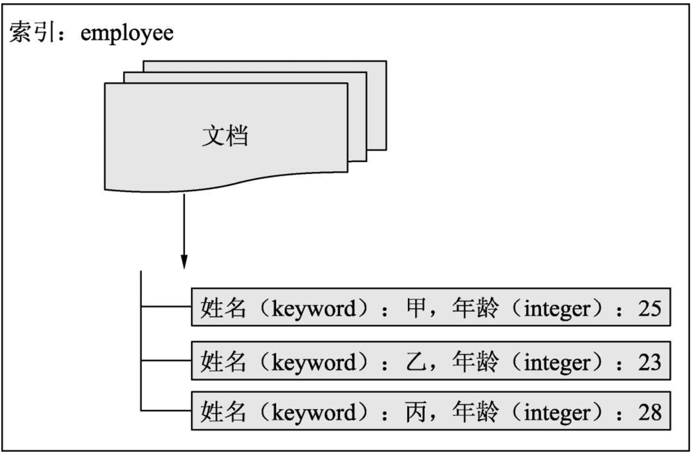

5.集群和节点

略

6.分片

在分布式系统中，为了能存储和计算海量的数据，会先对数据进行切分，然后再将它们存储到多台计算机中。这样不仅能分担集群的存储和计算压力，而且在该架构基础上进一步优化，还可以提升系统中数据的高可用性。在ES中，一个分片对应的就是一个Lucene索引，每个分片可以设置多个副分片，这样当主分片所在的计算机因为发生故障而离线时，副分片会充当主分片继续服务。索引的分片个数只能设置一次，之后不能更改。在默认情况下，ES的每个索引设置为5个分片。

7.副分片

为了提升系统索引数据的高可用性并减轻集群搜索的负载，可以启用分片的副本，该副本叫作副分片，而原有分片叫作主分片。在一个索引中，主分片的副分片个数是没有限制的，用户可以按需设定。在默认情况下，ES不会为索引的分片开启副分片，用户需要手动设置。副分片的个数设定后，也可以进行更改。一个分片的主分片和副分片分别存储在不同的计算机上，在极端情况下，当只有一个节点时，如果索引的副分片个数设置大于1，则系统只分配主分片，而不会分配副分片。

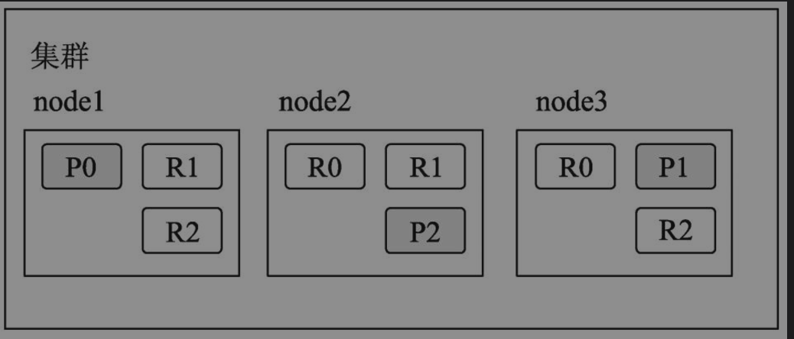

深色方框中的P表示该分片为主分片，R表示该分片为副分片，P和R后面的数字表示其编号

8.DSL

ES使用DSL（Domain Specific Language，领域特定语言）​，来定义查询。ES中的DSL采用JSON进行表达，相应地，ES也将响应客户端请求的返回数据封装成了JSON形式。这样不仅可以简单明了地表达请求/响应内容，而且还屏蔽了各种编程语言之间数据通信的差异。

### 1.1.3 Elasticsearch和关系型数据库的对比

ES属于非关系型数据库

1.索引方式

关系型数据库的索引大多是B-Tree结构，而ES使用的是倒排索引。ES建立在Lucene基础之上，与生俱来就能完成分词匹配，并且支持多种打分排序算法，还支持用户自定义排序脚本。

2.事务支持

ES更新文档时，先读取文档再进行修改，然后再为文档重新建立索引。如果同一个文档同时有多个并发请求，则极有可能会丢失某个更新操作。为了解决这个问题，ES使用了乐观锁，即假定冲突是不会发生的，不阻塞当前数据的更新操作，每次更新会增加当前文档的版本号，最新的数据由文档的最新版本来决定，这种机制就决定了ES没有事务管理。

4.扩展方式

ES本身就是支持分片的，只要初期对分片的个数进行了合理的设置，后期是不需要对扩展过分担心的，即使现有集群负载较高，也可以通过后期增加节点和副分片的方式来解决。

5.数据查询速度

ES是基于Lucene库的搜索引擎，可以支持全字段建立索引。在ES中，单个索引存储上百个字段或几十亿条记录都是没有问题的，并且查询速度也不会变慢。

6.数据实时性

ES的数据写入不是实时的，而是准实时的。

## 1.2 Elasticsearch的架构原理

### 1.2.1　节点职责

节点按照职责可以分为master节点、数据节点和协调节点，每个节点类型可以进行单独配置。在生产环境中需要对这些节点的角色进行最优划分，否则在高并发请求的情况下，集群容易出现服务阻塞超时甚至服务崩溃的隐患。

master节点负责维护整个集群的相关工作，管理集群的变更，如创建/删除索引、节点健康状态监测、节点上/下线等。master节点是由集群节点通过选举算法选举出来的，一个集群中只有一个节点可以成为master节点，但是可以有一个或多个节点参与master节点的选举。在默认情况下，任意节点都可以作为master的候选节点，可以通过配置项node.master对当前节点是否作为master的候选节点进行控制。

数据节点主要负责索引数据的保存工作，此外也执行数据的其他操作，如文档的删除、修改和查询操作。数据节点的很多工作是调用Lucene库进行Lucene索引操作，因此这种节点对于内存和I/O的消耗比较大，生产环境中应多注意数据节点的计算机负载情况。

客户端可以向ES集群的节点发起请求，这个节点叫作协调节点。在默认情况下，协调节点可以是集群中的任意节点，此时它的生命周期是和一个单独的请求相关的。也就是说，当客户端向集群中的某个节点发起请求时，此时该节点被称为当前请求的协调节点；当它将响应结果返回给客户端后，该协调节点的生命周期就结束了。如图1.4所示的左右两图分别表示两次不同的请求，因为请求时客户端指定的请求地址不同，所以左图中的请求协调节点是node1，右图中的请求协调节点是node3。协调节点根据具体情况将请求转发给其他节点，并将最终的汇总处理结果返回给客户端。

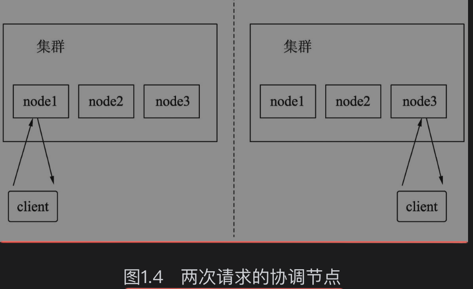

当然，为了降低集群的负载，可以设置某些节点作为单独的协调节点。在节点的配置文件中设置node.master和node.data配置项为false，此时，这个节点就不会被选中为master节点并且不再担任数据节点，而客户端就可以把这类节点作为协调节点来使用，把所有的请求都分发到这些节点上

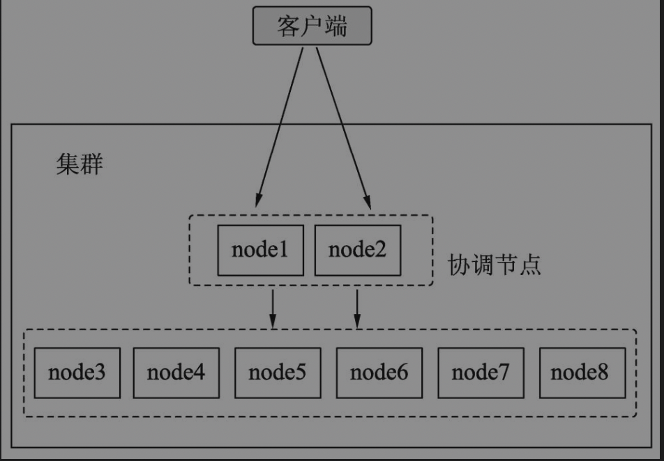

### 1.2.2 主分片和副分片

一个索引由一个或者多个分片构成，并且每个分片有0个甚至多个副分片。集群中的索引主分片和副分片在不同的计算机上，如果某个主分片所在的节点宕机，则原有的某个副分片会提升为主分片继续对外进行服务。

例如，在如图1.3所示的集群中，如果node1发生故障宕机，集群感知到分片0的主分片P0将要丢失，此时集群会立即将其他节点（如node3）上的分片0对应的副分片R0作为主分片P0进行服务。集群中由node2和node3对外提供服务，所有的分片相关的服务不受影响，如图1.6所示。

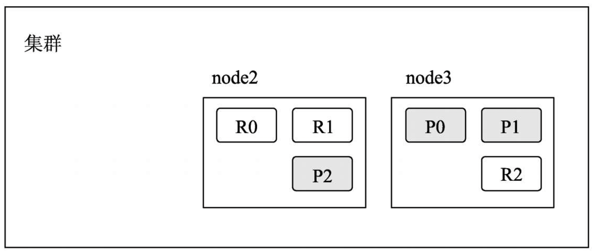

如果node1恢复了服务并加入集群中，因为在node1上还保留有分片0的数据，此时node1上的分片P0会变成副分片R0，在此期间缺失的数据会通过node3上的主分片P0进行补充。并且node1上的分片R1和R2也会分别从node3和node2上对应的P1和P2分片上补充数据，如图1.7所示。

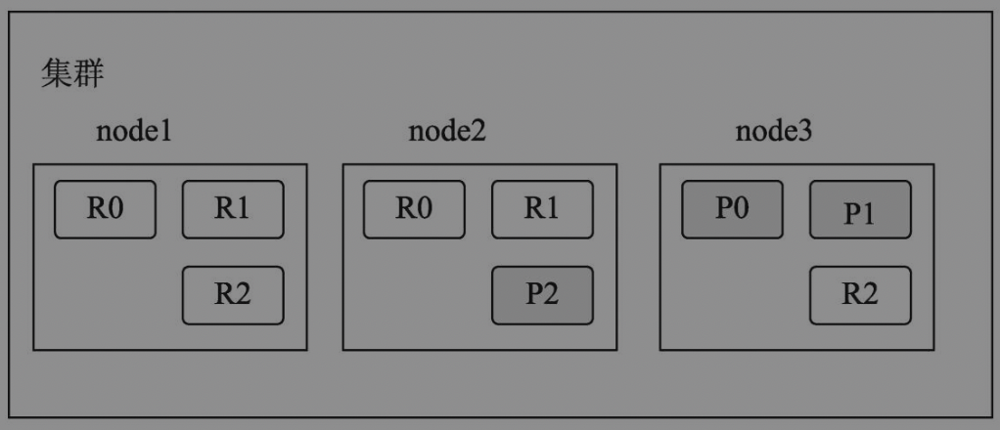

协调节点中有一份分片-节点路由表，该表主要存放分片和节点的对应关系。协调节点采用轮询算法，选取该索引的主/副分片所在的节点进行请求转发。一个索引的主分片设定后就不能再修改，如果想继续提升索引的并发性能，则可以增加索引的副分片个数，此时协调节点会将这些副分片加入轮询算法中。

### 1.2.4 文档读写过程

当ES协调节点接收到来自客户端对某个索引的写入文档请求时，该节点会根据一定的路由算法将该文档映射到某个主分片上，然后将请求转发到该分片所在的节点。完成数据的存储后，该节点会将请求转发给该分片的其他副分片所在的节点，直到所有副分片节点全部完成写入，ES协调节点向客户端报告写入成功。

如图1.8所示为一个包含3个节点的ES集群，假设索引中只有3个主分片和6个副分片，客户端向节点1发起向索引写入一条文档的请求，在本次请求中，节点1被称为协调节点。节点1判断数据应该映射到哪个分片上。假设将数据映射到分片1上，因为分片1的主分片在节点2上，因此节点1把请求转发到节点2上。节点2接收客户端的数据并进行存储，然后把请求转发到副分片1所在的节点1和节点3上，当所有副分片所在的节点全部完成存储后，协调节点也就是节点1向客户端返回成功标志。

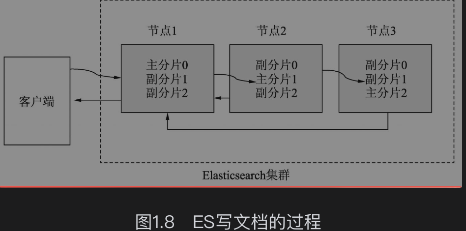

当ES协调节点接收到来自客户端的获取某个索引的某文档的请求时，协调节点会找到该文档所在的所有分片，然后根据轮询算法在主/副分片中选择一个分片并将请求转发给该分片所在的节点，该节点会将目标数据发送给协调节点，协调节点再将数据返回给客户端。

## 1.3 Elasticsearch的应用场景

### 1.3.1 搜索引擎

毫无疑问，ES最擅长的是充当搜索引擎，在这类场景中较典型的应用领域是垂直搜索，如电商搜索、地图搜索、新闻搜索等各类站内搜索。创建索引时，业务系统模块把数据存储到数据库中，第三方数据同步模块（如Canal）负责将数据库中的数据按照业务需求同步到ES中。搜索时，前端应用先向搜索模块发起搜索请求，然后搜索模块组织搜索DSL向ES发起请求，ES响应搜索模块的请求开始搜索，并将搜索到的商品信息（如名称、价格、地理位置等）进行封装，然后把数据传送给搜索模块，进而数据再由搜索模块传递到前端进行展现。

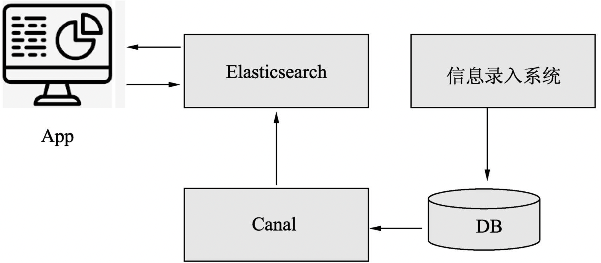

### 1.3.2　推荐系统

可以把推荐模型算法计算的商品和用户向量存储到ES索引中，当实时请求时，加载用户向量并使用ES的Script Score进行查询，使每个文档最终的排序分值等于当前用户向量与当前文档向量的相似度。

### 1.3.3　二级索引

数据存储在RDBMS中，建立ES索引时其中仅包含查询字段，RDBMS中的主键在ES中仅存储不用建立索引。这些主键存在于RDBMS的索引中，叫作一级索引；ES中的查询字段构成的索引叫作二级索引。查询时客户端可以把查询请求分发到ES中，ES从索引中查询并返回符合条件的记录主键，客户端再根据返回的记录主键请求RDBMS得到实时数据。

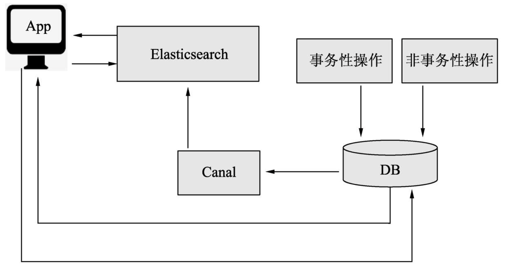

### 1.3.4　日志分析

ES具有很强的查询能力，支持任意字段的各种组合查询，同时它又具有很强大的数据统计和分析能力，因此也可以当作数据分析引擎。ES官方提供的ELK（Elasticsearch+Logstash+Kibana）全家桶可以完成日志采集、索引创建再到可视化的数据分析等工作，使用户可以0代码完成搭建工作。

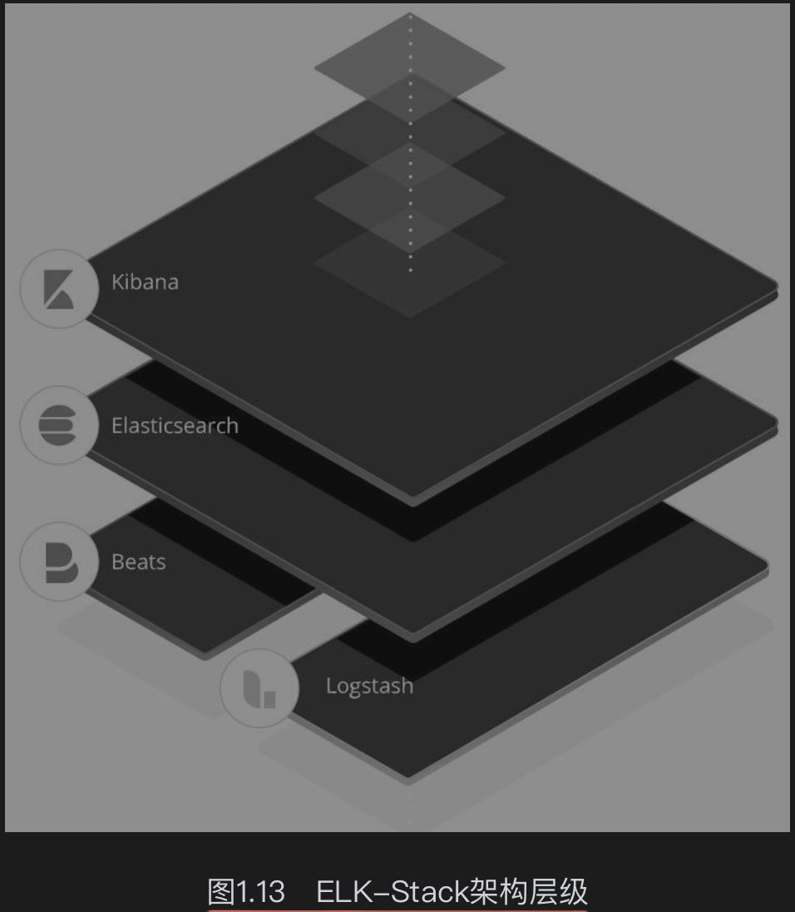

## 1.4　Elasticsearch的安装

略

## 1.5 Elasticsearch搜索入门

### 1.5.1 创建索引

完成搜索的第一步是建立搜索数据集的对象，即建立索引。在定义酒店的搜索需求时，应该包括的字段有酒店标题、所属城市和房价等。假设使用默认的分片数和副本数，整体的索引创建语句如下：

```js
curl -H "Content-Type: application/json" -XPUT  http://127.0.0.1:9200/hotel  -d 
{ 
    "mappings":{ 
        "properties":{           //指定字段名称及其数据类型 
            "title":{ 
                "type":"text"    //title字段为text类型 
            }, 
            "city":{ 
               "type":"keyword"   //city字段为keyword类型 
            }, 
            "price":{ 
                "type":"double"   //price字段为double类型 
            } 
        } 
    } 
}
```

为简单起见，在后面的请求说明和示例中将省略一部分内容，直接使用请求类型和URL相对路径，例如上面的请求将表示为如下方式：

```js
PUT /hotel 
{ 
    "mappings":{ 
        "properties":{           //指定字段名称及其数据类型 
            "title":{ 
                "type":"text"    //title字段为text类型 
            }, 
            "city":{ 
               "type":"keyword"   //city字段为keyword类型 
            }, 
            "price":{ 
                "type":"double"   //price字段为double类型 
            } 
        } 
    } 
}
```

### 1.5.2　写入文档

在目标索引中写入下面的数据：

```swift
POST /hotel/_doc/001 
{ 
    "title":"好再来酒店", 
    "city":"青岛", 
    "price":578.23 
}
```
执行上述命令后，在索引中创建了一条ID为001的文

### 1.5.3　根据_id搜索文档

有的时候需要根据文档的ID直接定位某个文档

```swift
GET /hotel/_doc/001
```

检索结果如下：

```JSON
{ 
 "_index" : "hotel",                  //索引名称 
  "_type" : "_doc", 
 "_id" : "001",                       //文档ID 
 "_version" : 1,                      //文档版本 
  "_seq_no" : 0, 
  "_primary_term" : 1, 
  "found" : true, 
 "_source" : {                        //文档内容 
    "title" : "好再来酒店", 
    "city" : "青岛", 
    "price" : 578.23 
  } 
}
```

### 1.5.4　根据一般字段搜索文档

在ES中进行搜索时需要用到query子句，其请求形式如下：

```swift
GET /${index_name}/_search 
{ 
 "query": {                          //查询内容 
    … 
  } 
}
```

query子句可以按照需求填充查询项。假设按照城市进行搜索，把酒店文档搜索出来。因为只需要进行文本是否相等的判断，所以需要用到term搜索.

```swift
GET /hotel/_search 
{ 
  "query": { 
    "term": { 
      "price": {                                    //根据价格搜索文档 
        "value": 578.23 
      } 
    } 
  } 
}
```

搜索结果如下：

```JSON
{ 
  "took" : 1, 
  "timed_out" : false, 
 "_shards" : {       //命中的分片信息 
    "total" : 1, 
    "successful" : 1, 
    "skipped" : 0, 
    "failed" : 0 
  }, 
  "hits" : {  
   "total" : {                         //命中的文档总数 
      "value" : 1, 
      "relation" : "eq" 
    }, 
   "max_score" : 1.0,                  //命中文档中的最高分
   "hits" : [                          //命中文档集合的信息
      { 
        "_index" : "hotel",            //文档所在索引 
        "_type" : "_doc",   
        "_id" : "001",                //文档ID 
        "_score" : 1.0,               //文档分值 
        "_source" : {                 //文档内容 
          "title" : "好再来酒店", 
          "city" : "青岛", 
          "price" : 578.23 
        } 
      } 
    ] 
  } 
}
```

### 1.5.5　根据文本字段搜索文档

对文本进行模糊匹配并给出匹配分数这一功能是搜索引擎所独有的。此处使用match搜索对某个字段进行模糊匹配，按照标题进行模糊搜索，示例如下：

```swift
GET /hotel/_search 
{ 
  "query": { 
   "match": {                                    //根据title字段搜索 
      "title": "再来" 
    } 
  } 
}
```

# 第2章　Elasticsearch客户端实战

## 2.1　Kibana客户端简介

借助Kibana，用户不需要编码就可以将ES中分析的结果进行可视化呈现，如以常用的饼图、柱状图和时序图等方式呈现。除了可视化数据分析功能，Kibana还提供了Dev Tools，它是一款可以与ES进行交互式请求的工具，可以借助它进行DSL调试。

# 第3章　Elasticsearch基础操作

## 3.1　索引操作

### 3.1.1　创建索引

ES创建索引的请求类型为PUT，其请求形式如下：

```Ruby
PUT /${index_name} 
{   "settings":{ 
        … 
    } 
    "mappings":{ 
        … 
    } 
}
```

其中：变量index_name就是创建的目标索引名称；可以在settings子句内部填写索引相关的设置项，如主分片个数和副分片个数等；可以在mappings子句内部填写数据组织结构，即数据映射。假设设置主分片个数为15，副分片个数为2，则相应的DSL如下：

```JS
PUT /hotel 
{  
    "settings" : { 
        "number_of_shards" : 15,    //指定主分片个数 
        "number_of_replicas" : 2    //指定副分片个数 
    }, 
    "mappings":{ 
        "properties":{ 
            … 
        } 
    } 
}
```

### 3.1.2　删除索引

ES中删除索引的请求类型是DELETE，其请求形式如下：

```Ruby
DELETE /${index_name}
```

其中，${index_name}就是将要被删除的索引的名称，例如执行下面的删除命令：

```Bash
DELETE /hotel
```

### 3.1.3　关闭索引

在有些场景下，某个索引暂时不使用，但是后期可能又会使用，这里的使用是指数据写入和数据搜索。这个索引在某一时间段内属于冷数据或者归档数据，这时可以使用索引的关闭功能。

把索引hotel关闭，请求形式如下：

```Ruby
POST /hotel/_close
```

此时可以尝试进行数据写入：

```swift
POST /hotel/_doc/002 
{  
  "title":"阳光夏日酒店", 
  "city":"北京", 
  "price":788.00 
}
```

ES返回信息如下：

```json
{ 
  "error" : { 
    "root_cause" : [ 
      { 
        "type" : "index_closed_exception", //提示异常类型为索引已经关闭 
        "reason" : "closed", 
        "index_uuid" : "TIYkM2N5SCKlnmCOXuJPmg", 
        "index" : "hotel"                  //当前索引名称 
      } 
    ], 
    "type" : "index_closed_exception", 
    "reason" : "closed", 
    "index_uuid" : "TIYkM2N5SCKlnmCOXuJPmg", 
    "index" : "hotel" 
  }, 
  "status" : 400 
}
```

### 3.1.4　打开索引

索引关闭后，需要开启读写服务时可以将其设置为打开状态。关闭状态的hotel索引设置为打开状态。

```python
POST /hotel/_open 
```

### 3.1.5　索引别名

顾名思义，别名是指给一个或者多个索引定义另外一个名称，使索引别名和索引之间可以建立某种逻辑关系。

可以用别名表示别名和索引之间的包含关系。例如，我们建立了1月、2月、3月的用户入住酒店的日志索引，假设当前日期是4月1日，需要搜索过去的3个月的日志索引，如果分别去3个索引中进行搜索，这种编码方案比较低效。此时可以创建一个别名last_three_month，设置前面的3个索引的别名为last_three_month，然后在last_three_month中进行搜索即可。如图3.1所示，last_three_month包含january_log、february_log和march_log3个索引，用户请求在last_three_month中进行搜索时，ES会在上述3个索引中进行搜索。

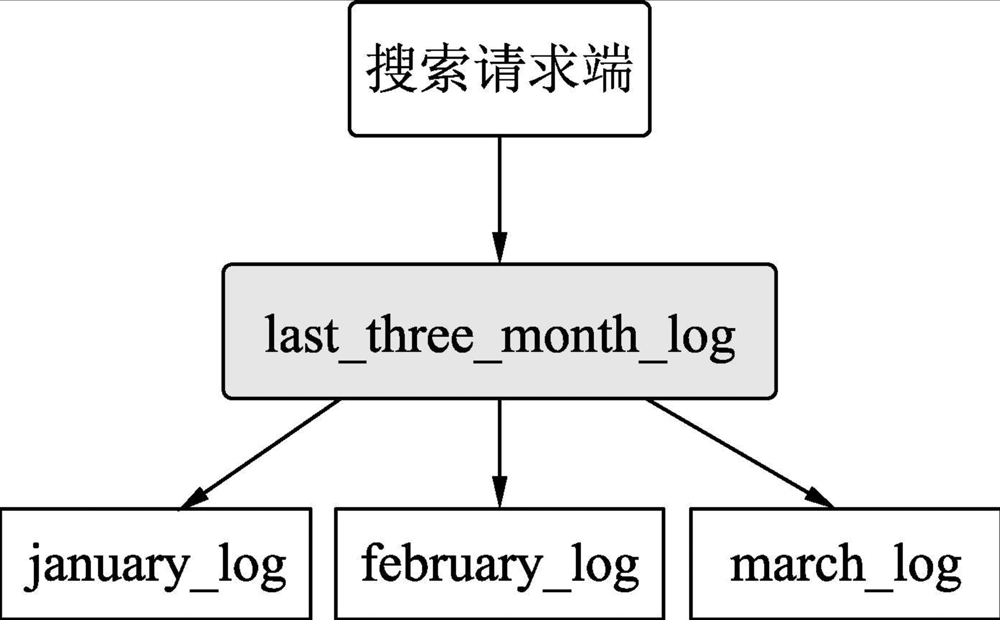

首先依次建立january_log、february_log和march_log3个索引。

```js
PUT /january_log 
{ 
    "mappings":{ 
        "properties":{ 
            "uid":{              //用户ID字段 
                "type":"keyword" 
            }, 
            "hotel_id":{         //酒店ID字段 
                "type":"keyword" 
            }, 
            "check_in_date":{     //入住日期字段 
                "type":"keyword" 
            } 
        } 
    } 
}
```

在索引january_log中写入记录的DSL如下：

```swift
POST /january_log/_doc/001 
{                                 //写入的文档数据    
  "uid":"001", 
  "hotel_id":"92772", 
  "check_in_date":"2021-01-05" 
}
```
在索引february_log中写入记录的DSL如下：

```swift
POST /february_log/_doc/001 
{                                //写入的文档数据 
  "uid":"001", 
  "hotel_id":"33224", 
  "check_in_date":"2021-02-23" 
}
```

在索引march_log中写入记录的DSL如下：

```swift
POST /march_log/_doc/001 
{                               //写入的文档数据 
  "uid":"001", 
  "hotel_id":"92772", 
  "check_in_date":"2021-03-28" 
}
```

现在建立别名last_three_month，设置上面3个索引的别名last_three_month，请求的DSL如下：

```JS
POST /_aliases 
{ 
  "actions": [ 
    { 
      "add": {   //为索引january_log建立别名last_three_month 
        "index": "january_log", 
        "alias": "last_three_month" 
      } 
    }, 
    { 
      "add": {   //为索引february_log建立别名last_three_month 
        "index": "february_log", 
        "alias": "last_three_month" 
      } 
    }, 
    { 
      "add": {   //为索引march_log建立别名last_three_month 
        "index": "march_log", 
        "alias": "last_three_month" 
      } 
    } 
  ] 
}
```

此时，请求在索引last_three_month中搜索uid为001的用户的入住记录，搜索的DSL如下：

```swift
GET /last_three_month/_search 
{ 
  "query": { 
    "term": {        //搜索uid为001的文档 
      "uid": "001" 
    } 
  } 
}
```

搜索结果返回的数据如下：

```js
{ 
  … 
  "hits" : { 
    … 
    "hits" : [ 
      {               //索引february_log中命中的文档信息 
        "_index" : "february_log",
        "_type" : "_doc", 
        "_id" : "001", 
        "_score" : 0.2876821, 
        "_source" : { 
          "uid" : "001", 
          "hotel_id" : "33224", 
          "check_in_date" : "2021-02-23" 
        } 
      }, 
     {                //索引january_log中命中的文档信息 
        "_index" : "january_log", 
        "_type" : "_doc", 
        "_id" : "001", 
        "_score" : 0.2876821, 
        "_source" : { 
          "uid" : "001", 
          "hotel_id" : "92772", 
          "check_in_date" : "2021-01-05" 
        } 
      }, 
     {                //索引march_log中命中的文档信息 
        "_index" : "march_log", 
        "_type" : "_doc", 
        "_id" : "001", 
        "_score" : 0.2876821, 
        "_source" : { 
          "uid" : "001", 
          "hotel_id" : "92772", 
          "check_in_date" : "2021-03-28" 
        } 
      } 
    ] 
  } 
}
```

需要指出的是，在默认情况下，当一个别名只指向一个索引时，写入数据的请求可以指向这个别名，如果这个别名指向多个索引（就像上面的例子）​，则写入数据的请求是不可以指向这个别名的。

ES不能确定向last_three_month写入数据时的转发对象。这种情况需要在别名设置时，将目标索引的is_write_index属性值设置为true来指定该索引可用于执行数据写入操作。例如设置january_log为数据写入转发对象，对应的DSL如下：

```js
POST /_aliases 
{ 
  "actions": [ 
    { 
      "add": {  //设置january_log为索引别名last_three_month的数据写入转发对象 
        "index": "january_log", 
        "alias": "last_three_month", 
         "is_write_index":true 
      } 
    } 
  ] 
}
```

引入别名之后，还可以用别名表示索引之间的替代关系。这种关系一般是在某个索引被创建后，有些参数是不能更改的（如主分片的个数）​，但随着业务发展，索引中的数据增多，需要更改索引参数进行优化。我们需要平滑地解决该问题，既要更改索引的设置，又不能改变索引名称，这时就可以使用索引别名。

## 3.2　映射操作

在使用数据之前，需要构建数据的组织结构。这种组织结构在关系型数据库中叫作表结构，在ES中叫作映射。作为无模式搜索引擎，ES可以在数据写入时猜测数据类型，从而自动创建映射。但有时ES创建的映射中的数据类型和目标类型可能不一致。当需要严格控制数据类型时，还是需要用户手动创建映射。

### 3.2.1　查看映射

在ES中查看映射请求的类型是GET，其请求形式如下：

```python
GET /${index_name}/_mapping  
```
上面的index_name就是索引名称。查看索引hotel的mappings

```swift
GET /hotel/_mapping  
```
ES的返回结果如下：

```json
{ 
  "hotel" : { 
    "mappings" : { 
      "properties" : { 
        "city" : {      //定义city字段类型为keyword 
          "type" : "keyword" 
        }, 
        "price" : {     //定义price字段类型为double 
          "type" : "double" 
        }, 
        "title" : {     //定义title字段类型为text 
          "type" : "text" 
        } 
      } 
    } 
  } 
} 
```

### 3.2.2　扩展映射

映射中的字段类型是不可以修改的，但是字段可以扩展。最常见的扩展方式是增加字段和为object（对象）类型的数据新增属性。下面的DSL示例为扩展hotel索引，并增加tag字段。

```swift
POST /hotel/_mapping 
{ 
  "properties": { 
    "tag": {                  //索引中新增字段tag，类型为keyword 
      "type": "keyword" 
    } 
  } 
}
```

### 3.2.3　基本的数据类型

#### 1.keyword类型

keyword类型是不进行切分的字符串类型。这里的“不进行切分”指的是：在索引时，对keyword类型的数据不进行切分，直接构建倒排索引；在搜索时，对该类型的查询字符串不进行切分后的部分匹配。keyword类型数据一般用于对文档的过滤、排序和聚合。

。keyword类型数据一般用于比较字符串是否相等，不对数据进行部分匹配，因此一般查询这种类型的数据时使用term查询。例如，建立一个人名索引，可以设定姓名字段为keyword字段：

```js
PUT /user 
{ 
  "mappings": { 
    "properties": { 
      "user_name":{                 //定义user_name字段类型为keyword 
        "type": "keyword" 
      } 
    } 
  } 
}
```

现在写入一条数据，请求的DSL如下：

```swift
POST /user/_doc/001 
{                                     //写入数据 
  "user_name":"张三" 
}
```

查询刚刚写入的数据，请求的DSL如下：

```swift
GET /user/_search 
{ 
  "query": { 
   "term": {                         //term查询 
      "user_name": { 
        "value": "张三" 
      } 
    }  
  } 
}
```

返回的结果信息如下：

```js
{ 
    … 
    "hits" : [ 
     {                                 //返回命中的文档 
        "_index" : "user", 
        "_type" : "_doc", 
        "_id" : "001", 
        "_score" : 0.2876821, 
        "_source" : { 
          "user_name" : "张三" 
        } 
      } 
    ] 
  } 
}
```

对keyword类型使用match搜索进行匹配是不会命中文档的。

#### 2.text类型

text类型是可进行切分的字符串类型。这里的“可切分”指的是：在索引时，可按照相应的切词算法对文本内容进行切分，然后构建倒排索引；在搜索时，对该类型的查询字符串按照用户的切词算法进行切分，然后对切分后的部分匹配打分。

一个酒店搜索项目，我们希望可以根据酒店名称即title字段进行模糊匹配，因此可以设定title字段为text字段，建立酒店索引的DSL如下：

PUT /hotel 
{ 
    "mappings":{ 
        "properties":{ 
            "title":{                          //定义title字段类型为text 
                "type":"text" 
            } 
            … 
        } 
    } 
}

现在写入一条数据：

```swift
POST /hotel/_doc/001 
{   //写入数据  
   "title":"文雅酒店" 
}
```

下面先按照普通的term进行搜索，观察能否搜索到刚刚写入的文档，请求的DSL如下：

```swift
GET /hotel/_search 
{ 
  "query": { 
   "term": {                     //使用term搜索 
      "title": { 
        "value": "文雅酒店" 
      } 
    } 
  } 
}
```

返回结果如下：

```js
{ 
  … 
  "hits" : { 
   "total" : {                //使用term搜索text类型数据时没有命中文档 
      "value" : 0, 
      "relation" : "eq" 
    }, 
    "max_score" : null, 
    "hits" : [ ]              //命中的文档集合为空 
  } 
}
```

term搜索用于搜索值和文档对应的字段是否完全相等，而对于text类型的数据，在建立索引时ES已经进行了切分并建立了倒排索引，因此使用term没有搜索到数据。一般情况下，搜索text类型的数据时应使用match搜索。关于match搜索的具体使用。

```swift
GET /hotel/_search 
{ 
  "query": { 
   "match": {                      //使用match搜索 
      "title": "文雅" 
    } 
  } 
}
```

返回结果如下：

```js
{ 
  … 
  "hits" : { 
    "total" : { 
      "value" : 1,               //有一个文档被命中 
      "relation" : "eq" 
    }, 
    "max_score" : 0.5753642, 
   "hits" : [                    //命中的文档数据 
      { 
        "_index" : "hotel", 
        "_type" : "_doc", 
        "_id" : "001", 
        "_score" : 0.5753642, 
        "_source" : { 
          "title" : "文雅酒店" 
        } 
      } 
    ] 
  } 
}
```

#### 3.数值类型

ES支持的数值类型有long、integer、short、byte、double、float、half_float、scaled_float和unsigned_long等。各类型所表达的数值范围可以参考官方文档，网址为https://www.elastic.co/guide/en/elasticsearch/reference/current/number.html。为节约存储空间并提升搜索和索引的效率，在实际应用中，在满足需求的情况下应尽可能选择范围小的数据类型。比如，年龄字段的取值最大值不会超过200，因此选择byte类型即可。数值类型的数据也可用于对文档进行过滤、排序和聚合。

酒店的索引除了包含酒店名称和城市之外，还需要定义价格、星级和评论数等，创建索引的DSL如下：

```js
PUT /hotel 
{ 
    "mappings":{ 
        "properties":{ 
            "title":{ 
                "type":"text" 
            }, 
            "city":{ 
                "type":"keyword" 
            }, 
            "price":{               //定义价格字段，类型为double 
                "type":"double" 
            }, 
            "star":{                //定义星级字段，类型为byte 
                "type":"byte" 
            }, 
            "comment_count":{       //定义评论数字段，类型为integer 
                "type":"integer" 
            } 
        } 
    } 
}
```

对于数值型数据，一般使用term搜索或者范围搜索。例如，搜索价格为350～400（包含350和400）元的酒店，搜索的DSL如下：

```swift
GET /hotel/_search 
{ 
  "query": { 
   "range": {                     //定义range查询 
      "price": { 
        "gte": 350, 
        "lte": 400 
      } 
    } 
  } 
}
```

#### 4.布尔类型

布尔类型使用boolean定义，用于业务中的二值表示，如商品是否售罄，房屋是否已租，酒店房间是否满房等。写入或者查询该类型的数据时，其值可以使用true和false，或者使用字符串形式的"true"和"false"。下面的DSL定义索引中“是否满房”的字段为布尔类型：

```js
PUT /hotel 
{ 
    "mappings":{ 
        "properties":{ 
            "title":{ 
                "type":"text" 
            }, 
            "city":{ 
                "type":"keyword" 
            }, 
            "price":{ 
                "type":"double" 
            }, 
            "full_room":{             //定义是否满房的字段，类型为boolean 
              "type": "boolean" 
            } 
        } 
    } 
}
```

下面的DSL将查询满房的酒店：

```swift
GET /hotel/_search 
{ 
  "query": { 
    "term": { 
      "full_room": {              //使用term查询boolean类型的数据 
        "value": "true" 
      } 
    } 
  } 
}
```

#### 5.日期类型

在ES中，日期类型的名称为date。ES中存储的日期是标准的UTC格式。下面定义索引hotel，该索引有一个create_time字段，现在把它定义成date类型。定义date类型请求的DSL如下：

```bash
PUT /hotel 
{ 
    "mappings":{ 
        "properties":{ 
            "title":{ 
                "type":"text" 
            }, 
            "city":{ 
                "type":"keyword" 
            }, 
            "price":{ 
                "type":"double" 
            }, 
            "create_time":{              //定义create_time字段，类型为date 
                "type":"date" 
            } 
        } 
    } 
}
```

一般使用如下形式表示日期类型数据：

- 格式化的日期字符串。
- 毫秒级的长整型，表示从1970年1月1日0点到现在的毫秒数。
- 秒级别的整型，表示从1970年1月1日0点到现在的秒数。

日期类型的默认格式为strict_date_optional_time||epoch_millis。其中，strict_date_optional_time的含义是严格的时间类型，支持yyyy-MM-dd、yyyyMMdd、yyyyMMddHHmmss、yyyy-MM-ddTHH:mm:ss、yyyy-MM-ddTHH:mm:ss.SSS和yyyy-MM-ddTHH:mm:ss.SSSZ等格式，epoch_millis的含义是从1970年1月1日0点到现在的毫秒数。

下面写入索引的文档中有一个create_time字段是日期格式的字符串，请求的DSL如下：

```swift
POST /hotel/_doc/001 
{                                       //写入数据 
  "title":"好再来酒店",  
  "city":"青岛", 
  "price":578.23, 
  "create_time":"20210115" 
}
```

搜索日期型数据时，一般使用ranges查询。例如，搜索创建日期为2015年的酒店，请求的DSL如下：

```swift
GET /hotel/_search 
{ 
  "query": { 
   "range": {                          //使用range搜索日期型数据 
      "create_time": { 
        "gte": "20150101", 
        "lt": "20160101" 
      } 
    } 
  } 
}
```

日期类型默认不支持yyyy-MM-dd HH:mm:ss格式，如果经常使用这种格式，可以在索引的mapping中设置日期字段的format属性为自定义格式。下面的示例将设置create_time字段的格式为yyyy-MM-dd HH:mm:ss：

```js
PUT /hotel 
{ 
    "mappings":{ 
        "properties":{ 
            "title":{ 
                "type":"text" 
            }, 
            "city":{ 
                "type":"keyword" 
            }, 
            "price":{ 
                "type":"double" 
            }, 
            "create_time":{                     //指定日期型字段的格式 
                "type":"date",  
                "format": "yyyy-MM-dd HH:mm:ss" 
            } 
        } 
    } 
}
```

此时如果再写入以前的数据，系统将报错。错误的原因是写入的数据格式和定义的数据格式不同。此时需要写入的格式为yyyy-MM-dd HH:mm:ss的文档，请求的DSL如下：

```swift
POST /hotel/_doc/001 
{                                       //写入数据 
  "title":"好再来酒店",  
  "city":"青岛", 
  "price":578.23, 
  "create_time":"2021-01-15 01:23:30"  //写入符合自定义格式的日期数据 
}
```

### 3.2.4　复杂的数据类型

#### 1.数组类型

ES数组没有定义方式，其使用方式是开箱即用的，即无须事先声明，在写入时把数据用中括号[​]括起来，由ES对该字段完成定义。当然，如果事先已经定义了字段类型，在写数据时以数组形式写入，ES也会将该类型转为数组。

例如，为hotel索引增加一个标签字段，名称为tag，请求的DSL如下：

```swift
PUT /hotel/_mapping 
{ 
  "properties": { 
    "tag": {                      //增加tag字段，类型为keyword 
      "type": "keyword" 
    } 
  } 
}
```

查看一下索引hotel的mapping,通过返回的mapping信息来看，新增的tag字段与普通的keyword类型字段没什么区别:

```json
{ 
  "hotel" : { 
    "mappings" : { 
      "properties" : { 
        "city" : {                //原有的city字段，类型为keyword 
          "type" : "keyword" 
        }, 
        "price" : {               //原有的price字段，类型为double 
          "type" : "double" 
        }, 
        "tag" : {                 //增加tag字段，类型为keyword 
          "type" : "keyword" 
        }, 
        "title" : {               //原有的title字段，类型为text 
          "type" : "text" 
        } 
      } 
    } 
  } 
}
```

现在写入一条数据：

```swift
POST /hotel/_doc/001 
{                            //写入数据  
  "title":"好再来酒店", 
  "city":"青岛", 
  "price":578.23, 
  "tag":["有车位","免费WIFI"] //写入字符串数组数据 
}
```

查看一下写入的数据，ES返回的信息如下：

```js
{ 
  … 
  "_source" : { 
    "title" : "好再来酒店", 
    "city" : "青岛", 
    "price" : 578.23, 
   "tag" : [                 //tag字段自动转换为字符串数组类型 
      "有车位", 
      "免费WIFI" 
    ] 
  } 
}
```

数组类型的字段适用于元素类型的搜索方式，也就是说，数组元素适用于什么搜索，数组字段就适用于什么搜索。例如，在上面的示例中，数组元素类型是keyword，该类型可以适用于term搜索，则tag字段也可以适用于term搜索，搜索的DSL如下：

```swift
GET /hotel/_search 
{ 
  "query": { 
   "term": {             //使用term搜索数组类型的数据 
      "tag": { 
        "value": "有车位" 
      } 
    } 
  } 
}
```

ES中的空数组可以作为missing field，即没有值的字段，下面的DSL将插入一条tag为空的数组：

```swift
POST /hotel/_doc/002 
{     
    "title":"环球酒店", 
    "city":"青岛", 
    "price":530.00, 
    "tag":[]              //写入空数组 
} 
```

#### 2.对象类型

在实际业务中，一个文档需要包含其他内部对象。例如，在酒店搜索需求中，用户希望酒店信息中包含评论数据。评论数据分为好评数量和差评数量。为了支持这种业务，在ES中可以使用对象类型。和数组类型一样，对象类型也不用事先定义，在写入文档的时候ES会自动识别并转换为对象类型。下面将在hotel索引中添加一条记录，请求的DSL如下：

```swift
 
POST /hotel/_doc/001 
{                                 //写入数据 
  "title": "好再来酒店", 
  "city": "青岛", 
  "price": 578.23, 
      "comment_info": {           //评论数据 
      "properties": { 
        "favourable_comment":199, //好评数据 
        "negative_comment": 68    //差评数据 
      } 
    } 
}   
```

执行以上DSL后，索引hotel增加了一个字段comment_info，它有两个属性，分别是favourable_comment和negative_comment，二者的类型都是long。下面查看mapping进行验证：

```json
{ 
  "hotel" : { 
    "mappings" : { 
      "properties" : { 
        "city" : { 
          "type" : "keyword" 
        }, 
        "comment_info" : {                 //评论数据 
          "properties" : { 
            "properties" : { 
              "properties" : { 
                "favourable_comment" : {   //好评数据，类型为long 
                  "type" : "long" 
                }, 
                "negative_comment" : {     //差评数据，类型为long 
                  "type" : "long" 
                } 
              } 
            } 
          } 
        }, 
        "create_time" : { 
          "type" : "date", 
          "format" : "yyyy-MM-dd HH" 
        }, 
        "price" : { 
          "type" : "double" 
        }, 
        "title" : { 
          "type" : "text" 
        } 
      } 
    } 
  } 
}   
```

根据对象类型中的属性进行搜索，可以直接用“​。​”操作符(也就是对象.属性的方式)进行指向。例如，搜索hotel索引中好评数大于200的文档，请求的DSL如下：

```swift
GET /hotel/_search 
{ 
  "query": { 
   "range": {                                 //使用range搜索对象类型数据 
      "comment_info.properties.favourable_comment": { 
        "gte": 209 
      } 
    } 
  } 
}  
```

对象内部还可以包含对象。例如，评论信息字段comment_info可以增加前3条好评数据，请求的DSL如下：

```swift
POST /hotel/_doc/001 
{                                    //写入数据 
  "title": "好再来酒店", 
  "city": "青岛", 
  "price": 578.23,
  "comment_info": { 
    "properties": { 
      "favourable_comment": 199, 
      "negative_comment": 68, 
      "top3_favourable_comment": {   //新增字段 
       "top1": {                     //增加的第一条评论数据 
          "content": "干净整洁的一家酒店", 
          "score": 87 
        }, 
       "top2": {                     //增加的第二条评论数据 
          "content": "服务周到，停车方便", 
          "score": 89 
        }, 
        "top3":  {                  //增加的第三条评论数据 
          "content": "闹中取静，环境优美", 
          "score": 90 
        } 
      } 
    } 
  } 
}    
```

#### 3.地理类型

在移动互联网时代，用户借助移动设备产生的消费也越来越多。地理数据类型的定义需要在mapping中指定目标字段的数据类型为geo_point类型，示例如下：

```js
PUT /hotel 
{ 
  "mappings": { 
    "properties": { 
      "title": { 
        "type": "text" 
      }, 
      "city": { 
        "type": "keyword" 
      }, 
      "price": { 
        "type": "double" 
      }, 
      "create_time": { 
        "type": "date" 
      }, 
      "location": {                 //定义字段location，类型为geo_point 
        "type": "geo_point" 
      } 
    } 
  } 
}  
```

location字段定义为地理类型，现在向索引中写入一条酒店文档，DSL如下：

```swfit
POST /hotel/_doc/001 
{ 
  "title": "文雅酒店", 
  "city": "北京", 
  "price": 556, 
  "create_time": "2021-01-15", 
 "location": {                      //写入geo_point类型数据，lat为纬度，lon为经度 
    "lat": 40.012134, 
    "lon": 116.497553 
  } 
}  
```

### 3.2.5　动态映射

当字段没有定义时，ES可以根据写入的数据自动定义该字段的类型，这种机制叫作动态映射。

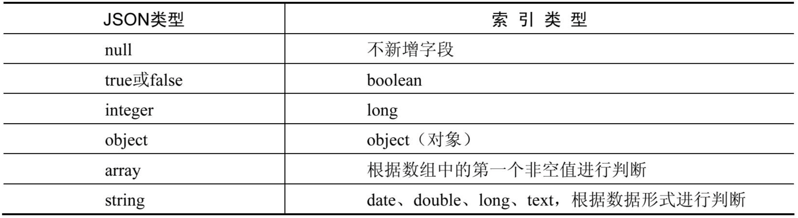

在一般情况下，如果使用基本类型数据，最好先把数据类型定义好，因为ES的动态映射生成的字段类型可能会与用户的预期有差别。

提前定义好数据类型并将索引创建语句纳入SVN或Git管理范围是良好的编程习惯，同时还能增强项目代码的连贯性和可读性。

### 3.2.6　多字段

针对同一个字段，有时需要不同的数据类型，这通常表现在为了不同的目的以不同的方式索引相同的字段。例如，在订单搜索系统中，既希望能够按照用户姓名进行搜索，又希望按照姓氏进行排列，可以在mapping定义中将姓名字段先后定义为text类型和keyword类型，其中，keyword类型的字段叫作子字段，这样ES在建立索引时会将姓名字段建立两份索引，即text类型的索引和keyword类型的索引。订单搜索索引的定义如下：

```JS
PUT /hotel_order 
{ 
  "mappings": { 
    "properties": { 
      "order_id": {     //定义order_id字段类型为keyword 
        "type": "keyword" 
      }, 
      "user_id": {     //定义user_id字段类型为keyword 
        "type": "keyword" 
      }, 
      "user_name": {    //定义user_name字段类型为text 
        "type": "text", 
        "fields": {     //定义user_name多字段 
          //定义user_name字段的子字段user_name_keyword，并定义其类型为keyword 
          "user_name_keyword": { 
            "type": "keyword" 
          } 
        } 
      }, 
      "hotel_id": {     //定义hotel_id字段类型为keyword 
        "type": "keyword" 
      } 
    } 
  } 
} 
```

可以看出，正常定义user_name字段之后，使用fields定义其子字段的定义方式和普通字段的定义方式相同。为方便演示，写入如下数据：

```bash
POST /_bulk 
{"index":{"_index":"hotel_order","_id":"001"}} 
{"order_id": "001","user_id":"user_00x","user_name":"Michael Jordan", 
"hotel_id":"h001"} 
{"index":{"_index":"hotel_order","_id":"002"}} 
{"order_id": "002","user_id":"user_00a","user_name":"Stephen Jordan", 
"hotel_id":"h0500"} 
{"index":{"_index":"hotel_order","_id":"003"}} 
{"order_id": "003","user_id":"user_30e","user_name":"Tim Jordan", 
"hotel_id":"h0520"} 
{"index":{"_index":"hotel_order","_id":"004"}} 
{"order_id": "004","user_id":"user_430","user_name":"Kobe Jordan", 
"hotel_id":"h0600"} 
```

可以在普通搜索中使用user_name字段，DSL如下：

```swift
GET /hotel_order/_search 
{ 
  "query": { 
    "match": {     //match搜索使用text类型的字段 
      "user_name": "Jordan" 
    } 
  }, 
  "sort": {      //排序使用子字段 
    "user_name.user_name_keyword": "asc" 
  } 
}  
```

搜索结果如下：

```js
{ 
  … 
  "hits" : { 
    … 
    "max_score" : null, 
   "hits" : [          //命中文档列表 
      { 
        … 
        "_id" : "004", 
        "_score" : null, 
        "_source" : { 
          … 
          "user_name" : "Kobe Jordan" 
        }, 
        "sort" : [     //按照姓名全称排序 
          "Kobe Jordan" 
        ] 
      }, 
      { 
        "_index" : "hotel_order", 
        "_type" : "_doc", 
        "_id" : "001", 
        "_score" : null, 
        "_source" : { 
          … 
          "user_name" : "Michael Jordan" 
        }, 
        "sort" : [     //按照姓名全称排序 
          "Michael Jordan" 
        ] 
      }, 
      { 
        "_index" : "hotel_order", 
        "_type" : "_doc", 
        "_id" : "002", 
        "_score" : null, 
        "_source" : { 
          … 
          "user_name" : "Stephen Jordan" 
        }, 
        "sort" : [     //按照姓名全称排序 
          "Stephen Jordan" 
        ] 
      }, 
      … 
    ] 
  } 
} 
```

## 3.3　文档操作

### 3.3.1　单条写入文档

在ES中写入文档请求的类型是POST，其请求形式如下：

```Ruby
POST /${index_name}/_doc/${_id} 
{   //写入的文档数据 
    …  
} 
```

上面的_id就是ES中的文档_id，这种请求方式是用户直接定义_id值，不使用ES生成的_id。请求的数据体即为写入的文档数据，格式是JSON形式。

代码 todo

### 3.3.2　批量写入文档

在ES中批量写入文档请求的类型是POST，其请求形式如下：

```Kotlin
POST /_bulk                           //批量请求 
{"index":{"_index":"${index_name}"}}  //指定批量写入的索引 
{…}                                  //设定写入的文档内容 
{"index":{"_index":"${index_name}"}} 
{…}                                  //设定写入的文档内容 
```

请求体的第一行表示写入的第一条文档对应的元数据，其中，index_name表示写入的目标索引，第2行表示数据体，第3行表示写入的第二条文档对应的元数据，第4行表示数据体。以此类推，在一次请求里可以写入多条数据。下面将向hotel索引中批量写入两条酒店数据：

```js
POST /_bulk                                               //批量请求 
{"index":{"_index":"hotel"}}   //指定批量请求的索引，不指定文档_id 
{"title": "文雅酒店","city": "北京","price": 556.00}      //写入的数据 
{"index":{"_index":"hotel"}}   //指定批量请求的索引，不指定文档_id 
{"title": "嘉怡假日酒店","city": "北京","price": 337.00}  //写入的数据  
```

上面的DSL写入索引中的文档_id是ES自动生成的。如果需要指定_id，则应该在元数据中添加_id.

代码 todo

### 3.3.3　更新单条文档

在ES中更新索引的请求类型是POST，其请求形式如下：

```Ruby
POST /${index_name}/_update/${_id} 
{ //需要更新的数据，在URL中指定文档_id 
… 
}
```

上面的_id就是将要修改的ES文档中的_id，修改后的字段和值将会填写到大括号中，其格式是JSON形式。例如把_id为001的文档修改成下面的数据：

```Swift
POST /hotel/_update/001 
{//需要更新的数据，在url中指定文档_id 
 "doc": {                                  //更新后的数据 
    "title": "好再来酒店", 
    "city": "北京", 
    "price": 659.45 
  } 
}
```

代码 todo

除了普通的update功能，ES还提供了upsert。upsert即是update和insert的合体字，表示更新/插入数据。如果目标文档存在，则执行更新逻辑；否则执行插入逻辑。以下DSL演示了upsert的应用：

``` Swift
POST /hotel/_update/001 
{ 
  "doc": { 
    "title": "好再来酒店", 
    "city": "北京", 
    "price": 659.45 
  }, 
  "upsert": { 
    "title": "好再来酒店", 
    "city": "北京", 
    "price": 659.45 
  } 
}
```

执行以上DSL后，如果文档001存在，则执行更新逻辑，将doc内容更新到文档中；否则执行插入逻辑，将upsert的内容写入文档中。

代码 todo

### 3.3.4　批量更新文档

与批量写入文档相似，批量更新文档的请求形式如下：

```Python
POST /_bulk                //批量请求 
//指定批量更新的索引和文档_id 
{"update":{"_index":"${index_name}",”_id”:”${_id}”}} 
{“doc”:{ …}#JSON数据}      //设定更新的文档内容 
//指定批量更新的索引和文档_id  
{"update":{"_index":"${index_name}",”_id”:”${_id}”}} 
{“doc”:{ …}#JSON数据}      //设定更新的文档内容
```

注意，与批量写入文档不同的是，批量更新文档必须在元数据中填写需要更新的文档_id。下面的DSL将批量更新_id为001和002的文档：

```js
POST /_bulk                               //批量请求 
//指定批量更新的索引和文档_id 
{"update":{"_index":"hotel","_id":"001"}} 
//设定更新的文档内容 
{"doc":{"title": "文雅豪情酒店","city": "北京","price": 556.00}} 
{"update":{"_index":"hotel","_id":"002"}} //指定批量更新的索引和文档_id 
//设定更新的文档内容 
{"doc":{"title": "嘉怡七天酒店","city": "北京","price": 337.00}}
```

代码 todo

### 3.3.5　根据条件更新文档

在索引数据的更新操作中，有些场景需要根据某些条件同时更新多条数据，类似于在RDBMS中使用update table table_name set…where…更新一批数据。为了满足这样的需求，ES为用户提供了_update_by_query功能，其请求形式如下：

```Swift
POST /${index_name}/_update_by_query 
{ 
 "query": {                   //条件更新的查询条件 
  … 
  }, 
 "script": {                 //条件更新的具体更新脚本代码 
    … 
  } 
}
```

请求的DSL如下：

```swift
POST  /hotel/_update_by_query 
{ 
 "query": {                //更新文档的查询条件：城市为北京的文档 
    "term": { 
      "city": { 
        "value": "北京" 
      } 
    } 
  }, 
 "script": {              //条件更新的更新脚本，将城市改为“上海” 
    "source": "ctx._source['city']='上海'", 
    "lang": "painless" 
  } 
}
```

代码 todo

如果更新所有文档中的某个字段应该如何操作呢？其实，_update_by_query中的query子句可以不定义，这种情况下ES会选中所有的文档执行script中的内容。

```swift
POST /hotel/_update_by_query 
{ 
 "script": {                        //更新所有文档中的城市为“上海” 
    "source": "ctx._source['city']='上海'", 
    "lang": "painless" 
  } 
} 
```

### 3.3.6　删除单条文档

在ES中删除文档的请求的类型是DELETE，其请求形式如下：

```Bash
DELETE /${index_name}/_doc/${_id}
```

上面的_id就是将要删除的ES文档的_id。执行下面的删除命令：

```swift
DELETE /hotel/_doc/001 
```

代码 todo

### 3.3.7　批量删除文档

批量删除文档不需要提供JSON数据，其请求形式如下：

```Python
POST /_bulk 
//批量删除文档，指定文档_id 
{"delete":{"_index":"${index_name}",”_id”:”${_id}”}} 
//批量删除文档，指定文档_id 
{"update":{"_index":"${index_name}",”_id”:”${_id}”}}  
```

例如，下面的DSL将批量删除_id为001和002的文档：

```js
POST /_bulk 
{"delete":{"_index":"hotel","_id":"001"}} //批量删除文档，指定文档_id为“001” 
{" delete ":{"_index":"hotel","_id":"002"}} //批量删除文档，指定文档_id为“002” 
```

代码 todo

### 3.3.8　根据条件删除文档

和条件更新操作类似，有些场景需要根据某些条件同时删除多条数据，类似于在RDBMS中使用delete table_name where…删除一批数据。为了满足这样的需求，ES为用户提供了_delete_by_query功能，其请求形式如下：

```swift
POST /${index_name}/_delete_by_query 
{                          //删除文档的查询条件 
  "query": { 
  … 
  } 
} 
```

query子句用于指定删除数据的匹配条件，相当于SQL中的where语句。下面的DSL将把city为北京的文档删除：

```swift
POST /hotel/_delete_by_query 
{ 
 "query": {                //条件删除文档的查询条件：城市为“北京”的文档 
    "term": { 
      "city": { 
        "value": "北京" 
      } 
    } 
  } 
} 
```

代码 todo

# 第4章　丰富的搜索功能

## 4.1　搜索辅助功能

### 4.1.1　指定返回的字段


